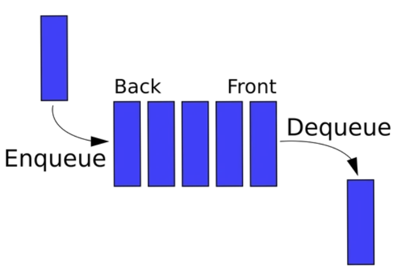
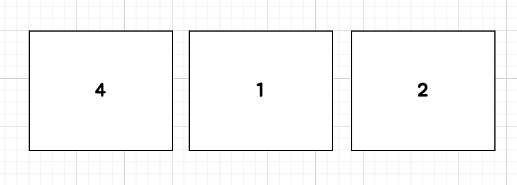
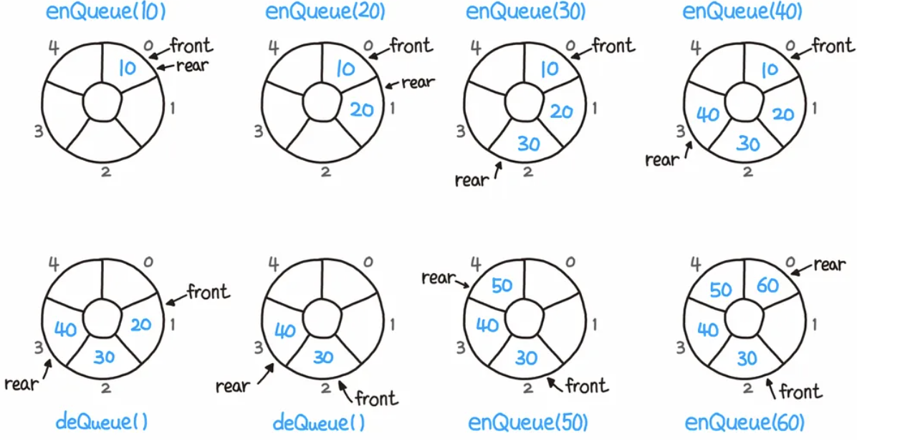

# 큐와 우선순위 큐를 비교해보세요

## Queue

> FIFO 형식의 자료 구조



- 그냥 간단히 스택 = 책을 쌓고 뺌

- 큐 = 영어 그대로 줄을 서는 행위

로 저는 항상 떠올립니다.

여기서 알면 되는 것은 Enqueue = 큐 맨 뒤에 데이터 추가

Dequeue. = 큐 맨 앞 쪽에 데이터를 삭제

### 사용처

- BFS 에서 사용됩니다.

- 또한 컴퓨터 버퍼에서 사용되고 입력 시 처리가 안되었으면 버퍼(큐)에 대시 시킵니다.


### Java 로 Queue 구현하기

```java
public class ArrayQueue {
    int MAX = 1000;
    int front;
    int rear;
    int[] queue;
    public ArrayQueue() {
        front = rear = 0;
        queue = new int[MAX];
    }

    // 비어있는가?
    public boolean queueisEmpty() {
        return front == rear;
    }

    // queue 가 가득 차있는가?
    public boolean queueIsFull() {
        return rear == (MAX-1);
    }

    // queue 데이터 개수
    public int size() {
        return front-rear;
    }

    public void push(int val) {
        if(queueIsFull()) {
            System.out.println("Queue is Full");
            return;
        }
        queue[rear++] = val;
    }

    public int pop() {
        if (queueIsEmpty()) {
            System.out.println("Queue is Empty");
            return -1;
        }
        return queue[front++];
    }

    public int peek() {
        if (queueIsEmpty()) {
            System.out.println("Queue is Empty");
            return -1;
        }
        return queue[front];
    }
}
```

위는 간략히 만든 것이고 LinkedList 로도 당연히 만들 수 있다. (그리고 대부분이 LinkedList 로 할당하는 것을 원할지도)

### Java Queue

본인은 일반적으로 문제를 풀 때 Stack과 Queue 의 클래스를 사용하지 않고 모두 Deque 로 사용한다.

Deque 는 특수한 형태의 큐로 Stack 과 Queue 를 합친 형태라고 알면 된다.

```java
Deque<Integer> queue = new ArrayDeque<>();

queue.offer(1);
queue.poll();
queue.offer(1);
queue.peek();
queue.pollFirst();
```

## Priority Queue

> FIFO 이지만 우선 순위에 따라서 나가는 순서가 정해진다.



왼쪽부터 순서대로 들어왔대도 우선순위가 높은 것부터 나갈 것이다.

즉, 4 -> 2 -> 1 순으로 나가게 된다.

그런데 데이터가 100개가 있을 때 우리가 우선순위 대로 나가고 싶다면 매번 나갈 때마다 해당 값을 비교하기 위해 시간이 더 필요하고 (예를 들어 4가 나가려고 할 때 뒤에 보다 큰지 작은지 등)

그렇다면 반대로 아예 들어올 때 우선순위대로 해놓으면 되는거 아닌가? 라고 생각할 수 있지만 이 또한 위와 동일한 완전 탐색이 들어가게 된다.

그래서 우리는 일반적으로 **Heap**으로 이 우선순위 큐를 구현하게 된다.


## Circular Queue

> 큐를 효율적으로 쓰기 위한 자료구조

기존의 큐는 공간이 다 차면 더 이상 요소를 추가할 수 없는데 (뭐 자바 큐 구현체는 사이즈를 조정할 수 있다만)

- 또한 앞 부분을 poll 하게 되면 앞의 공간은 비는데 뒤는 다 차는 상황이 올 것이다.

이를 효율적으로 쓰기 위해서 아래 그림과 같은 원형 큐가 있다.




이는 투 포인터와 비슷하다.

그런데 문제는 생각 없이 구현하면 큐에 완전히 원소가 없을 때와 큐가 꽉 찼을 때를 구분할 수 없는 단점이 있다.

- 이는 플래그나 실제 공간보다 한 칸 적게 채우는 방법이 있다.

사실 우리가 실제로 큐를 구현하기 보다는 해당 기술이 큐를 사용한다. 또는 큐 + 알파 인 경우가 대부분이기에 일반적으로 문제를 풀 때는 큐를 선택하자.

## 우선 순위 큐 관련 문제

[프로그래머스 프로세스](https://school.programmers.co.kr/learn/courses/30/lessons/42587)

문제 설명

1. 큐에서 대기중인 프로세스 하나를 꺼낸다.

2. 큐에 대기 중인 프로세스 중 우선순위가 더 높은 프로세스가 있다면 방금 꺼낸 프로세스를 다시 큐에 넣는다.

3. 그런 큐가 없다면 방금 꺼낸 프로세스를 실행하고 종료한다.

input

- 프로세스의 중요도가 담긴 배열 `priorities`

- 몇 번째로 실행되는지 알고싶은 프로세스의 위치를 알려주는 `location`

해당 프로세스가 몇 번째로 실행되는지 return

```java
import java.util.*;

class Solution {
	public int solution(int[] priorities, int location) {
		PriorityQueue<Integer> pq = new PriorityQueue<>(Collections.reverseOrder());
		
		for (int pri : priorities) {
			pq.add(pri);
		}
		
		int result = 0;
		while(!pq.isEmpty()) {
			for (int i = 0; i < priorities.length; i++) {
				if (priorities[i] == pq.peek()) {
					pq.poll();
					result++;
					
					if(i == location) return result;
				}
			}
		}
        
        return result;
	}
}
```