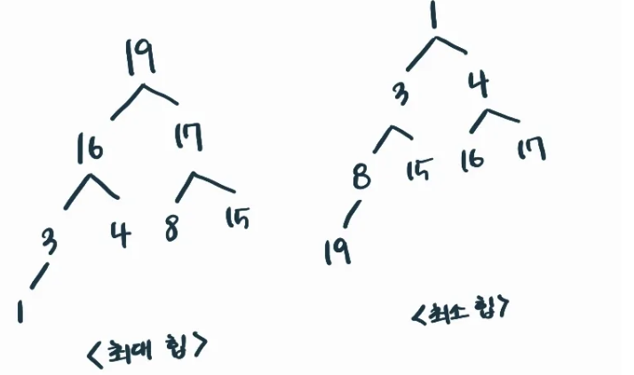
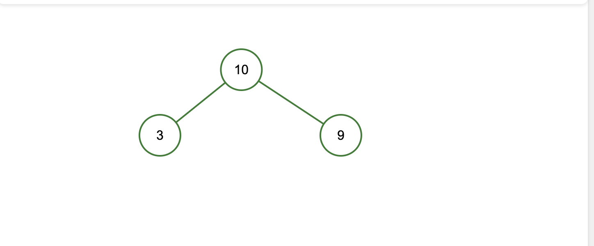
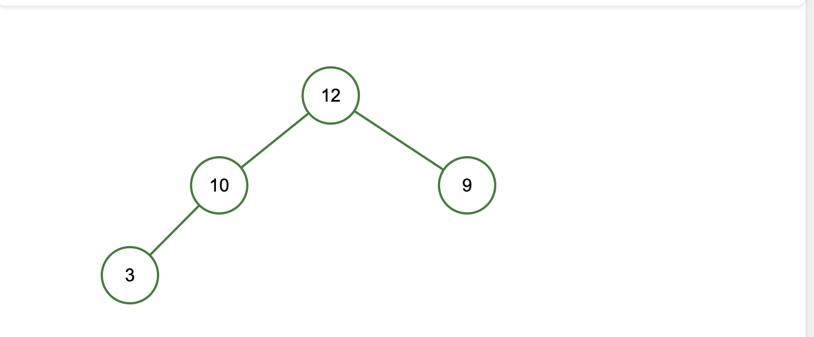
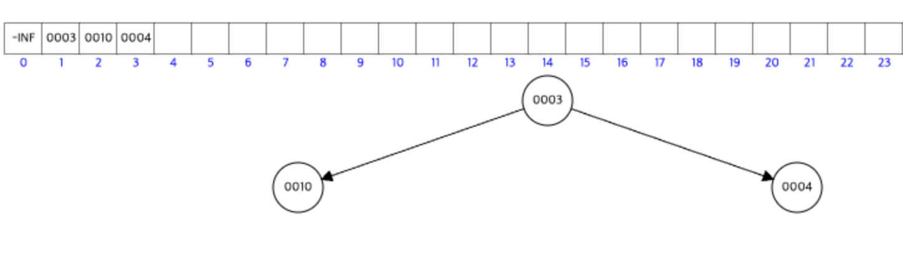
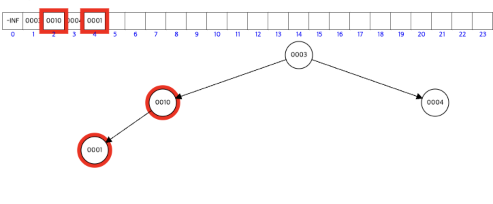
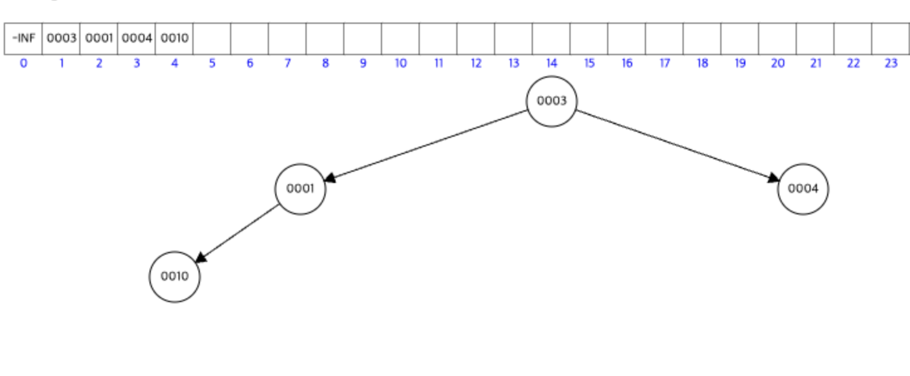
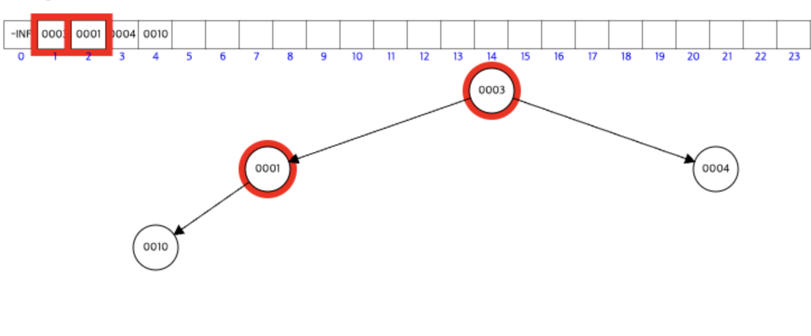
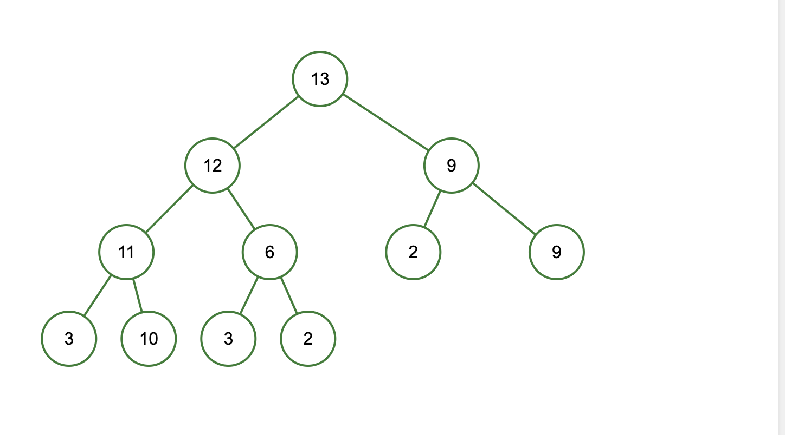

# 힙의 구조와 활용 예 그리고 삽입, 삭제에 대해 간략히 설명해주세요.

## HEAP

> 우선 순위 큐를 위해 만들어진 자료구조이다.

일단 우선 순위 큐는 시뮬레이션 시스템, 네트워크 트래픽 제어, 스케줄링, 등에서 사용되게 된다.

여러 값 중 **최대값이나 최솟값**을 빠르게 찾기 위한 완전 이진 트리이다.

**우선 순위 큐**를 구현하는 방법으로는 배열, LinkedList, Heap 이 있는데 이 중에서 **Heap 이 가장 효율적**입니다.

그 이유는 삽입, 삭제에 있습니다.

| 구분 | 삽입 | 삭제 |
| -- | -- | -- |
| 순서가 없는 배열 | O(1) | O(n) |
| 순서 없는 LinkedList | O(1) | O(n) |
| 정렬된 배열 | O(n) | O(1) |
| 정렬된 LinkedList | O(n) | O(1) |
| heap | O(logn) | O(logn) |

## heap 의 종류

***




### 1. 최대 힙

부모 노드의 값이 자식 노드보다 크거나 같다.

- 최상위 = 루트가 최대값



여기에 12를 넣으면 어떻게 될까?



가장 왼쪽에 붙었다가 위의 부모 노드랑 비교후 계속해서 자리를 바꾸어 가장 상위로 가는 것을 볼 수 있다.

### 2. 최소 힙

부모 노드의 값이 자식 노드보다 작거나 같다

- 루트 = 최솟값

단, 자식 노드의 왼쪽/오른쪽은 일반적으로 크기 순서가 없다.



위에다가 1을 넣으면 어떻게 될까?








결론적으로 이의 과정을 거쳐서 진행된다.

## 예시

우리가 만약 성능을 측정하고 이를 분석하기 위해서 다음을 만든다고 생각해보자

- 쿼리들 중 수행 속도가 느린 것은 어느 것인가요?

```java
public class QExtract {
    static class QueryLog implements Comparable<QueryLog> {
        String queryId;
        long exeTime;

        public QueryLog(String queryId, long exeTime) {
            this.queryId = queryId;
            this.exeTime = exeTime;
        }

        @Override
        public int compareTo(QueryLog other) {
            return Long.compare(this.exeTime, other.exeTime);
        }
    }

    public static void getSlowQueries(QueryLog[] all, int k) {
        // 가장 느린 k 개를 가져오자
        PriorityQueue<QueryLog> minHp = new PriorityQueue<>();

        for (QueryLog log : all) {
            if (minHp.size() < k) {
                minHp.add(log);
            } else if (log.exeTime > minHp.peek().exeTime) {
                // 현재 로그가 힙의 루트보다 실행 시간이 길면 교체
                minHp.poll();
                minHp.add(log);
            }
        }
        while(!minHp.isEmpty()) {
            QueryLog log = minHp.poll();
            System.out.println(log.queryId + "/ time: " _ log.exeTime);
        }
    }
}
```

## 힙의 삽입과 삭제가 왜 일정한가?

일단 이는 완전 이진 트리라는 점을 떠올리면 왜 `O(logN)` 인지 이해가 쉬울 것이다.



위 그림을 보면 우리가 어떠한 값을 넣을 때 다음이 수행된다.

1. 가장 하위에 붙는다. (단 완전 이진 트리이므로 최하위 노드가 다 채워져야 아래 붙을 수 있음)

2. 부모 노드와 비교한다. 

2-1. 만약 바꿔야 한다면 바꾼다.

2-2. 아니라면 stop

3. 다시 부모 노드와 비교한다. 
...

결론적으로 가장 MAX 로 확인 하는 것은 O(logN)이다.

(전체 개수가 N이라면 완전 이진 트리에서는 Depth 가 Logn 까지라 봄)

***

삭제를 하게 된다면

가장 마지막 노드가 루트 노드로 이동하고 자식 노드와 비교해서 자리를 계속 바꾼다.

## 언제 쓸까?

이는 일반적으로 랭킹의 경우에 사용되는 알고리즘이다.

단, 이는 형제 노드 사이의 규칙이 없기에 임의의 데이터를 찾을 때는 배열 전체를 완탐으로 해야 한다.
