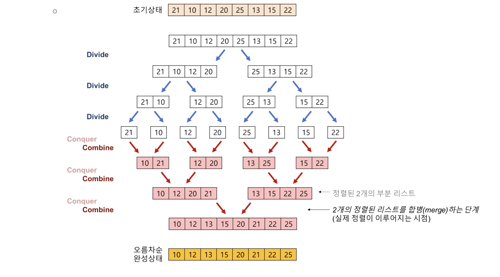
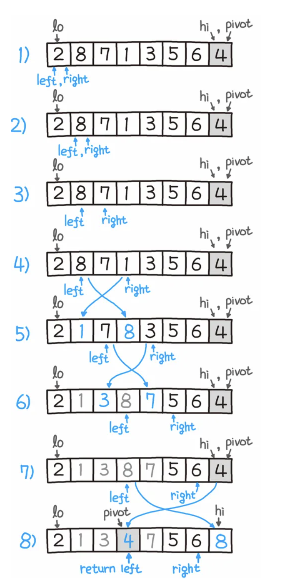

# 정렬에 대해서 간략히 소개하되 시간복잡도와 함께 설명해주세요.

정렬 알고리즘은 사실 엄청 다양하다.

일단 정렬 = 규칙을 가지로 순서를 세운다는 것인데, 일반적으로 오름차순/내림차순을 생각하면 된다.

- 정렬을 하는 이유는 무엇일까?

바로 **탐색** 때문이다.

보통 데이터들은 삽입 삭제보다는 데이터 조회가 더 많이 필요한 경우가 많은데, (예: 검색) 이 때 정렬이 되어 있지 않다면 우리는 **이진 탐색**과 같은 알고리즘 적용 없이 완탐이 필요할 것이다.

만약 우리가 정렬 상태에서 N이라는 값을 찾고 싶은데, 임의로 하나를 잡았을 때 N 보다 작다면 오른쪽 부분만 보면 된다.

## `O(n^2)` 의 시간 복잡도를 가지는 정렬

### 1. 버블 정렬 (Bubble Sort)

- 1번째와 2번째를 비교 -> 2번째와 3번째를 비교 -> ... -> n-1 번째와 n번째를 비교한다.

그러면 n 은 가장 큰 수가 될 것이고,

이를 다시 1~n-1 까지 비교하고 계속해서 수행한다.

웬만하면 쓰지 않는다. 장점이 거의 없다 차라리 내장 정렬을 쓰는 것이 더 유용하다.

요즘은 정말 웃긴게 이런 것을 밈으로 만들기도 하는데,

- 타노스 정렬, 셰이커 정렬, 등등

## `O(nlogn)` 의 시간 복잡도를 가지는 정렬

아래의 정렬은 최선과 평균 모두 O(nlogn)의 시간 복잡도를 가진다.

### 1. 병합 정렬 (Merge Sort)

메모리가 더 필요하다는 단점이 있지만, 데이터가 이미 정렬된 상태여도 영향을 별로 주지 않는다는 장점이 있다.

### 2. 힙 정렬 (Heap Sort)

이는 Heap 과 동일하므로 넘어가겠다.

### 3. 퀵 정렬 (Quick Sort)

- 적절한 원소 하나를 기준(피벗)으로 그보다 작은 것을 앞으로 빼고 그 뒤를 피벗보다 옮겨서 작은 것, 큰 것으로 나누고 다시 피벗을 잡아서 정렬을 하는 방식이다,

하지만 중요한 것은 이는 최악의 경우 O(n^2) 의 시간 복잡도를 가지게 된다.

- 계속해서 피벗을 최소나 최대로 잡는 경우

위의 문제에도 불구하고 퀵 정렬을 가장 많이 쓰는데,

동일한 O(nlogn)의 상황에서는 셋 중 퀵 정렬이 제일 빠르다. (그러나 불안정 정렬임, 그래서 파이썬에서는 하지 않음. 안정성은 우선 순위가 같은 데이터들의 원래 순서가 정렬 후에도 그대로 유지되는지를 의미함.)

그래서 실제로 쓸 때는 퀵 정렬을 조금 바꿔서 최악의 경우가 발생하지 않도록 하거나 나쁘다 싶은 경우에 힙 정렬로 전환하게끔 코드를 작성한다.

### 4. 트리 정렬

이진 탐색 트리를 만들어서 정렬하는 방식인데 힙과 비슷해보이지만, 다른 점은 자식 노드의 규칙이 존재한다는 것이다.

***

P.s. 사실 우리가 이를 실제로 짜는 일은 드물다. 왜?

- 이미 프로그래밍 언어의 내장 정렬에 하이브리드 정렬 알고리즘을 사용하기 때문이다.

Java 에서는 객체 정렬 시 (`Collections.sort(obj)`) TimSort 를 사용한다.

간략히 TimSort 는 삽입 정렬 + 병합 정렬이다.