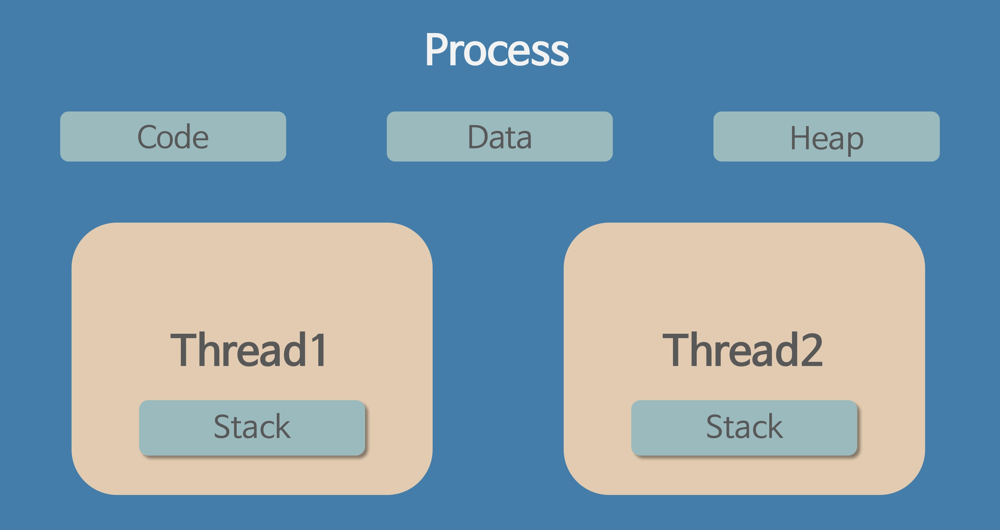
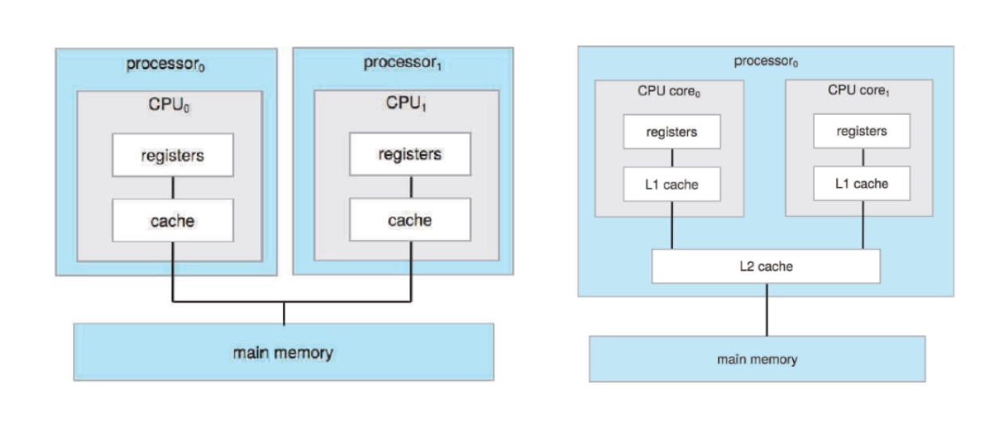

### 멀티 프로세서 시스템의 하드웨어적 장점은 무엇인가요?

---

> 먼저 여러 프로세서가 명렬로 작업할 수 있기에 처리량이 증가합니다.
또한 독립된 컴퓨터 여러 대보다 단일 시스템에서 처리할 수 있기에 메모리와 IO 디바이스를 공유할 수 있어 자원적으로 유리할 수 있습니다.
또한 멀티 프로세서의 다른 중요점 중 하나로 하나의 프로세서가 장애가 발생해도 전체 시스템이 다운되지 않고, 남은 프로세서들이 분담해 처리할 수 있어 신뢰성이 증가합니다.
> 

### 프로세스 | 스레드

---

> 프로세스는 OS 로 부터 **고유 자원 (메모리)**를 할당 받아 실행 중인 **독립적인 프로그램**입니다.
> 

완전히 독립된 하나의 공장으로 자신만의 건물(메모리 공간), 설비(CPU 할당), 원자재(데이터)를 가집니다.

> 스레드는 하나의 프로세스 내에서 **할당된 자원을 공유**하며 동작하는 실제 실행의 흐름 단위입니다. **OS 관점**에서는 프로세스가 최소 작업 단위이지만, **CPU 관점**에서는 스레드가 최소 작업 단위입니다.
> 

공장 안에서 일하는 일꾼들로 같은 건물과 자재를 공유하지만, 각자 고유한 작업 지시서와 개인 도구(Stack)을 들고 일합니다.
***

### 멀티 프로세스 | 멀티 스레드

**멀티 프로세스** : 하나의 프로그램에서 여러 개의 프로세스를 동시에 실행하는 방식

**멀티 스레드** : 하나의 프로세스 내에 여러 개의 스레드를 생성해 동시에 작업을 수행하는 방식

당연하게도 멀티 프로세스가 메모리 소비나 컨텍스트 스위치 비용이 더 많이 든다.

그러나 멀티 스레드에서는 하나의 공유 자원(Data, Heap)의 관리를 고려해야 하기에 **동기화 문제를 제어**해야 한다.(Mutex, Semaphore)

- [다음 스터디에 나올 내용이지만 간략히 언급할 Tomcat + Thread]
    
    Spring 에서는 매번 스레드 생성/삭제 비용을 줄이기 위해서 스레드 풀을 사용하는데,
    
    트래픽에 맞추어 Tomcat 스레드 풀 크기를 적절히 튜닝하는 방법도 있다.
    
    내가 했던 프로젝트에서는 AI 요청 제한을 위해서 스레드 풀을 설정했다.
    

### 멀티 프로세서

---

참고로 이는 멀티 프로세스(Multi-Process) 와 멀티 프로세서(Multi-Processer)과 완전히 다른 개념이다.

프로세스 : 프로그램 실행 상태  |  프로세서 : **CPU 코어**

여러 개의 CPU 코어가 하나의 시스템에서 동시에 실행되는 것을 의미한다.

한 컴퓨터에 2개 이상의 CPU가 장착된 것을 말하며 서버, 워크스테이션 등 많은 데이터를 처리하고 고성능이 필요한 컴퓨터에서 사용한다.

> 멀티 코어는 하드웨어 관점에서의 물리적 구성 단위, 멀티스레드/멀티스레딩은 소프트웨어 관점에서의 논리적 작업 처리 단위이다.
> 

- **멀티 코어 프로세서**
    
    코어 여러 개가 집적된 일반 CPU를 이야기한다.
    
    2017년 부터는 AMD 가 라이젠 CPU 를 출시해 6코어, 8코어가 대중화되어 있다.
    
    참고로 CPU 2개를 꽂는다고 성능이 2배가 아니라 그 안에서 각 프로세서가 어떻게 역할을 분담할지 (병렬화)에 대한 처리가 필요하다.
    

[가격이 궁금해서 메인 보드 가격을 찾아보았다)](https://search.danawa.com/dsearch.php?query=dual+processor+motherboard)

### 멀티 프로세서 특징

---

멀티 프로세서의 주요 목적은 **처리 능력(Throughput)** 과 **신뢰성(Reliability)** 를 높이는 것이다.

**1️⃣ 병렬 처리(Parallel Processing)**

여러 프로세서(CPU)가 동시에 다른 작업을 수행하는 병렬 처리 능력을 제공한다.

CPU 수 증가에 따라서 **처리율 향상**을 목표로 한다.

**2️⃣ 신뢰성(Reliability)와 내고장성(Fault Tolerance)**

프로세서 중 하나가 고장나도 시스템이 계속 작동하는 내고장성을 제공한다.

고장난 프로세서를 격리하고 나머지 프로세서가 부하를 나누어 처리한다.

프로세서 간 통신은 주로 공유 메모리를 통해 이루어지며 프로세서들이 공통의 메모리 영역에 데이터를 쓰고 읽어 작업 동기화 및 데이터 교환을 수행한다.

- 참고 내용
    
    멀티 프로세서에서는 공유 메모리가 있기때문에 동기화가 필수적이다.
    
    상호 배제(Mutual Exclusion)을 보장해야 하는데, 공유 자원에 접근하는 코드 부분인 임계 구역(Critical Section)에 한 시점에 오직 하나의 프로세서만 진입해 코드 실행을 보장하는 조건이다.
    

### 멀티 프로세서의 장점

---

### 1️⃣ 자원 공유 및 로드 밸런싱

모든 프로세서는 메인 메모리를 공유하기에 OS의 스케줄러가 각 프로세서의 Ready Queue 를 모니터링하고, 쉬고 있는 상태인 프로세서에 스레드를 할당해 병목을 방지한다.

### 2️⃣ 캐시 일관성 유지

각 프로세서는 속도 향상을 위해서 자신만의 고속 캐시인 L1 과 L2 를 가진다.

한 프로세서가 캐시의 데이터를 수정하면, 다른 프로세서가 과거 데이터를 읽지 않도록 하드웨어 레벨에서 데이터의 일관성을 실시간으로 동기화해준다.

결론적으로 다음의 장점이 있다.

- **처리량 증가**

동시에 작업을 수행할 수 있어, 당연히 단위 시간당 처리 프로세스/스레드 수가 선형적으로 증가한다.

- **신뢰성**

하나의 시스템이 다운되어도 다른 시스템에는 영향을 받지 않는다. (Graceful Degradation)