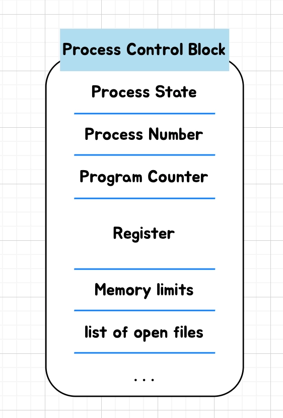
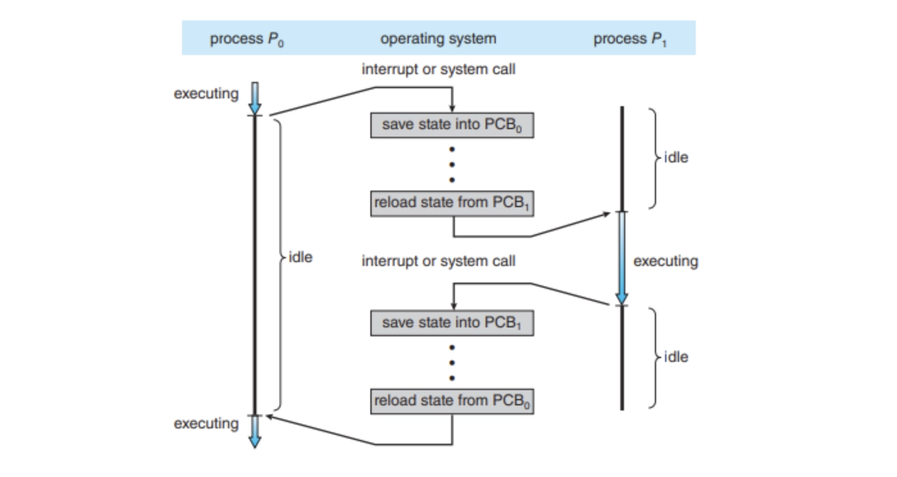
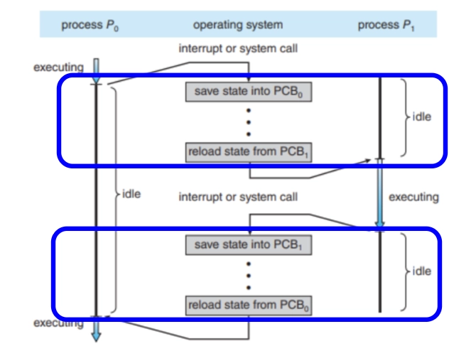

### 프로세스 문맥 교환(Context Switching)의 정의와 발생 시 CPU에 미치는 오버헤드를 설명해 주세요.

---

> Context Switching 은 CPU가 현재 프로세스의 상태를 PCB 에 저장하고, 다음 실행할 프로세스의 상태를 적재해 실행을 재개하는 과정이다.
오버헤드는 문맥 교환이 일어나는 동안에는 원하는 작업을 수행하기 어렵기에 이 때 처리를 위한 시간을 나타내는 단어입니다.
> 

### Context Switching

---

CPU가 현재 실행 중인 프로세스나 스레드의 상태를 저장하고 다음 실행할 다른 작업의 이전 상태를 복원해 이어 나가는 OS 기술이다.

현재 실행 중인 Task(프로세스/스레드)의 현재 상태 정보(레지스터 값, PC 등)을 해당 작업의 Process Control Block(PCB)에 저장한다.

CPU가 중단되었던 다른 작업의 PCB를 읽어서 레지스터에 적재하고 실행한다.

### 교환이 일어나는 시점

---

1️⃣ 각 프로세스에 할당된 CPU 시간이 끝났을 때

2️⃣ 파일을 읽거나 네트워크 통신 등(I/O)의 대기 시간이 발생할 때

3️⃣ 우선순위가 더 높은 작업이 끼어들거나 하드웨어 요청이 들어왔을 때 (인터럽트)

### Context Switching 과정

---

Idle: 아무것도 안하는 상태

현재 상황: $P_0$에서 $P_1$로 프로세스를 변경하려 한다.

현재 Idle(아무것도 안 하는 상태)가 겹치게 되는데 이 때 오버헤드가 발생한다.

시스템 성능 저하로 이어지기 때문에 이를 해결하기 위해 알고리즘, 자원 관리, 시스템 설계 등이 요구된다.

문맥 교환 시 레지스터 상태 저장 및 복원, 스케줄링, 메모리 전환, 캐시 무효화나 IO 때문에 발생한다.

일반적으로 문맥 교환에서 일어나는 오버헤드를 줄이기 위해 **스레드**를 활용하거나 메모리에 너무 많은 프로그램을 올리면 발생하기에 다중 프로그래밍 개수를 고려한다.