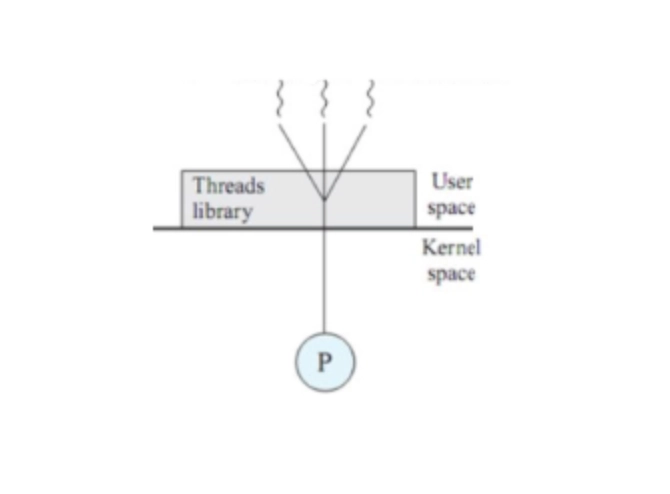

### 사용자 수준 스레드(User-level Thread)와 커널 수준 스레드(Kernel-level Thread)의 차이점과 각각의 장단점은 무엇인가요?

---

> 사용자 수준 스레드는 스레드 라이브러리가 관리해 모드 전환 오버헤드 없이 빠르지만 하나의 스레드가 IO 블로킹이 발생되면 프로세스 전체가 멈추고 멀티 코어를 활용하지 못하는 단점이 있다.
커널 수준 스레드는 OS 가 직접 관리해 IO 블로킹에도 다른 스레드를 실행 가능하지만, 컨텍스트 스위칭이 발생하면 오버헤드가 쌓인다.
자바 21부터는 가상 스레드를 도입해 JVM 이 사용자 스레드를 더 적은 커널 스레드에 동적 매핑해 동기식 코드를 유지하면서도 커널 스레드의 블로킹을 막아 성능을 극대화하는 방향으로 발전했다.
> 

스레드는 **사용자 수준 스레드**와 **커널 수준 스레드**가 존재한다.

### 사용자 수준 스레드

---

스레드를 관리하는 라이브러리로 **사용자 단에서 생성되고 관리되는 스레드**이다.

그래서 커널이 관리하는 것이 아니어서 커널이 이 스레드에 대해 알지 못한다.

참고로 물리적으로 커널 밖이 아니라 커널의 통제권 안에 없는 스레드이다.

커널에는 커널 모드 와 사용자 모드 2가지가 있다.

따라서 **인터럽트 발생 시 커널은 사용자 모드가 되어 사용자 수준 스레드의 응답을 기다린다.**

사용자 수준 스레드의 응답이 오면 다시 커널 모드로 변환되어 이어서 커널 스레드가 일 처리를 하게 되는 것이다.

✅ 장점

**Context Switching 이 없어서 커널 스레드보다 오버헤드가 적다.**

스레드 전환 시에 커널 스케줄러 호출할 필요가 없기 때문이다.

단지 모드만 전환하면 되기에 문맥 교환이 빠르다.

❎ 단점

**그러나 프로세스 내의 한 스레드가 커널로 진입하는 순간, 나머지 스레드들도 전부 정지된다.**

커널이 스레드의 존재를 알지 못하기 때문이다.

### 커널 수준 스레드

커널 레벨에서 생성되는 스레드로 OS에서 생성되어 동작하는 스레드로, **커널이 직접 관리**한다.

커널 수준에서는 프로세스가 주기억 장치에 여러 개가 적재되어 **CPU 할당을 기다리며 동작**한다.

CPU에서 인터럽트 발생으로 현재 작업 중인 프로세스가 Block 되고 다른 프로세스로 변경할 때 CPU 내 재배치 Register 에 다음 실행 프로세스 정보들로 교체하고 캐시를 비운다. (Context Switching 이 일어난다.)

하지만 이 Context Switching 과정에서도 커널이 직접 관리하기에 특정 스레드가 Block 되어도 **다른 스레드들은 독립적**으로 일을 할 수 있다.

✅ 장점

**사용자 수준 스레드보다 효율적이다.**

커널 스레드를 쓰면 멀티 프로세서를 사용할 수 있기 때문이다.

사용자 스레드는 CPU가 많아도 커널 모드의 스케줄이 되지 않아 각 CPU에 효율적으로 스레드를 할당할 수 없다.

❎ 단점

**그러나 Context Switching 이 발생해 오버헤드가 발생한다.**

이 과정에서 프로세서 모드가 사용자 모드 ↔ 커널 모드 사이를 움직이기에 많이 움직일수록 성능이 떨어진다.

- 참고
    
    자바 초기에는 사용자 수준 스레드를 사용했다.
    
    자바 1.2 이후 ~ 19 이전 까지는 커널 수준 스레드를 도입해 멀티 코어 활용과 독립적인 IO 처리가 가능해졌다. (그러나 커널 모드 전환의 오버헤드, 스택 메모리 낭비 등의 문제가 있었다.)
    
    **자바 21 이후부터는 가상 스레드**를 도입해 JVM이 사용자 수준 스레드를 스케줄링하고 이를 소수의 커널 수준 스레드를 매핑한다.