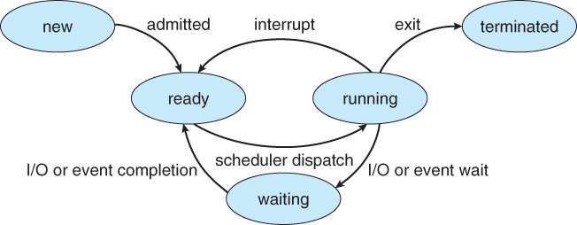

### 프로세스 스케줄링(Process Scheduling)과 CPU 스케줄링의 정의는 무엇이며, CPU 스케줄링은 언제 발생하나요?

### 프로세스 스케줄링

---

단일 프로세서 시스템에서는 한 번에 한 프로세스만 실행될 수 있는데, 항상 프로세스가 CPU 를 사용하는 것은 아니다.

IO 작업에서는 CPU가 일을 하지 않고 기다린다.

여러 프로세스 작업을 처리할 때, 한 프로세스가 모든 작업이 끝날 때까지 기다렸다가 다음 프로세스를 실행하는 방법보다, **한 프로세스를 실행 가능한 시점까지 실행하고, IO 등 CPU 를 사용하지 않는 작업을 할 때 다른 프로세스를 실행하면 CPU 효율을 높일 수 있다.**

이를 Process 스케줄링으로 구현한다.

- **프로세스의 상태**
    
    생성, 실행, 준비, 대기, 종료의 5가지 상태가 있다.

    
    

## CPU 스케줄링

---

프로세스 스케줄링의 하위 단계로 단기 스케줄러가 수행하는 작업이다.

메모리에 적재되어 실행 대기 중인 준비 큐의 프로세스들 중 다음 번에 CPU를 할당받아 실행될 프로세스를 선택하는 의사 결정 과정이다.

장기, 중기, 단기 스케줄러가 있는데

- 장기: 디스크 → 메모리로 어떤 프로세스를 올릴지 결정
- 중기: 메모리 부족 시 어떤 프로세스를 디스크의 Swap 영역으로 쫒을 지(페이지 교체 알고리즘)
- **단기: 메모리의 준비 큐에 있는 프로세스 중 누구에게 CPU를 줄지 (스케줄링 알고리즘)**

### 선점과 비선점 방식

---

프로세스 스케줄링은 다음의 4가지 경우에 발생하는데,

1. 프로세스가 실행 상태 → 대기 상태로 전환될 때
2. 프로세스가 실행 상태 → 준비 상태로 전환될 때
3. 프로세스가 대기 상태 → 준비 상태로 전환될 때
4. 프로세스가 종료되었을 때

### 1️⃣ 비선점 방식 (non-preemptive)

스케줄링이 만약 첫번째와 네 번째 경우에만 일어나면 비선점 스케줄링이라 한다.

> 한 프로세스가 CPU를 선점해 자신의 작업이 다 끝날 때까지 반환하지 않는 스케줄링 방법
> 

### 2️⃣ 선점 방식 (preemptive)

스케줄링이 위 4 경우 모두 일어나면 선점 스케줄링이라 한다.

> 운영체제가 CPU를 먼저 선점하여 필요하다면 CPU 를 프로세스로부터 뺏을 수 있는 스케줄링 방법
> 

둘 중 무엇이 더 효율적인지는 답이 없다.

타이머 같은 특정 하드웨어에서는 선점 스케줄링이 필요하다.

선점 방식에서는 당연히 프로세스 간 공유 자원 때문에 문제가 발생할 수 있는데 이가 뮤텍스 관련 블루 스크린이 선점 방식의 상호 배제 관련 영역에서 문제가 발생해 뜨는 것이다.

### 스케줄링 알고리즘

---

이는 CPU 이용률, Through-put, 소요 시간, 대기 시간, 반응 시간 등에 따라서 효용성을 따진다.

### 1️⃣ FCFS 스케줄링

> **First Come first Serve Scheduling**
> 

비선점 방식이며 CPU를 먼저 요청한 프로세스가 먼저 CPU를 할당받는 스케줄링이다.

구현이 쉽지만 늦게 들어온 프로세스는 너무 오래 기다려야 한다는 단점이 있다. (특히 처음의 프로세스가 시간이 길어질수록)

### 2️⃣ SJF 스케줄링

> Shortest Job First Scheduling
> 

선점, 비선점 둘 다 가능하며 CPU 의 burst time 이 작은 프로세스 부터 먼저 끝낸다.

그러나 긴 시간의 프로세스는 계속 할당받지 못하는 기아 상태가 될 수 있다.

- 변비가 있다.
    
    A 는 똥을 5초만에 싸고 B는 2초만에, C는 5분만에 쌀 수 있다.
    
    C는 평생 화장실에 갈 수 없는 초유의 사태가 발생한다….
    
    그러나 HRN 기법을 통해 C도 화장실을 갈 수 있게 되는데…
    
    이는 가중치 프로세스 스케줄링 기법이다.
    

### 3️⃣ SRTF 스케줄링

> Shortest Remaing Time First Scheduling
> 

프로세스 도착 시간을 고려하지 않고 한 프로세스가 실행 중이면 다른 프로세스가 도착한 시간을 기준으로 남은 처리 시간과 다른 프로세스의 처리 시간을 비교해 스케줄 순서를 결정하는 방식이다.

### 4️⃣ 우선순위 스케줄링

선점형과 비선점형으로 나뉘는데

선점형은 프로세스 실행 중일 때 해당 프로세스보다 우선 순위가 더 높은 프로세스가 들어오면 해당 프로세스를 중단하고 더 높은 프로세스를 실행

비선점형은 지금 실행 중인 프로세스는 계속 실행

### 5️⃣ RR 스케줄링

우선 순위 없이 순서대로 시간 단위로 프로세스에 자원을 할당하는 선점 스케줄링이다.

- 똥을 다시 싸자
    
    A 는 5초, B 는 2초, C 는 5분이다.
    
    A가 들어가 2초 동안 싸고 뒤로 이동한다. B가 들어가서 2초 동안 싸고 끝낸다.
    
    C가 들어가고 2초.. A가…
    
    그러나 이 서로 돌아가면서 문 열고 닫는 오버헤드가 발생해 FCFS 와 비슷해 시간을 적절히 해야 한다.
    

그 외에도 MQ 나 MFQ 정말 다양하다.