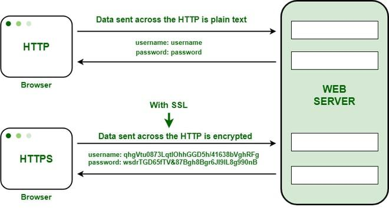
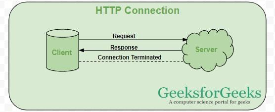
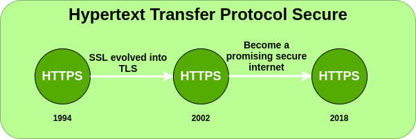

# HTTP와 HTTPS에 대해 간략히 설명하고 차이를 알려주세요.

***

## HTTP란?

일단 기본적으로 둘 다 클라이언트 <-> 서버 간 통신 규칙(프로토콜)입니다.

### HTTP(Hypertext Transfer Protocol)

- 웹을 통해서 데이터를 전송하는 데 사용되는 **Application 계층 프로토콜**입니다.

    - 웹 브라우저와 웹 서버 간 통신을 가능하게 하고
    - World-Wide-Web(www)에서 데이터 전송의 기반을 형성합니다.
    - 시스템 간 **데이터 요청 및 전달**에 대한 규칙을 정의합니다.

### HTTP 특징

클라이언트와 서버가 웹을 통해서 효율적으로 리소스를 교환할 수 있도록 하는 표준 프로토콜이기에 다음의 특징을 가지고 있습니다.

1.  Stateless 

    - 각 요청을 독립적이고 서버는 **이전 상태를 저장하지 않는다.**

2. Text 기반
    
    - 메시지는 일반 텍스트 형식으로 읽고 디버깅하기 쉽다.

3. 클라이언트 - 서버 모델

    - 리소스 요청 및 제공에 있어 클라이언트 - 서버 아키텍처를 따른다.

4. Request - Response 방식

    - 클라이언트와 서버 간 요청과 응답의 반복으로 작동합니다.

5. 요청 메서드

    - 리소스에 대한 다양한 작업을 위해 **GET, POST, PUT, DELETE**와 같은 다양한 메서드를 제공합니다.

" 참고로 이 프로토콜은 이후 QUIC(HTTP/3)으로 이름이 바뀌었고 구글에서 개발했습니다.

- 그 외의 내용

    - 기본 포트 번호는 80번이고
    - **암호화 또는 인증 기능을 제공하지 않습니다.**

그렇기 때문에 HTTP는 **데이터 가로채기 및 변조에 취약**합니다.

### HTTP 의 동작 방식

1. 클라이언트는 서버로 HTTP 요청을 보냅니다.

2. 서버가 요청을 처리하고

3. 서버는 상태 코드, 헤더 및 응답 본문을 포함하는 HTTP 응답을 보냅니다.

## HTTPS란?

### HTTPS (Hypertext Transfer Protocol Secure)

HTTP + SSL/TLS 둘을 결합해 암호화된 통신과 연결된 웹 서버의 안전한 식별 정보를 제공하는 프로토콜입니다.

>  TLS는 Transfer 계층에서 보안을 제공하도록 설계된 암호화 프로토콜입니다. 이는 SSL(보안 소켓 계층)이라는 보안 프로토콜에서 나아간 프로토콜로 TLS은 **클라이언트와 서버 간 전송되는 모든 메시지를 제 3자가 도청하거나 변조할 수 없도록 보장**합니다.

> 간략히 이야기하면 핸드셰이크를 통해서 TCP 기반으로 인증서를 검증하고 키를 교환하는 등의 행위로 보안을 높였다고 보면 되겠습니다.

결론적으로 HTTPS는 **SSL 인증**을 받기에 HTTP 보다 더 안전합니다.

따라서 현대의 인터넷은 웹사이트의 URL 이 HTTP로 시작하면 해당 웹사이트는 안전하지 않다고 경고를 띄웁니다.

### HTTPS 가 안전한 이유

- 위에서 말했듯 **데이터는 암호화되어 도청을 방지**합니다.

- 서버의 신원은 **디지털 인증서**를 사용해 확인됩니다.

- 중간 공격으로부터 보호합니다.

### HTTPS 동작 방식

1. 클라이언트가 보안 연결을 시작합니다.

2. 서버는 SSL/TLS 인증서를 제시합니다.

3. 고객은 신뢰할 수 있는 기관을 통해 인증서를 검증합니다.

4. 암호화된 세션이 설정됩니다.

5. 모든 HTTP 데이터는 이 암호화된 채널 내에서 안전하게 전송됩니다.

HTTPS 는 443번 포트를 사용하고 이는 **Transfer 계층**에서 작동합니다.

미세하게 HTTPS 가 HTTP 보다 느리지만 이정도는 누구나 감수할 사항입니다.

### 정말 HTTPS 로 안전한 것인가?

***

HTTPS 에서 중요한 것은 **내가 통신하고 있는 상대방이 진짜 그 상대방이 맞는가?(인증)**을 확인하는 것이다.

일반적으로 CA(Certificate Authority, 인증기관)이라는 3자가 인증서를 발급해주는데, 브라우저는 아무 CA나 믿지 않고 세계적으로 엄격한 보안 심사를 통과한 소수의 CA 만 신뢰한다.

무료 인증서 역시 이 보안 심사를 통과했기에 안전한 인증으로 된다.

그러나 해커가 인증서를 발급받더라도 **도메인 소유권**만 증명할 수 있을 뿐, **기업의 신원**이나 **피싱 사이트가 아님**은 보장받지는 못한다.

### 참고 자료

[aws: HTTP와 HTTPS의 차이점은 무엇인가요?](https://aws.amazon.com/ko/compare/the-difference-between-https-and-http/)

[Secure Socket Layer(SSL)](https://www.geeksforgeeks.org/computer-networks/secure-socket-layer-ssl/)

[Transfer Layer Secure(TLS)](https://www.geeksforgeeks.org/computer-networks/transport-layer-security-tls/)