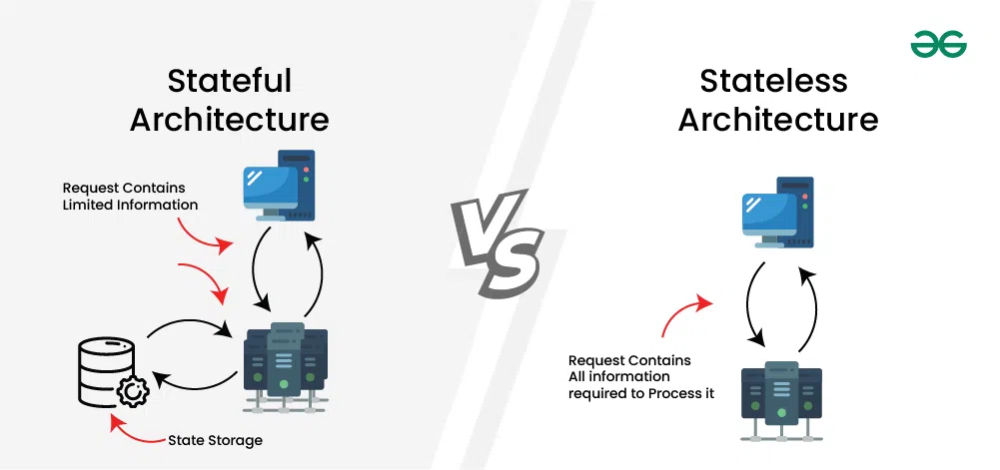

# Stateful 과 Stateless 의 차이에 대해 알려주세요.

***

> Stateful 은 서버가 세션 등을 통해 클라이언트 상태를 유지하는 반면, Stateless 는 서버가 상태를 보존하지 않아 모든 요청이 독립적으로 처리되는 방식입니다. Stateful 은 인증이나 비즈니스 연속성을 서버가 통제해 보안과 정보 유지에 장점이 있지만 서버 확장이 어렵습니다. 반면 Stateless 는 서버가 무상태성을 유지하기에 시스템 내결함성을 높이고 수평 확장에 용이합니다.

## Stateful

> 서버가 여러 요청에 걸쳐서 세션 데이터를 저장한다.

- 즉, 서버는 여러 상호 작용 또는 요청 전반에 걸쳐서 클라이언트의 데이터와 컨텍스트를 추적합니다.

일반적으로 세션 데이터는 **서버 메모리**, **데이터베이스** 또는 기타 저장 장치에 저장하는 경우가 많다.

    사용자가 데이터나 장바구니 내용을 저장하기 위해 서버 측 세션을 사용하는 옛날 애플리케이션

### Stateful 장점

1. 세션을 지속한다.
    - 세션을 유지해서 플로우에 따라 변할 때 유용할 수 있다.
    > 상품을 구매 시 [장바구니 확인]->[배송지 입력]->[쿠폰 사용]->[최종 결제]라는 여러 단계를 거치게 되는데, 세션 서버에 이를 두면 새로 고침 등을 해도 서버에 세션이 남아있기에 나가기 전 단계부터 다시할 수 있다.

2. 효율적인 자원 사용
    - 세션 데이터를 서버에 저장해 반복적인 전송 및 처리를 줄일 수 있다.
    > 최초 로그인 시 서버 세션 메모리에 정보를 한 번만 올리기에 이후 클라이언트는 `Session ID` 만 보내서 네트워크 전송량이 확 준다.

3. 개인화
    - 과거 상호 작용을 통해 추천과 같은 맞춤형 서비스를 제공할 수 있다.
    > 사용자의 실시간 행동 로그를 누적해 저장할 수 있기에 이 Context 를 기반으로 다음 페이지 이동 시 "방금 보신 상품과 어울리는 추천 아이템"을 즉각적으로 보여줄 수 있다.
    > 하지만 요즘은 세션 방식을 더이상 사용하지 않기에 이벤트 기반 아키텍처로 유저 행동 이벤트를 전송 뒤 이를 AI 모델 서빙 인프라를 통해 실시간 개인 추천을 보낸다.

4. 보안
    - 중앙 집중식 세션 관리를 통해 인증 및 암호화가 더 강력해졌다.
    > PC방에서 로그인을 하고 자리를 비우거나 핸드폰을 분식하면 사용자가 원격으로 세션을 즉시 만료시켜 로그아웃 시킬 수 있다. 또한 민감 정보를 볼 수 없고 오직 Session ID만 가지고 있기에 위변조가 어렵다.

## Stateless

> 각 요청은 독립적이고 세션이 저장되지 않는다.

- 클라이언트의 각 요청은 독립적인 트랜잭션으로 처리된다.

- 사용자 세션을 유지하기 위해 Stateless 아키텍처는 JWT나 쿠키 등을 통해 세션 데이터를 저장한다.

- 클라이언트 상태를 유지하기 위해 서버 리소스가 필요하지 않아 확장성에 유용하다.

    RESTful API 에서는 각 요청에 서버가 독립적으로 처리하는 데 필요한 모든 정보가 포함되어 있다.

### 장점

1. 확장성
    - 세션 관리 없이 모든 요청을 쉽게 처리할 수 있다.
    > 블랙 프라이데이 이벤트로 사용자 요청이 10배 늘어 서버를 10대로 늘리는 스케일 아웃을 진행 시 새로 추가된 서버는 사용자 정보를 가질 필요 없이 트래픽만 나누면 된다.

2. 내결함성(Fault Tolerance)
    - 각 요청이 독립적이기에 한 영역의 오류가 다른 영역에 영향을 미치지 않는다.
    > 세션 관련 데이터가 날아가면 모두 강제 로그아웃과 관련 정보가 사라진다. 즉, 장애나 데이터 유실로 이어지지 않는다.

3. 로드 밸런싱이 쉬워진다.
    - 세션 고정 없이 요청을 고르게 분산할 수 있다.
    > Stateful 은 특정 사용자의 요청이 무조건 그 세션이 있는 서버로만 가야하는 세션 고정(Sticky Session) 기술이 필요하다. (해당 서버에 무조건 보내야하기에 어떤 서버는 사람이 없어 놀고 있을 수도)

4. 성능
    - 세션 오버헤드가 없어 응답 속도가 빠르고 지연 시간이 준다.
    > 서버 메모리에 세션 객체를 들고 있어야 하는데 이를 피하기 위해서 Redis 등을 따로 두어 요청이 올 때마다 Redis 조회 비용이 발생한다. 
    > JWT 의 경우 Access-Token 은 Redis 를 거치지 않고, 재발급 시에만 (일부) Redis 를 조회하기에 Stateless 장점을 유지하며 최소한의 상태만 저장하는 형태이므로 Redis 부하가 훨신 적다.

## Stateful vs Stateless

***

| Stateful | Stateless |
| --- | --- |
| 세션 데이터의 **동기화**가 필요 | **수평 확장**이 간단하다. |
| 한 서버에 장애 발생 시 해당 서버에 저장된 세션에 영향 | Error 는 개별 요청에만 영향 |
| 세션 관리로 지연 시간 증가 가능 | 세션 오버헤드가 없어 응답 시간이 더 빠름 |
| 세션 상태 저장, 관리 리소스 필요 | 리소스가 효율적 |
| 세션별 데이터로 인해 캐싱이 복잡해질 수 있다. | 요청들이 독립적이기에 캐싱이 더 간단 |
| 세션 데이터 동기화로 배포가 복잡할 수도 | 배포 및 유지 관리가 더 쉽다. |
| 트랜잭션 연속성을 보장하기 위해 세션 컨텍스트를 유지해야 한다. | 요청 수준에서 개별적으로 처리 |
| 로드 밸런싱에서는 세션 고정이 필요할 수도 있다. | 서버마다 모든 요청을 처리할 수 있기에 로드 밸런싱이 더 간단하다. |
| 개발자가 세션 처리 및 문제를 해결해야 함. | 비즈니스 로직에 더 집중할 수 있음 |

