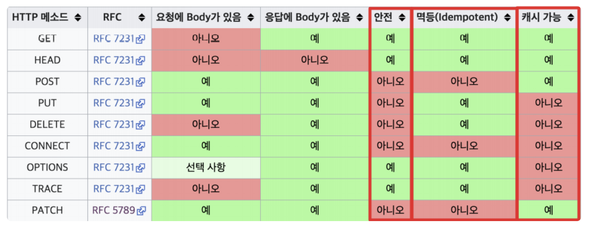

# REST method의 5가지 중 멱등성을 보장하는 메서드는 무엇이고 그 이유가 무엇인가요?(꼬리 질문)

***

HTTP 의 주요 메서드는 `GET` / `POST` / `PUT` / `PATCH` / `DELETE` 입니다.

## 안정성

***

> 보안 취약성이 아닌 **호출해도 리소스가 변경되지 않는 성질**을 의미한다. (시스템 장애로부터 안전하다 는 의미가 아니다 !!!)

- `GET` 메서드만 안전하다.

## 멱등성 (Idempotent)

***

> 연산을 여러 번 적용하더라도 결과가 달라지지 않는 성질

| 멱등성을 가진다. | ❌ |
| --- | --- |
| GET, PUT, DELETE | POST, PATCH |

요청을 **여러번** 호출해도 그 결과가 같음을 의미한다.

- **동일 요청을 한 번 보내는 것 == 여러번 연속으로 보내는것 ** 같은 효과를 가지고, 서버의 상태도 동일하게 남을 때 해당 HTTP 메서드가 멱등성을 가진다고 한다.

### GET의 멱동 ✅

> post 의 id 가 1인 게시글을 GET 메서드로 요청한다.

위의 요청은 여러 번 보내도 서버의 상태는 항상 동일하다.

만약 위에서 GET 시 해당 게시글의 조회수 데이터를 1 증가 시키고 이 글을 응답한다면, 이는 **HTTP 스펙에 부합하지 않게 API**를 구현했다고 한다.

-> 우리는 조회수 컬럼을 증가시키는 요청을 PATCH로 분리하는 것이 올바르다.

만약 중간에 다른 PUT 메서드로 결과가 달라졌다고 해서 멱등성이 깨지는 것이 아니라 이는 GET 에 의해 달라진 것이 아닌 PUT에 의해 변한 것이므로 올바른 방법이 맞다.

### DELETE의 멱등 ✅

> post 의 id 가 1인 게시글을 DELETE 메서드로 삭제 요청한다.

이는 여러번 요청해서 이 리소스는 삭제 상태 그대로이기 때문에 서버의 상태가 변하지 않는다.

! 멱등은 변경과 상관없이 여러번 호출해도 동일한가? 를 의미하는 것이다 !

만약 Delete 시 "마지막 게시글" 삭제를 위해서 `DELETE /posts/last` 로 설계했다.
-> 그러나 DELETE 시 계속적으로 마지막으로 존재하는 게시글이 삭제되기에 이는 멱등하지 않다 !! (옳지 않는 스펙, 이는 POST로 요청하는 것이 맞다.)

### POST의 멱등 ❎

서버로 데이터를 전송해 계속 새로운 자원을 생성하기에 여러번 요청하면 이에 따라 계속 서버의 상태가 변경된다.

만약 TIMEOUT 과 같은 문제로 정상 응답을 받지 못해 다시 요청하면 문제가 발생할 수 있다. (에러의 이유가 서버일 수도 아니면 요청은 정상 처리되었는데 인터넷의 문제일 수도 있음)

🤑 이것이 만약 돈과 관련된 내용이라면 중복 결제로 이어질 수 있다.

그렇기에 **복구 메커니즘**의 사용 가능에 따라 HTTP 멱등적인 속성은 설계의 중심이 된다.

### PUT의 멱등 ✅

PUT은 대상 리소스를 덮어씌워 변경하고 없다면 새로 추가한다.

리소스 없음 -> POST 와 동일

리소스 있음 -> 덮어씌움

만약 PUT 요청을 보냈는데 리소스가 없다면 `201 CREATED` 를 보내게 될 것이고, 기존 데이터를 덮어쓰면 `200 OK` 나 `204 No Content` 를 보내게 될 것이다. (즉, 멱등하다고 결과가 같은 것은 아니라는 뜻이다.)

### PATCH의 멱등 ✅ ❎

PUT은 전체 교체라면, PATCH는 부분 수정이다.

기본적으로는 멱등성을 가지지 않는데, 만약 PUT 처럼 할 구현할 경우는 멱등성을 가질수도 있다 !

📍 PUT과 PATCH 의 차이는 일부 교체 보다는 멱등을 보장하냐 안 하냐의 차이가 더 크다. !!

만약 일부 리소스만 변경되도록 설계했다면 **멱등한** 설계라 할 수 있다. (같은 요청도 계속 동일하게 나오기 때문)

PATCH 의 다른 특징으로 HTTP 스펙상 구현 방법에 대한 제한이 없다는 것인데, 그렇기에 요청에 따라 PUT 의 형태가 아니여도 된다는 소리이다.

만약 요청 시 count 가 증가되게 한다면, 여러 요청을 보내면 이에 따라 count 가 증가되기 때문에 멱등성이 깨진다.

## 캐시 가능성

> 응답 결과 리소스를 캐싱해서 효율적으로 사용할 수 있는가?

| 캐시 가능 | 불가능 |
| --- | --- |
| GET, POST, PATCH | PUT, DELETE |

캐시가 OS나 서버에만 있는 것이 아니라 브라우저 자체도 캐시 공간을 갖고 있기에 client 가 서버에 요청을 보낸 데이터에 대해서 다시 전송 필요가 없도록 브라우저가 임시적으로 가지고 있는 장소가 캐시이다.

스펙 상으로 GET, POST, PATCH 는 캐시가 가능하지만, 일반적으로는 POST 와 PATCH 는 지원되지 않는 것이 일반적이다.

(왜냐면 변경 가능하기 때문에)

