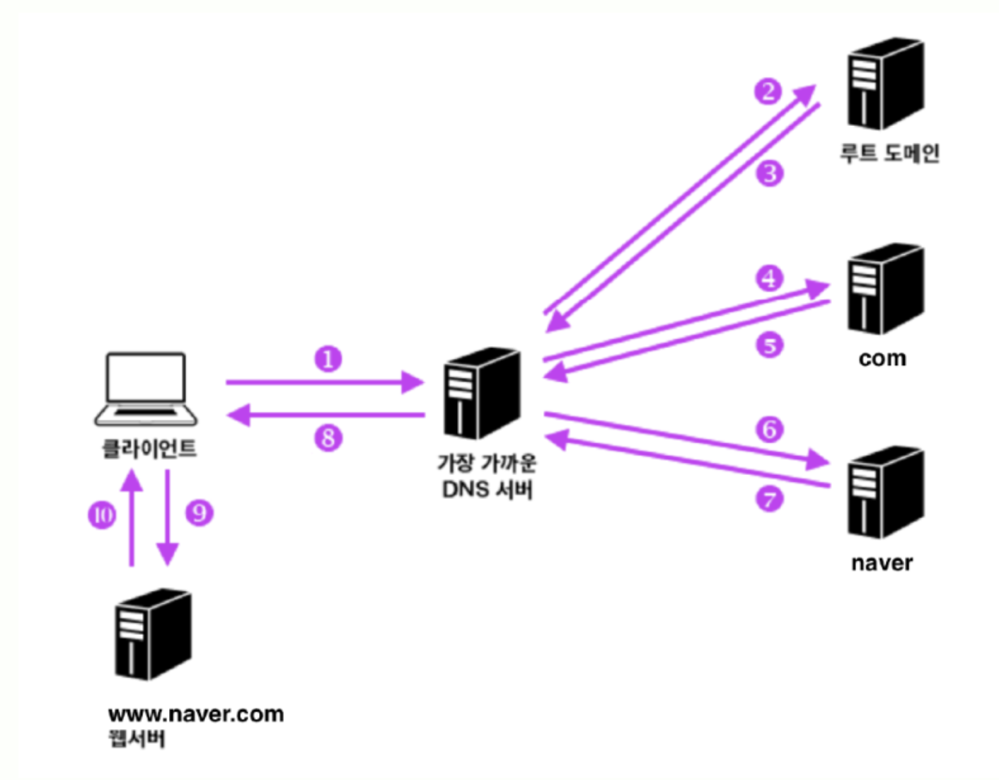
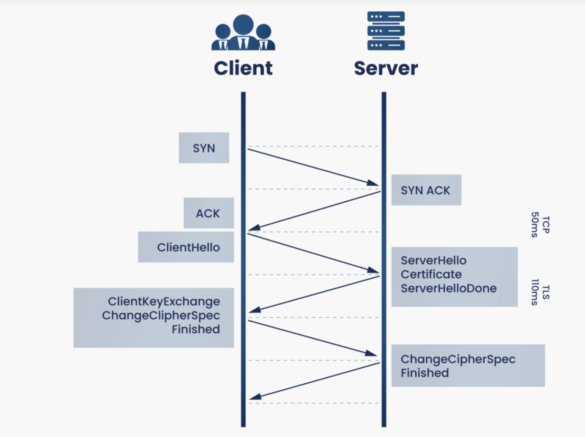

## https://www.google.com 을 접속 시 어떤 일이 일어나는지 설명해주세요.

브라우저에 https://www.google.com을 입력하면 먼저 DNS를 통해 해당 도메인이 어떤 IP를 가지는지 확인합니다.

이 과정에서 브라우저, OS, 라우터, ISP DNS 순으로 캐시를 먼저 확인하고, 없으면 Root DNS → TLD DNS → 권한 DNS 순으로 질의가 진행됩니다.

이때 권한 DNS 단계에서는 GSLB 로직을 통해 사용자 위치나 서버 상태를 기반으로 가장 적절한 서버 IP를 선택해서 반환합니다.

IP를 얻으면 해당 서버와 TCP 3-way handshake를 통해 연결을 생성합니다.

이후 HTTPS 연결이기 때문에 TLS Handshake를 통해 세션 키를 생성하고, 이후 모든 HTTP 통신은 해당 키로 암호화되어 전송합니다.

또한 CDN이 적용된 경우, HTML 자체 또는 정적 리소스는 CDN edge 서버를 통해 제공되어 더 빠르게 로딩됩니다.

</br>
</br>

### 1. 캐시 확인 (DNS Resolution 시작 전)

사용자가 URL을 입력하면 가장 먼저 브라우저는 DNS 조회 전에 캐시를 확인한다.

아래와 같은 순서로 캐시를 확인한다. (순서 지키기)

- 브라우저 캐시
    - 브라우저 내부 DNS 캐시 확인
    - 최근 방문한 도메인의 IP 저장
- OS 캐시
    - 운영체제 DNS 캐시 확인
    - hosts 파일 포함
    
    ```
    /etc/hosts
    ```
    
- 라우터 캐시
    - 공유기 / 로컬 네트워크 장비가 DNS 캐시를 가질 수 있음
    - 모든 환경에 존재하지는 않음
- ISP DNS (Recursive Resolver)
    - 실제 DNS 질의를 수행하는 서버
    - 클라이언트를 대신해 전체 DNS 조회 수행
    - ISP = Local DNS Server : 사용자와 가장 가까운 DNS 서버

</br>

### 2. DNS 질의 과정 (Recursive Query)



ISP DNS에 IP 정보가 없을 경우 계층적으로 질의를 진행한다.

- Root DNS Server
    - 최상위 DNS 서버
    - TLD DNS 서버의 위치를 알려줌 (TLD DNS 서버 IP 관리)
    
    ```
    요청 : www.google.com의 IP 알려줘
    Root DNS Server : .com 도메인은 여기 TLD DNS 서버로 가세요
    ```
    
- TLD DNS Server (.com)
    - 도메인 최상위 관리 서버
    - `.com` 영역 전체를 관리 → 하지만 google.com의 IP는 모름 → google.com의 권한 DNS의 서버를 알려줌
    
    ```
    요청 : google.com 어디 있음?
    TLD DNS Server : google.com은 Google 네임서버가 관리합니다
    									→ ns1.google.com
    									→ ns2.google.com
    ```
    
- Authoritative DNS Server (권한 DNS 서버)
    - 최종 도착지 서버
    - 실제 도메인 IP를 가지고 있는 서버
    - 도메인 운영자가 직접 관리 (도메인 호스팅 업체, 개인 서버)
    
    ```
    요청 : www.google.com IP 알려줘
    권한 DNS 서버 : www.google.com → 142.250.190.78
    ```
    
</br>

### 3. TCP 연결 (3-way handshake)

IP를 알았으면 실제 통신을 위해 TCP 연결을 생성한다.

- Client : SYN
    - 연결 요청
- Server : ACK + SYN
    - 클라이언트의 연결 요청을 확인했고(ACK) 서버도 연결을 시작하겠다는 메시지(SYN) 보냄
- Client : ACK
    - 서버의 ACK+SYN을 잘 받았고, 연결을 최종 확정한다는 의미

</br>

### 4. TLS Handshake

TCP 연결 이후, 클라이언트와 서버는 암호화 통신을 위해 키 교환 과정을 수행하고, 세션 키를 생성하여 이후 모든 HTTP 통신을 암호화한다.

**TLS 1.2**



- Client : Client Hello
    - 클라이언트가 서버에서 Client Hello 메시지를 전송함.
    - 지원 가능한 암호화 알고리즘(cipher suites), Client Random, Session ID 등을 전달한다.
    - Client Random은 이후 세션 키 생성에 사용되는 난수이다.
- Server : Server Hello
    - Client Hello에 대한 응답이다.
    - 서버가 지원 가능한 암호화 방식 중 하나를 선택해서 전달한다.
    - Server Random 값을 함께 전달한다.
- Server : Server Certificate
    - 서버 인증서(CA 서명 포함)를 클라이언트에 전달한다.
    - 클라이언트는 이를 통해 서버의 신원을 검증한다.
- Server : Server Hello Done
    - 서버 측 초기 핸드셰이크 메시지 전송 완료를 의미한다.
- Client : Client Key Exchange
    - 인증서 검증이 완료되면 키 교환 과정을 수행한다.
    - (대표적으로 RSA 방식 기준)
    - 클라이언트는 Pre-Master Secret을 생성한다.
    - 이 값을 서버의 공개키로 암호화하여 서버에 전달한다.
    - 이후 Client Random + Server Random + Pre-Master Secret을 기반으로 양쪽이 동일한 Session Key(대칭키)를 생성한다.
    - → 키를 직접 보내는 것이 아니라, 동일한 키를 만들 수 있는 재료를 공유하는 구조
- Server + Client : Change Cipher Spec
    - 이후부터는 협상된 암호화 알고리즘과 세션 키를 이용해 통신하겠다는 선언이다.
    - 실제 데이터 암호화 시작 시점을 의미한다.
- Server + Client : Finished
    - 핸드셰이크 전체 과정의 무결성을 검증하는 메시지이다.
    - 이후부터 암호화된 HTTP 통신이 시작된다.

**TLS 1.3**

- Client : Client Hello
    - 지원 가능한 암호화 방식(cipher suites)과 Client Random을 전달한다.
    - Key Share (ECDHE 공개값)를 함께 포함한다.
    - → 이미 키 교환 준비가 시작된 상태
- Server : Server Hello
    - 선택된 암호화 방식과 Server Random을 전달한다.
    - Server Key Share (ECDHE 공개값)를 포함한다.
    - → 이 단계에서 ECDHE 기반 Shared Secret 계산이 가능해진다
- Key Exchange (ECDHE)
    - Client와 Server는 서로의 Key Share를 이용해 동일한 Shared Secret을 계산한다.
    - 이 과정에서 RSA 기반 키 전달 방식은 제거되었다.
    - ECDHE : 서로 공개값만 교환하고, 각자 계산해서 같은 비밀키를 만드는 키 교환 방식
- Key Derivation
    - Client Random + Server Random + Shared Secret을 기반으로
    Session Key(대칭키)를 생성한다.
- Encrypted Handshake
    - 이후 핸드셰이크 메시지부터는 이미 암호화된 상태로 진행된다.
    - Server Certificate를 포함한 대부분의 handshake 메시지는 Server Hello 이후 생성된 키로 암호화되어 전달된다.
- Finished
    - 핸드셰이크 무결성을 검증한다.
    - 양쪽이 동일한 키를 생성했는지 확인 후, HTTPS 통신을 시작한다.

**그래서 무슨 차이지??**

- 키 교환 차이
    - TLS 1.2는 RSA / DH / ECDHE 등 여러 방식 중 하나를 선택해서 키를 교환하는 구조
    - TLS 1.3은 ECDHE로 통일하고 Client Hello 단계에서 Key Share를 미리 교환해 빠르게 Shared Secret을 생성하는 구조
- 인증서 차이
    - TLS 1.2는 인증서를 handshake 초반에 평문으로 전달하고 클라이언트가 이를 검증한다
    - TLS 1.3은 ECDHE로 키를 먼저 생성한 뒤 handshake 대부분을 암호화된 상태로 진행하며, 인증서 검증도 그 안에서 이루어진다

</br>

### 5. HTTP 통신

TLS Handshake로 암호화된 통신 채널이 만들어진 이후, 실제 웹 데이터를 주고받는다.

**HTTP 응답 구조**

클라이언트는 서버로 HTTP 요청을 보낸다.

```
GET / HTTP/1.1
Host: www.google.com
```

서버는 이에 대한 응답을 반환한다.

```
HTTP/1.1 200 OK
Content-Type: text/html

<html>...</html>
```

**연결 재사용(keep alive)**

- HTTP/1.1부터 기본적으로 TCP 연결을 유지(keep-alive) 한다 (매번 TCP 핸드쉐이크 하는건 느려지니깐)
- 하나의 TCP 연결로 여러 HTTP 요청/응답 처리 가능

**HTTP 버전별 차이**

- HTTP/1.1
    - keep-alive 기반
    - 요청은 순차 처리 (head-of-line blocking 발생)
- HTTP/2
    - 헤더 압축 → 성능 개선
    - Multiplexing 지원
    - HTTP/2는 Multiplexing을 통해 HTTP 레벨의 HOL(Head-of-Line Blocking) 문제는 해결했다.
        - 여러 HTTP 요청을 하나의 TCP 연결에서 동시에 처리 가능
    - 하지만 TCP 위에서 동작하기 때문에 TCP 레벨 HOL 문제는 여전히 존재한다.
        - TCP는 패킷의 순서를 보장하는 프로토콜이다.
        - 따라서 앞선 패킷이 유실되면 해당 패킷이 재전송될 때까지 이후 패킷도 처리할 수 없다.
- HTTP/3
    - TCP 대신 UDP 기반 QUIC 사용
    - TCP handshake + HOL 문제 해결

</br>

---

### GSLB (Global Server Load Balancing)

- 전 세계 데이터 센터, 서버 중에서 사용자에게 가장 **적합한 origin 서버를 선택**해주는 글로벌 트래픽 분산 기술이다.
- 사용자 위치(Geo Routing), 서버 상태(Health Check), 네트워크 지연, 트래픽 부하 등을 기반으로 최적의 서버를 선택한다.
- 예시 : 서울 서버 DOWN 되면 GSLB가 이를 감지해서 트래픽을 도쿄 서버로 보냄

**DNS 로드밸런싱 vs GSLB**

- DNS 로드밸런싱
    - 하나의 도메인에 대해 여러 IP를 등록하고, 요청마다 다른 IP를 반환하는 방식
    
    ```
    google.com → 1.1.1.1 / 2.2.2.2 / 3.3.3.3
    ```
    
    - DNS는 기본적으로 Health Check를 하지 않음 → 죽은 서버 IP를 줄 수도 있음 → 가용성 떨어짐
- GLSB
    - DNS의 한계를 해결하기 위해 등장
    - Authoritative DNS가 응답하는 과정에서 GSLB 로직을 사용해 최적의 IP를 선택한다

```
Client
  ↓
Root DNS
  ↓
TLD DNS
  ↓
Authoritative DNS
        ↓
     GSLB 로직 (최적 IP 선택)
        ↓
   최종 IP 반환
```

</br>

### CDN (Content Delivery Network)

- 이미지, CSS, JS 같은 정적 컨텐츠를 사용자와 가까운 **edge 서버에 저장하여 빠르게 전달**하는 시스템이다.
- 전 세계에 분산된 캐시 서버
- 원본 서버의 부하가 감소, 응답 속도 향상이라는 이점이 있음

```
User → CDN Edge 서버
            ↓ hit
         바로 응답

            ↓ miss
     Origin 서버에서 가져와 캐싱 후 응답
```