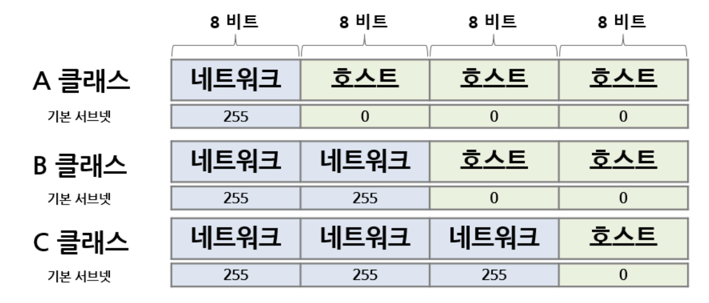

## IP 주소에 대해서 서브넷 마스크 까지 설명해주세요.

IP 주소는 네트워크 상에서 장비를 식별하는 32비트 주소이고, 네트워크 부분과 호스트 부분으로 나뉩니다.

이때 서브넷 마스크는 이 둘을 구분하는 기준으로, 네트워크 부분은 1, 호스트 부분은 0으로 표현되며 IP와 AND 연산으로 네트워크 주소를 계산합니다. 예를 들어 /24는 앞 24비트가 네트워크 영역이라는 의미입니다.

초기 클래스풀 방식은 네트워크 크기가 고정되어 IP 낭비가 발생했기 때문에, 이를 해결하기 위해 CIDR 방식이 도입되었고 서브넷 마스크를 통해 네트워크 크기를 유동적으로 나눌 수 있게 되었습니다.

</br>
</br>

### **IP 주소**

네트워크 상에서 호스트(장비)를 식별하는 논리적인 주소이다.

```
192.168.1.1
```

**특징**

- 8비트로 총 4옥텟이라서 32비트로 이루어져있다.
- [네트워크 주소 + 호스트 주소]로 구성되어 있다.
    - 네트워크 주소 : 어느 네트워크인가
    - 호스트 주소 : 해당 네트워크 내의 어떤 장비인가

**주소 공간 한계**

- 32비트로 이루어져 있어서 2^32 = 약 43억개의 주소만 가질 수 있음
- 전 세계 기기 증가로 인해 주소 부족 문제가 발생!!

</br>

### **클래스풀 방식**

초기 IP 할당 방식이다. IP를 고정된 범위(Class)로 나누는 방식을 말한다.



**문제점**

- 네트워크 크기가 고정되어 IP 주소가 낭비되는 문제
- 예를 들어, 직원이 100명인 회사에서 B 클래스를 사용한다고 했을 때, 호스트 주소 100개만 필요한데 Class B는 수만개의 호스트 주소를 제공한다.

</br>

### **CIDR**

클래스 개념을 없애고, 필요한 만큼 네트워크 크기를 유동적으로 설정하는 방식이다.

```
192.168.0.0/24
```

→ 뒤에 붙은 24가 ‘서브넷 마스크’다.

**장점**

- IP 낭비 감소
- 네트워크 크기 유연하게 조절 가능
- 라우팅 테이블 효율 개선

**서브넷 마스크**

- IP 주소에서 네트워크 부분과 호스트 부분을 구분하는 기준
- 네트워크 주소를 1, 호스트 주소를 0으로 표현
- 255.255.255.0 또는 /24로 표현

```
IP:   11000000.10101000.00000000.00001010
Mask: 11111111.11111111.11111111.00000000
```

- IP 주소와 Mask를 AND 연산해서 네트워크 주소를 계산할 수 있다.
- 네트워크 주소 : 해당 네트워크의 첫 주소
- 브로드캐스트 주소 : 해당 네트워크의 마지막 주소

**왜 서브넷이 필요할까?**

1. 네트워크 분리

조직이나 서비스 단위로 네트워크를 나눠서 관리하기 위해

예를 들어

- 개발팀 네트워크 (192.168.1.0/24)
- 운영팀 네트워크 (192.168.2.0/24)
- DB 서버 네트워크 (192.168.3.0/24)

→ 서로 다른 역할의 시스템을 물리적으로 분리하지 않고도 논리적으로 분리 가능하고, 보안 정책 적용이 쉬워진다.

1. 브로드캐스트 트래픽 감소

같은 네트워크 안에서는 브로드캐스트가 전체로 전파된다.

예:

- 1,000대가 있는 하나의 네트워크 → 브로드캐스트 1,000대 모두 수신
- 서브넷으로 100대씩 나누면 → 100대만 수신

→ 네트워크가 커질수록 불필요한 트래픽이 급증하는 문제 해결

1. IP 자원 효율화

필요한 만큼만 IP를 할당할 수 있다.

1. 라우팅 효율 증가

라우터는 개별 IP가 아니라 네트워크 단위로 라우팅 테이블을 관리한다.

```
192.168.0.0/16 → A 라우터
192.168.1.0/24 → B 라우터
```

→ 서브넷을 사용하면 라우팅 테이블이 단순해지고, 트래픽 경로 판단이 빨라짐