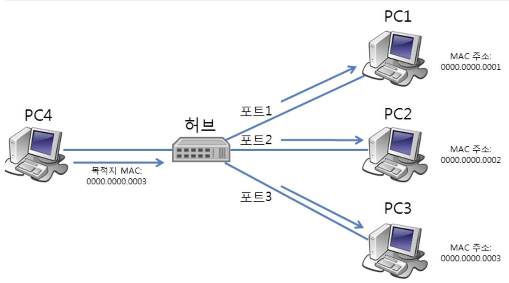
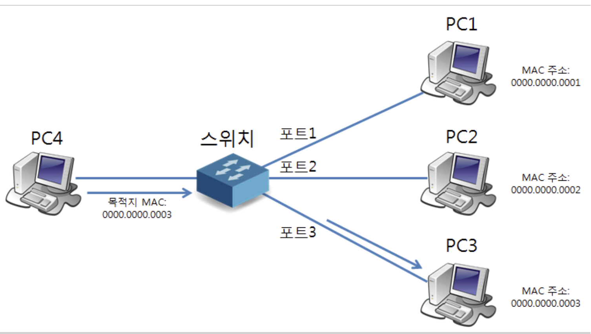
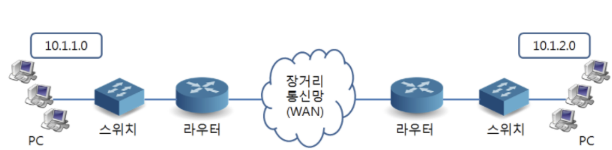

## 허브, 스위치, 라우터에 대해 간략히만 설명해주세요.

네트워크 장비는 데이터를 전달하는 기준에 따라 허브, 스위치, 라우터로 구분됩니다.

허브는 물리 계층(L1) 장비로, 들어온 데이터를 목적지 구분 없이 모든 포트로 전달합니다. 그래서 불필요한 트래픽이 많고 충돌이 발생할 수 있습니다.

스위치는 데이터 링크 계층(L2) 장비로, MAC 주소 테이블을 이용해 목적지 MAC 주소가 연결된 포트로만 프레임을 전달합니다. 따라서 허브보다 네트워크 효율이 높습니다.

라우터는 네트워크 계층(L3) 장비로, IP 주소를 기반으로 서로 다른 네트워크 간 패킷을 전달합니다. 예를 들어 서로 다른 서브넷에 있는 장비들이 통신할 때는 반드시 라우터를 거쳐야 합니다.


</br>
</br>

### 허브

- 여러 장비를 하나의 네트워크로 단순 연결해주는 ‘물리 계층' 장비이다.
- 플러딩(flooding) : 들어온 데이터를 받은 포트 제외하고 모든 포트로 다 전송함



**문제점**

- 모든 장비가 불필요한 데이터를 수신
- 네트워크 사용량 증가
- 충돌(Collision) 발생 가능
- 보안 취약

</br>

### 스위치

허브의 비효율성을 개선하기 위해 등장

- 같은 네트워크 내부에서 장비 간 통신을 효율적으로 중계하는 ‘데이터 링크 계층’ 장비이다.
- MAC 주소 기반 동작
- MAC 주소와 포트가 기록된 MAC 주소 테이블이 있음
- 예시 : PC1 → PC3 으로 데이터를 보낼 때, 스위치는 MAC 테이블을 조회한 뒤 PC3가 연결된 포트로만 프레임을 전송함



**특징**

- 브로드캐스트, 멀티캐스트, 목적지를 모르는 유니캐스트 프레임을 수신하면 플러딩을 수행한다.

**MAC 주소 테이블**

| MAC 주소 | 포트 |
| --- | --- |
| AA:AA:AA:AA:AA:01 | Port 1 |
| BB:BB:BB:BB:BB:02 | Port 2 |
| CC:CC:CC:CC:CC:03 | Port 3 |

예를 들어, PC1 (AA:AA...) → PC3 (CC:CC...)라고 한다면 스위치는 목적지 주소인 CC:CC...를 조회해서 Port3 정보를 얻고, 해당 포트로만 프레임을 전송한다.

</br>

### 라우터

- 서로 다른 네트워크를 연결하고, 패킷의 경로를 결정하는 ‘네트워크 계층’ 장비이다.
- IP 주소 기반 동작
- 라우팅 테이블을 참고하여 패킷 전달



**왜 라우터가 필요할까??**

예시

```
PC1 : 192.168.1.10/24
PC2 : 192.168.2.10/24
```

는 서로 다른 네트워크에 속한다.

PC1은 목적지 IP를 보고 ‘192.168.2.10은 내 네트워크가 아니네?’라고 판단한다.

따라서 직접 보내지 않고 기본 게이트웨이(라우터)로 패킷을 전달한다.

라우터는 목적지 네트워크를 확인한 후 적절한 경로로 패킷을 전달한다.

**라우터 테이블**

| 목적지 네트워크 | 다음 홉(Next Hop) | 인터페이스 |
| --- | --- | --- |
| 192.168.1.0/24 | Direct | eth0 |
| 192.168.2.0/24 | Direct | eth1 |
| 0.0.0.0/0 | 10.0.0.1 | eth2 |

위의 예시에 라우터 테이블이 이렇게 있다면, 192.168.2.10 이랑 192.168.2.0/24 이랑 매칭이 되어 eh1 인터페이스로 패킷을 전달하여 PC2까지 전송하게 된다.

---