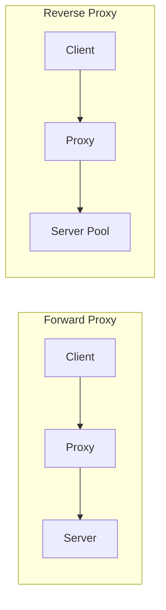
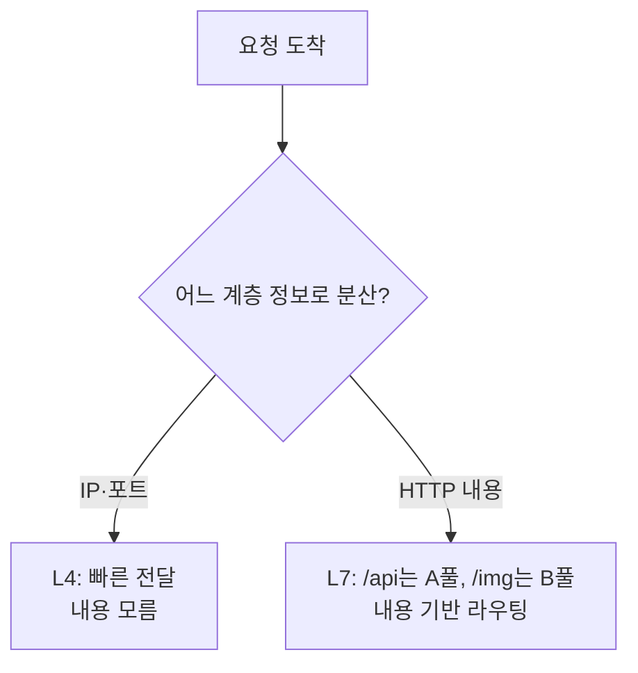

# 로드밸런서와 프록시의 차이

> - 프록시는 클라이언트와 서버 사이에서 요청을 중계하는 포괄적 개념이고, 로드밸런서는 그 중 리버스 프록시가 부하 분산에 특화된 형태
> - 프록시는 중계·은닉·캐싱·보안이 목적이고, 로드밸런서는 다수 서버로의 트래픽 분산이 목적
> - 동작 계층에 따라 L4(전송 계층, IP·포트 기반)와 L7(응용 계층, HTTP 내용 기반)로 나뉨

## 프록시의 개념

프록시(Proxy)는 클라이언트와 서버 사이에서 요청을 대신 받아 전달하는 중계자다. 어느 쪽을 대리하느냐에 따라 둘로 나뉜다.

|  구분   |    Forward Proxy     |     Reverse Proxy     |
|:-----:|:--------------------:|:---------------------:|
| 대리 대상 |       클라이언트 측        |         서버 측          |
|  위치   |   클라이언트 앞 (사내망 출구)   |    서버 앞 (데이터센터 입구)    |
| 은닉 대상 |  서버 입장에서 클라이언트를 가림   |   클라이언트 입장에서 서버를 가림   |
| 대표 용도 | 사내 트래픽 통제, 캐싱, 접근 제어 | 부하 분산, SSL 종료, 캐싱, 보안 |

로드밸런서는 이 중 리버스 프록시에 해당하며, 여러 서버로 요청을 분산하는 역할에 특화된 형태다.

## 로드밸런서와 프록시의 관계

로드밸런서는 리버스 프록시의 일종이지만, 모든 리버스 프록시가 로드밸런서인 것은 아니다.

|   관점    |   일반 리버스 프록시    |        로드밸런서        |
|:-------:|:---------------:|:-------------------:|
|  주된 목적  | 중계·캐싱·보안·SSL 종료 |   다수 서버로의 트래픽 분산    |
|  대상 서버  |   보통 단일 또는 소수   |   동일 역할의 서버 풀(다수)   |
|  헬스 체크  |       선택적       |  필수 (장애 서버 자동 제외)   |
| 분산 알고리즘 |       없음        | 라운드로빈·최소 연결 등 핵심 기능 |

실무에서는 Nginx처럼 하나의 소프트웨어가 리버스 프록시이자 로드밸런서로 동시에 기능하기 때문에 경계가 흐릿하지만, 개념적으로는 목적이 부하 분산이냐 아니냐에 따라 구분할 수 있다.

## L4 vs L7 로드밸런서

로드밸런서가 어느 계층의 정보를 보고 분산하느냐에 따라 성격이 크게 달라진다.

|   구분   |   L4 (Transport)   |       L7 (Application)       |
|:------:|:------------------:|:----------------------------:|
| 판단 기준  | IP·포트 (TCP/UDP 헤더) |  HTTP 헤더·URL·쿠키·메서드 (페이로드)   |
| 처리 비용  |   낮음 (패킷 헤더만 검사)   |     높음 (페이로드 파싱·복호화 필요)      |
| 가능한 분산 |    포트 단위 단순 분산     | URL 경로별 라우팅, A/B 테스트, 카나리 배포 |
| 대표 예시  |  AWS NLB, L4 스위치   | Nginx, AWS ALB, API Gateway  |

- L4는 패킷 헤더만 보고 빠르게 전달하므로 처리량이 높지만, 요청 내용을 기반으로 한 정교한 라우팅은 불가능
- L7은 HTTP 본문까지 들여다보므로 경로·헤더 기반 라우팅, SSL 종료, 콘텐츠 캐싱이 가능하지만 그만큼 비용이 큼

대표 예시를 풀어보면 다음과 같다.

- AWS NLB (L4): 들어온 TCP 연결의 서버를 결정하는 AWS의 네트워크 로드밸런서
    - 내용은 안 보고 IP·포트만 보고 분산하므로, HTTP가 아닌 다른 프로토콜도 처리 가능
- Nginx / AWS ALB (L7): 가장 흔히 쓰는 웹 서버·애플리케이션 로드밸런서
    - `/api`는 백엔드 서버 풀로, `/static`은 정적 파일 서버로 보내는 식의 URL 기반 라우팅이 핵심.
- API Gateway (L7): 인증·요청 변환·라우팅까지 처리하는 진입점
    - HTTP 내용을 깊게 들여다봐야 하므로 L7 로드밸런서에 해당하며, API별로 다른 백엔드로 라우팅하거나 인증·인증서 관리 같은 부가 기능도 수행

## 로드밸런서와 추상화

로드밸런서의 큰 장점으로는 단일 엔드포인트 뒤에 서버 풀을 추상화하는 것이다.

- 클라이언트는 로드밸런서의 IP 하나만 알면 되고, 뒤에 서버가 1대인지 100대인지 알 필요가 없음
- 서버를 추가·제거하거나 장애가 발생해도 클라이언트가 보는 엔드포인트는 변하지 않음 → 무중단 확장·배포의 기반
- 이 추상화 덕분에 서버 풀은 자유롭게 스케일 아웃/인 할 수 있고, 개별 서버의 생명주기가 클라이언트와 분리됨
