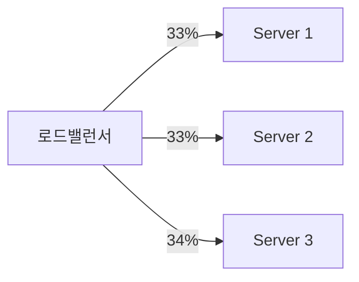
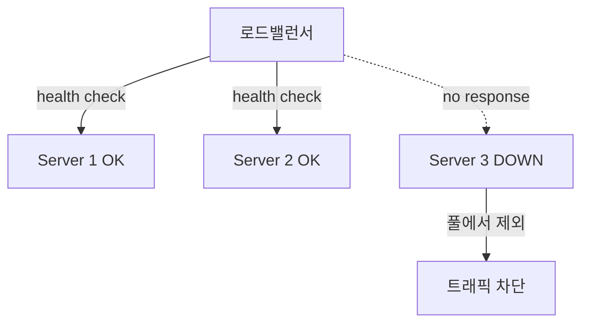

# 로드밸런서의 역할

> - 핵심 역할 셋은 부하 분산, 고가용성(헬스 체크·장애 격리), 확장성(무중단 스케일링)

## 1. 부하 분산 (Load Distribution)

가장 본질적인 역할로, 들어오는 요청을 여러 서버에 나눠 한 서버에 부하가 몰리는 것을 막는다.

- 단일 서버의 처리 한계(CPU·메모리·커넥션)를 넘는 트래픽을 여러 서버로 분산
- 라운드로빈·최소 연결 등 알고리즘으로 각 서버의 부하를 균형 있게 유지
- 특정 서버에 핫스팟이 생기지 않도록 트래픽을 고르게 배치

## 2. 고가용성 (High Availability)

로드밸런서는 헬스 체크로 서버 상태를 주기적으로 점검하여, 장애 서버를 자동으로 분산 대상에서 제외한다.

|   방식    |             동작              |        비용/정확도        |
|:-------:|:---------------------------:|:--------------------:|
| L4 헬스체크 |     TCP 연결 수립 가능 여부 확인      |  가벼움 / 프로세스 생존만 확인   |
| L7 헬스체크 | `/health` 같은 엔드포인트에 HTTP 요청 | 무거움 / 애플리케이션 동작까지 확인 |

- 헬스 체크에 실패한 서버를 풀에서 빼내 정상 서버로만 트래픽을 보냄 (Failover)
- 서버 한 대가 죽어도 서비스가 중단되지 않으므로, 단일 장애점(SPOF)을 서버 풀로 분산하는 효과
- 단, 로드밸런서 자체가 새로운 SPOF가 되므로 보통 Active-Standby나 다중화로 이중화

## 3. 확장성 (Scalability)

클라이언트에 영향을 주지 않고 서버를 늘리거나 줄일 수 있다.

- 트래픽 증가 시 서버를 풀에 추가(scale-out)하면 로드밸런서가 자동으로 분산 대상에 포함
- 새 서버를 먼저 띄우고 → 헬스 체크 통과 후 트래픽 투입 → 구 서버를 제외하는 방식으로 무중단 배포(롤링·블루그린) 구현
- 오토스케일링과 결합해 부하에 따라 서버 수를 자동 조절

## 부가적으로 수행하는 역할

세 핵심 역할 외에도 L7 로드밸런서는 여러 부가 기능을 담당한다.

|         역할          |                  설명                  |
|:-------------------:|:------------------------------------:|
| SSL/TLS Termination |  로드밸런서에서 복호화하여 백엔드 부담 경감, 인증서 일괄 관리  |
|   세션 유지 (Sticky)    |    같은 클라이언트를 같은 서버로 고정 (쿠키·IP 기반)    |
|     콘텐츠 기반 라우팅      | URL·헤더로 요청을 적절한 서버 풀로 분기 (MSA 게이트웨이) |
|         캐싱          |       정적 응답을 캐시하여 백엔드 요청 수 감소        |
