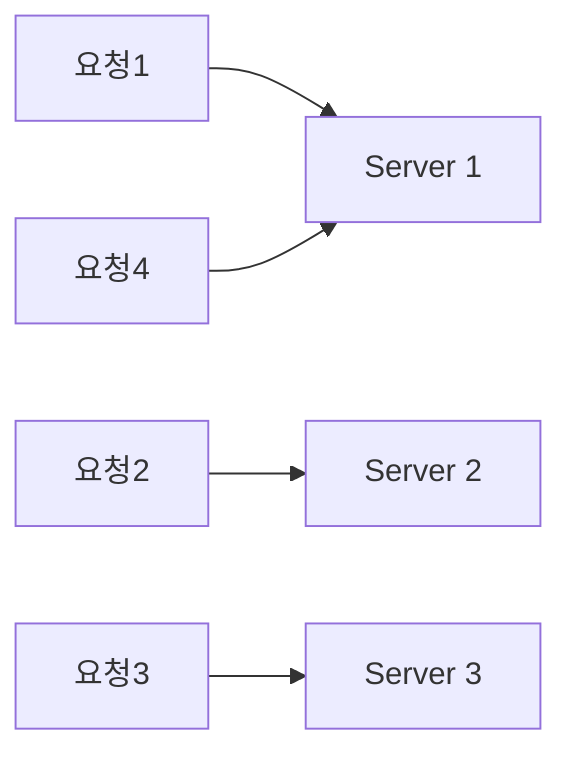
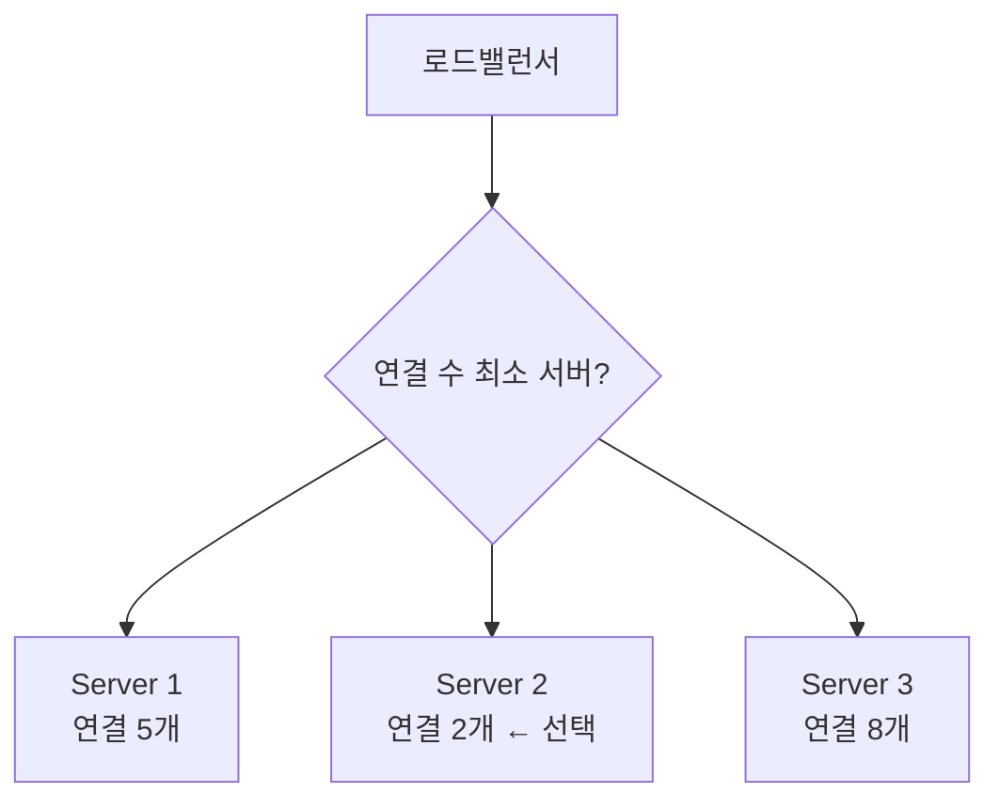

# 로드 밸런싱 알고리즘 - 정적 vs 동적

> - 정적 알고리즘은 서버의 실시간 상태를 보지 않고 미리 정한 규칙으로만 분산 (라운드로빈, 가중 라운드로빈, IP 해시)
> - 동적 알고리즘은 서버의 현재 부하(연결 수·응답 시간)를 반영해 분산 (최소 연결, 최소 응답 시간)

## 정적 vs 동적 구분

|   구분    |      정적 (Static)       |       동적 (Dynamic)        |
|:-------:|:----------------------:|:-------------------------:|
|  판단 근거  |   사전 정의된 규칙·가중치 (고정)   |  서버의 실시간 상태 (연결 수·응답 시간)  |
|  상태 추적  |          불필요           |     필요 (각 서버 상태 모니터링)     |
|   비용    |           낮음           |    높음 (상태 수집·계산 오버헤드)     |
|   적응성   |      서버 부하 편차에 둔감      |       부하 변화에 즉각 적응        |
| 대표 알고리즘 | 라운드로빈, 가중 라운드로빈, IP 해시 | 최소 연결, 가중 최소 연결, 최소 응답 시간 |

## 정적 알고리즘 — 라운드로빈 (Round Robin)

서버 목록을 순서대로 돌아가며 요청을 하나씩 배정하는 가장 단순한 방식이다.

- 요청을 `1 → 2 → 3 → 1 → 2 → 3 ...` 순으로 균등하게 배정
- 서버 상태를 추적하지 않으므로 구현이 단순하고 오버헤드가 거의 없음
- 서버 성능이 동일하고 요청 처리 비용이 균일한 환경에서 효과적
- 한계: 서버 성능 차이나 요청별 처리 시간 편차를 반영하지 못함 → 이를 보완한 것이 가중 라운드로빈(성능 좋은 서버에 더 많은 가중치 부여)

## 동적 알고리즘 — 최소 연결 (Least Connection)

현재 활성 연결 수가 가장 적은 서버에 새 요청을 보내는 방식이다.

- 각 서버가 처리 중인 연결 수를 추적하여, 가장 요청이 적은 서버로 새 요청 전송
- 요청마다 처리 시간이 들쭉날쭉한 환경(긴 커넥션, 무거운 쿼리)에서 라운드로빈보다 부하가 고르게 분산됨
- 비용: 모든 서버의 실시간 연결 수를 추적해야 하므로 라운드로빈보다 무거움

#### 동적 알고리즘과 분산 환경

최소 연결은 "한 LB가 모든 연결 수를 안다"는 전제에서 정확하다. 로드밸런서가 여러 대로 다중화되면 각 LB는 자기가 보낸 연결만 알고 전역 상태를 모르므로, 최소 연결이 제대로 작동하지 않을 수 있다.

- 여러 LB가 각자 하나의 서버를 동시에 골라 같은 서버로 몰리는 쏠림 발생
- 그래서 대규모에서는 전역 상태에 의존하지 않는 확률적 방식이 오히려 안정적일 수 있음

## 그 외 알고리즘

|        알고리즘         | 분류 |                핵심                |
|:-------------------:|:--:|:--------------------------------:|
|       IP Hash       | 정적 | 클라이언트 IP를 해싱해 같은 서버로 고정 (세션 유지)  |
|      가중 라운드로빈       | 정적 |      서버 성능에 비례해 라운드로빈 비율 조정      |
| Least Response Time | 동적 | 연결 수 + 응답 시간을 함께 고려해 가장 빠른 서버 선택 |
|   Least Bandwidth   | 동적 |    현재 트래픽(Mbps)이 가장 적은 서버 선택     |

선택 기준은 트래픽 특성에 달려 있으며, 요청 처리 비용이 균일하면 정적(라운드로빈)으로 충분하고, 요청별 부하 편차가 크면 동적(최소 연결·최소 응답 시간)이 유리하다.
