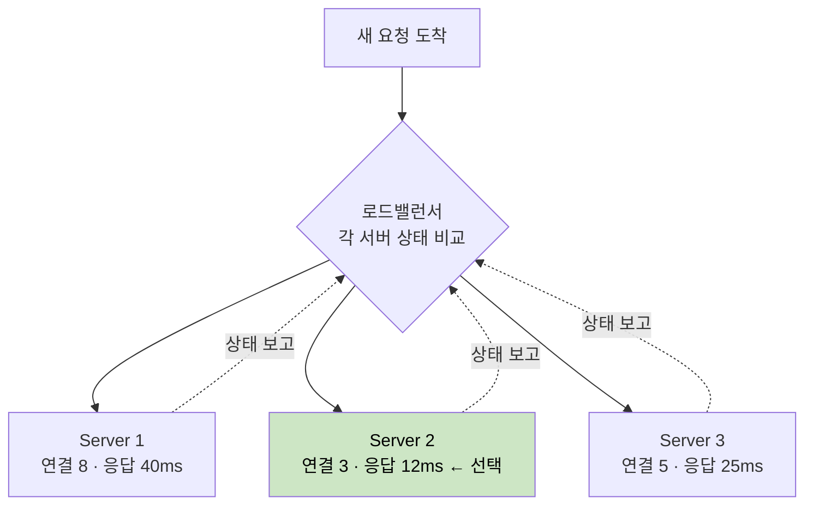
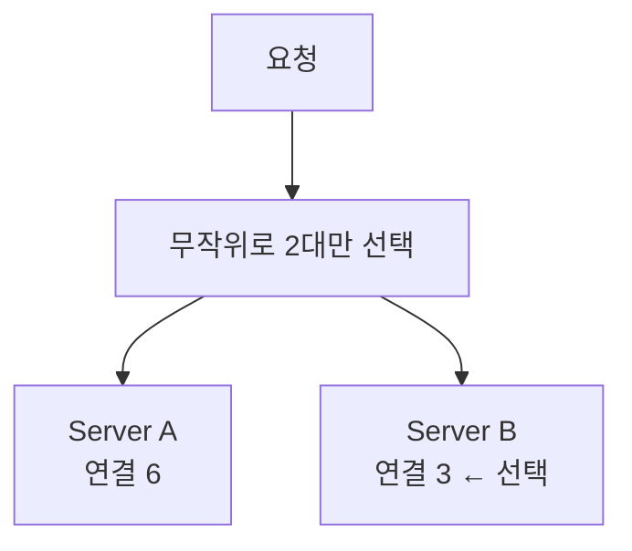
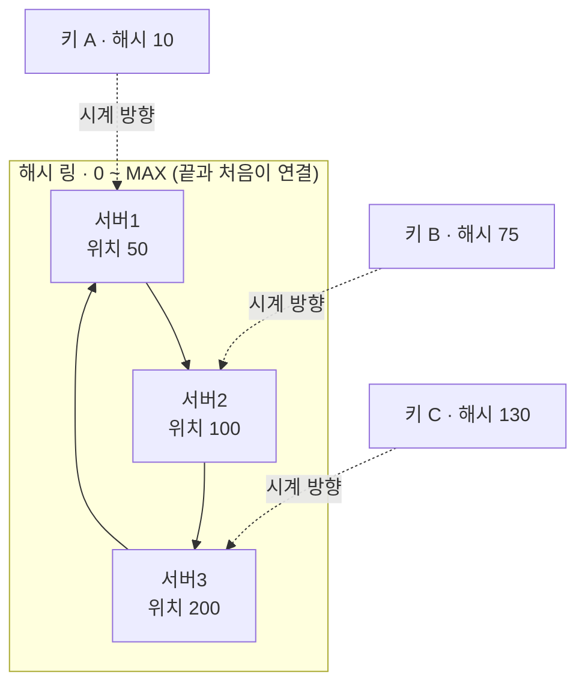
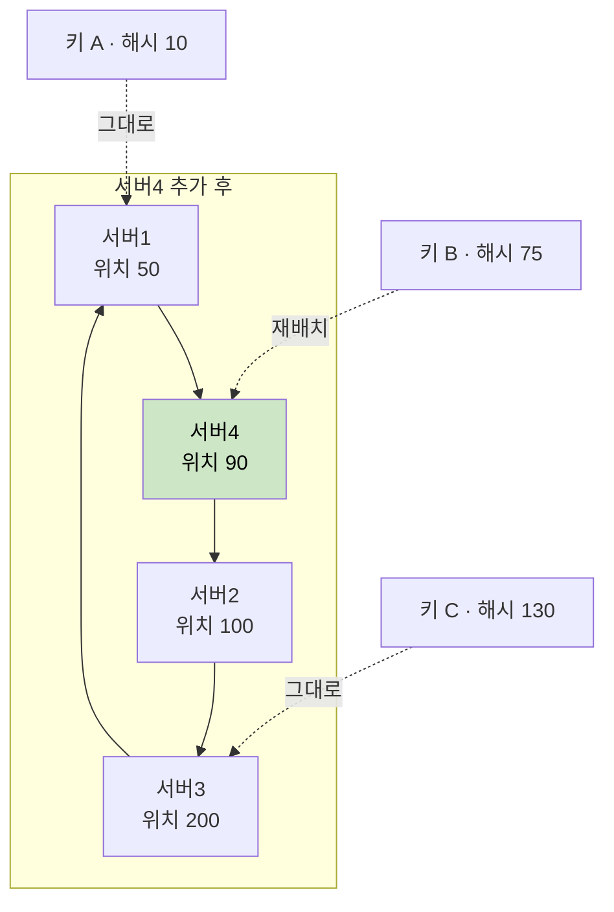

# 섬세한 밸런싱을 위한 해결 방안

> - 가중치(성능 차 보정), 최소 연결·최소 응답 시간(실시간 부하 반영)으로 분산을 정교화
> - 대규모에서는 모든 서버를 비교하는 비용이 부담 → P2C(Power of Two Choices)로 비교 비용을 줄이면서 효과 유지

## 단순 분산의 한계

라운드로빈처럼 단순한 분산은 모든 서버와 모든 요청이 동일하다고 가정하지만, 실제 환경에서는 그 전제가 거의 성립하지 않는다.

- 서버 성능이 제각각 (구형/신형 인스턴스 혼재)
- 요청마다 처리 비용이 다름 (단순 조회 vs 무거운 집계 쿼리)
- 커넥션 유지 시간이 다름 (즉시 응답 vs 장시간 스트리밍)

이 현상을 막기 위해서 서버의 실제 상태를 적당한 수준에서 반영하는 섬세한 분산이 필요하다.

- 디테일을 더할수록 트래픽이 고르게 분산되어 전체 처리량과 응답 시간이 개선
- 하지만 그만큼 상태 추적과 계산 비용이 늘어나므로, 트래픽 특성에 맞는 적절한 정교함을 선택하는 것이 중요

## 1단계 — 가중치로 성능 차 보정

서버 성능이 다르면 가중 라운드로빈·가중 최소 연결로 성능에 비례한 트래픽을 배정한다.

- 고성능 서버에 높은 가중치를 부여해 더 많은 요청을 받게 함
- 예: 8코어 서버에 가중치 2, 4코어 서버에 가중치 1 → 두 서버가 2:1 비율로 요청을 나눠 가짐

가중치를 미리 정하는 방식은 평균적인 성능 차이는 보정하지만, 실시간 부하 변화는 반영하지 못한다.

- 평균적인 성능 차는 잘 보정하지만, 그 순간의 실시간 부하는 알지 못함
- 부하 패턴이 바뀌면 가중치를 다시 손봐야 하는 수동 운영 부담이 남음

## 2단계 — 실시간 부하 반영

실시간으로 서버 상태를 보고 분산하는 동적 알고리즘은 서버마다 현재 부하를 추적하여, 가장 여유로운 서버로 새 요청을 보낸다.

- 연결이 오래 잡혀 있음 = 아직 처리가 끝나지 않았다는 신호
- 따라서 연결 수가 적은 서버일수록 여유가 있다고 판단

|        알고리즘         |           기준            |         적합한 상황          |
|:-------------------:|:-----------------------:|:-----------------------:|
|  Least Connection   |     활성 연결 수가 최소인 서버     |   요청별 처리 시간 편차가 큰 경우    |
| Least Response Time | 응답 시간(+연결 수)이 가장 빠른 서버  |  서버 성능·상태가 시시각각 변하는 경우  |
|     EWMA 기반 가중      | 최근 응답 시간을 지수가중이동평균으로 추적 | 순간 튀는 값에 흔들리지 않는 안정적 분산 |

응답 시간 기반 동적 분산은 보통 단순 평균이 아니라 EWMA(지수가중이동평균)로 응답 시간을 추적한다.

- 단발성 측정값의 노이즈를 걸러 내기 위함
- 응답 시간이 한 번 우연히 튀어도 그 순간의 상태로 판단하지 않고, 최근 추세를 부드럽게 반영

실제로 이 방식을 기본 로드밸런싱 정책으로 채택한 사례가 많다.

## 3단계 — 대규모에서의 비교 비용 절감 (P2C)

2단계의 최소 연결·최소 응답 시간은 한 대의 LB가 모든 서버의 상태를 정확히 안다는 전제에서 가장 잘 동작하지만, 서버가 수백 대로 늘고 LB도 여러 대로 나뉘면 이 전제가 두 가지 이유로 깨진다.

- 비교 비용: 요청 하나를 보낼 때마다 전체 서버를 훑어 가장 한가한 곳을 찾아야 하므로, 서버가 많을수록 비용이 선형적으로 증가
- 쏠림(herd behavior): 여러 LB가 같은 순간 한 대를 똑같이 지목 → 상태가 갱신되기 전에 요청이 몰려 과부하

P2C(Power of Two Choices)는 이 둘을 한 번에 푸는 단순한 발상으로, 전체를 비교하지 않고 무작위로 딱 2대만 뽑아 그중 덜 바쁜 쪽을 고른다.

- 비교 대상이 항상 2대뿐이라, 서버가 몇 대든 선택 비용이 일정
- 매 요청마다 뽑히는 2대가 달라져, 모두가 같은 서버로 몰리는 쏠림이 사라짐
- Nginx(`random two` 디렉티브), Envoy 같은 서비스 메시, Twitter Finagle 등이 채택

## 4단계 — 상태 보존이 필요할 때

같은 사용자의 요청을 늘 같은 서버로 보내야 하는 특수한 상황이 있다.

- 세션을 서버 메모리에 들고 있거나, 그 서버에 쌓인 로컬 캐시를 재활용해야 하는 경우
- 이렇게 "같은 키는 같은 서버로"가 중요한 성질을 지역성(locality)이라 하며, 이때는 부하가 아니라 키(사용자 ID 등)를 기준으로 분산

가장 단순한 방법은 키를 해시해 서버 수로 나눈 나머지로 서버를 정하는 `hash(key) % N`이다.

- 평소엔 키가 고르게 흩어지지만, 서버 수 N이 바뀌면 나머지 값이 통째로 달라져 거의 모든 키의 목적지가 변함
- 서버 4대(`% 4`)에서 5대(`% 5`)로 늘리면 키의 약 80%가 다른 서버로 재배치 → 캐시라면 대규모 캐시 미스, 세션이라면 대규모 로그아웃으로 직결

### Consistent Hashing

서버 한 대 늘렸을 뿐인데 거의 전부가 이사 가는 이 문제를 막는 것이 안정 해싱(Consistent Hashing)이다.

#### 기존 (서버 3대)

각 키는 시계 방향으로 가장 먼저 만나는 서버에 배정된다.

#### 결과 (서버4를 위치 90에 추가)

새로 75~90 구간을 맡아 키 B만 서버4로 옮겨 가고, 키 A·C는 그대로다.

두 그림을 비교하면 안정 해싱의 핵심이 드러난다 — 서버가 추가·제거돼도 영향받는 키는 인접 구간으로만 한정되어, 재배치량이 전체의 `1/N` 수준에 그친다.

다만 안정 해싱도 인기 키가 한쪽에 몰리면 특정 서버만 과부하되는 약점(hot spot)이 있다.

- 보완책: Consistent Hashing with Bounded Loads
- 각 서버에 부하 상한(예: 전체 평균의 1.25배)을 두고, 상한을 넘으면 링에서 다음 서버로 넘김
- 지역성은 최대한 지키면서 한 서버로의 과도한 쏠림은 막는 절충

## 정리 — 트레이드오프

|     방안     |       장점        |        단점        |
|:----------:|:---------------:|:----------------:|
|    가중치     |     성능 차 보정     |   수동 설정·재조정 부담   |
| 동적(최소연결 등) |    실시간 부하 균형    |    상태 추적 오버헤드    |
|    P2C     | 대규모에서 저비용·쏠림 완화 |  전역 최적은 아닌 근사 해  |
|   안정 해싱    |    상태 지역성 보존    | 부하 균일도가 떨어질 수 있음 |

- 요청·서버가 균일하면 굳이 동적 알고리즘을 쓸 이유가 없음
- 규모가 커지면 정확함(전체 비교)보다 확률적 근사(P2C)가 오히려 안정적
- 따라서 트래픽 특성에 맞는 최소한의 정교함을 택하는 것이 핵심

---

## 꼬리 질문 - 로드밸런싱을 도입한 경험과 이유

서버 사이드로는 AWS ALB(Application Load Balancer), 클라이언트 사이드로는 Spring Cloud LoadBalancer를 사용해봤다.

- 서버 사이드: 클라이언트와 서버 풀 사이에 둔 중앙 LB(ALB)가 분산을 담당
- 클라이언트 사이드: 호출하는 서비스가 인스턴스 목록을 직접 들고 한 대를 골라 호출

### ALB (서버 사이드)

인스턴스를 여러 대로 늘려 트래픽을 분산하기 위해서라기보다, 도메인·HTTPS 운영과 무중단 배포를 LB 한곳에서 처리하려고 도입했다.

- 도메인·TLS 운영: HTTPS(TLS) 종료와 호스트/경로 기반 라우팅을 LB에서 일원화
- 무중단 배포: 구버전 인스턴스를 대상 그룹에서 빼고 신버전을 넣는 식의 롤링 배포로 배포 중 끊김 방지
- 접근 제어: 특정 IP만 허용하는 화이트리스트(allowlist)를 LB 단에서 관리

본격적인 트래픽 분산까지 활용하진 않았지만, 인스턴스를 여러 대로 늘린다면 ALB의 분산 정책으로 자연스럽게 확장할 수 있다.

### 클라이언트 사이드 분산 (Spring Cloud LoadBalancer)

호출하는 서비스(클라이언트)가 대상 인스턴스 목록을 직접 들고, 그중 한 대를 스스로 골라 호출하는 방식이다.

- 도입 이유: 인스턴스가 동적으로 뜨고 내려가는 MSA 환경이라, 호출 대상을 특정 인스턴스에 고정하지 않고 분산 가능
- 중앙 LB 홉 없이 호출하는 쪽에서 바로 인스턴스를 고르므로 경로가 짧음

Spring Cloud는 이 일을 디스커버리와 분산이라는 두 컴포넌트로 나눠 처리한다.

- Eureka(서비스 디스커버리): 살아 있는 인스턴스 목록을 등록하고 조회하는 주소록 역할
- Spring Cloud LoadBalancer: 그 목록에서 한 대를 골라 호출하는 분산 주체 (기본 라운드로빈, 과거 Netflix Ribbon을 대체)
- `@LoadBalanced`를 붙인 RestTemplate이나 WebClient에 서비스 이름만 적으면, 중앙 LB를 거치지 않고 호출하는 쪽에서 직접 인스턴스를 골라 연결
