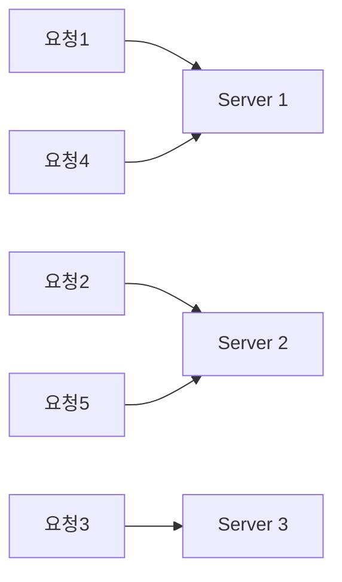
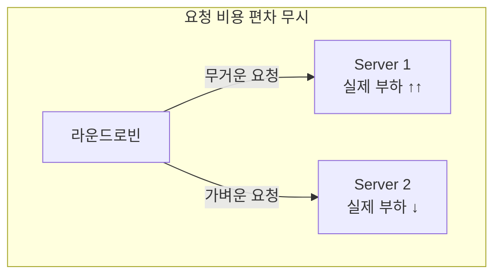

# 라운드로빈 방식의 장단점

> - 라운드로빈은 서버 목록을 순서대로 돌며 요청을 하나씩 배정하는 가장 단순한 정적 알고리즘
> - 구현이 쉽고 상태를 추적하지 않아 오버헤드가 거의 없으며, 요청을 고르게 나눠 줌
> - 대신 서버 성능 차이와 요청별 처리 비용을 고려하지 않아 특정 서버에 부하가 쏠릴 수 있음

## 동작 방식

서버 풀을 순환하며 `1 → 2 → 3 → 1 → 2 → 3 ...` 순으로 요청을 배정한다.

상태를 추적하지 않고 순서 카운터 하나만 유지하면 되므로, 분산 로직 중 가장 가볍다.

## 장점

|  장점   |             설명             |
|:-----:|:--------------------------:|
|  단순함  |    순서대로 배정해 구현과 이해가 쉬움     |
|  무상태  | 서버 상태를 추적하지 않아 오버헤드가 거의 없음 |
| 균등 분배 | 장기적으로 모든 서버가 동일한 요청 수를 받음  |
| 예측 가능 |  분산 패턴이 결정적이라 동작을 예상하기 쉬움  |

- 서버 상태 모니터링이 필요 없어 동적 알고리즘보다 비용이 낮음
- 서버 성능이 동일하고 요청 처리 비용이 균일한 환경에서는 이 단순함만으로 충분

## 단점

|     단점      |                   설명                   |
|:-----------:|:--------------------------------------:|
| 서버 성능 차 무시  |     저성능 서버에도 같은 양을 배정해 약한 서버가 과부하      |
| 요청 처리 비용 무시 | 무거운 요청이 한 서버에 몰리면 요청 수는 같아도 실제 부하는 불균형 |
|  세션 유지 안 됨  |     매 요청이 다른 서버로 가서 로컬 세션 사용 시 문제      |
|  롱 커넥션 불균형  |  연결 유지 시간이 다르면 시간이 지날수록 연결 수가 한쪽에 쏠림   |

라운드로빈은 요청 수를 균등하게 나눌 뿐, 실제 부하까지 균등해지는 것은 아니라는 한계가 있다.

## 라운드 로빈이 적절한 상황

- 서버 스펙이 동일하고, 요청 처리 비용이 비교적 균일한 경우
- 서버가 무상태(stateless)로 설계되어 세션 고정이 필요 없는 경우
- 분산 로직의 오버헤드를 최소화하고 싶은 경우

반대로 요청별 부하 편차가 크거나 서버 성능이 제각각이라면, 가중 라운드로빈이나 최소 연결로 넘어가는 것이 적절하다.
