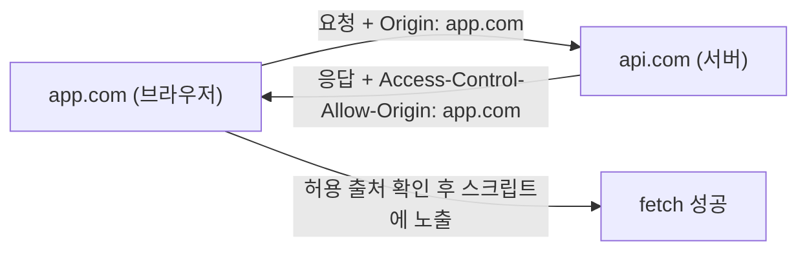
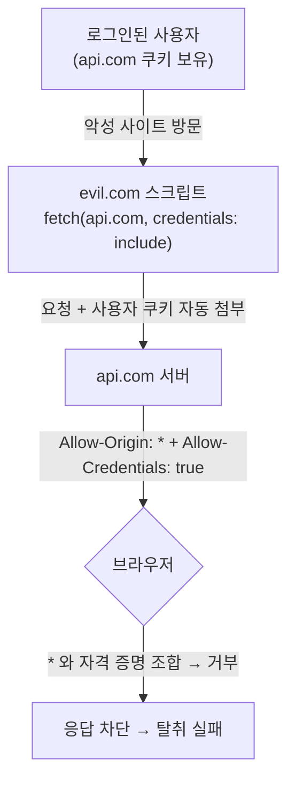
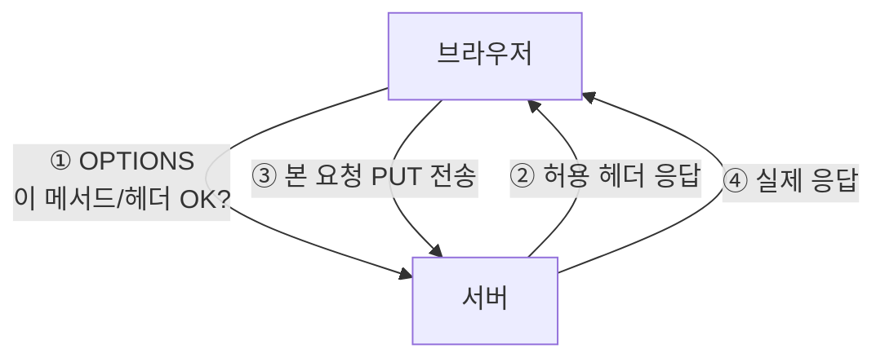

# CORS (Cross-Origin Resource Sharing)

> - 브라우저는 보안을 위해 다른 출처(Origin)의 리소스 접근을 막는 동일 출처 정책(SOP)을 기본 적용
> - CORS는 서버가 HTTP 헤더로 "이 출처는 허용한다"고 알려, SOP의 예외를 명시적으로 허가하는 메커니즘
> - 차단 주체는 서버가 아니라 브라우저로, 서버는 헤더만 내려줄 뿐 응답을 스크립트에 노출할지는 브라우저가 결정

## 동일 출처 정책(SOP)이 있는 이유

브라우저는 사용자가 로그인한 사이트의 쿠키를 요청에 자동으로 첨부하므로, 아무 제한이 없으면 악성 사이트의 스크립트가 그 쿠키로 다른 사이트의 응답을 읽어낼 수 있다.

동일 출처 정책(Same-Origin Policy)은 이 위협을 막기 위해 한 출처에서 로드된 스크립트가 다른 출처의 리소스에 접근하는 것을 기본 차단하는 브라우저 보안 모델이다.

- 막는 대상: 악성 사이트 스크립트가 사용자 인증 쿠키로 은행 등 다른 사이트의 응답을 `fetch`로 읽는 행위
- 허용하는 것: ``, `<script>`, `<link>` 태그를 통한 로드
    - 태그는 다른 출처 리소스를 사용만 하고 응답을 스크립트가 읽지는 못함
    - 그래서 CDN·외부 폰트·이미지 호스팅은 정상 동작

### 출처(Origin) 판별

출처는 스킴(scheme) + 호스트(host) + 포트(port) 세 가지의 조합이며, 셋 중 하나라도 다르면 서로 다른 출처(Cross-Origin)다.

|                  비교 대상                  |  결과   |   이유   |
|:---------------------------------------:|:-----:|:------:|
| `https://a.com` vs `https://a.com/path` | 동일 출처 | 경로는 무관 |
|    `https://a.com` vs `http://a.com`    | 교차 출처 | 스킴 다름  |
|   `https://a.com` vs `https://b.com`    | 교차 출처 | 호스트 다름 |
| `https://a.com` vs `https://a.com:8080` | 교차 출처 | 포트 다름  |
| `https://a.com` vs `https://www.a.com`  | 교차 출처 | 호스트 다름 |

## CORS가 필요한 이유

SOP가 모든 교차 출처를 막아 버리면 API 서버와 프론트엔드 도메인이 다른 현대 웹(예: `app.com` → `api.com`)이 동작할 수 없다.



CORS는 서버가 응답에 특정 HTTP 헤더를 실어 이 출처의 접근은 허용한다고 선언함으로써 SOP를 안전하게 완화한다.

## 주요 응답 헤더

서버가 교차 출처를 허용하기 위해 내려주는 헤더들이다.

|                 헤더                 |               역할                |
|:----------------------------------:|:-------------------------------:|
|   `Access-Control-Allow-Origin`    |    접근을 허용할 출처 (특정 출처 또는 `*`)    |
|   `Access-Control-Allow-Methods`   |    허용할 HTTP 메서드 (프리플라이트 응답)     |
|   `Access-Control-Allow-Headers`   |    허용할 커스텀 요청 헤더 (프리플라이트 응답)    |
| `Access-Control-Allow-Credentials` | 쿠키 등 자격 증명 포함 요청 허용 여부 (`true`) |
|      `Access-Control-Max-Age`      |      프리플라이트 결과를 캐시할 시간(초)       |
|  `Access-Control-Expose-Headers`   |   스크립트가 읽을 수 있게 노출할 응답 헤더 목록    |

## 무차별 허용이 위험한 이유

CORS는 막혀 있는 것을 푸는 설정이라, 무작정 열면 SOP가 막아 주던 위협에 그대로 노출된다.

|                              설정                              | 자격 증명(쿠키) |                   결과                    |
|:------------------------------------------------------------:|:---------:|:---------------------------------------:|
|               `Access-Control-Allow-Origin: *`               |   안 실림    | 모든 출처가 응답을 읽음 (공개 데이터면 무방, 내부망 API면 위험) |
| `Access-Control-Allow-Origin: *` + `Allow-Credentials: true` |    실림     |       브라우저가 응답을 차단 (CORS 표준에서 금지)       |

### `*`와 자격 증명을 함께 못 쓰는 이유

모든 출처를 열면서 쿠키까지 허용하는 `* + true`가 만약 동작한다면, 임의의 사이트가 사용자의 로그인 세션을 그대로 가로챌 수 있다.



1. 사용자가 `api.com`에 로그인한 상태(쿠키 보유)로 악성 사이트 `evil.com`에 접속
2. `evil.com` 스크립트가 `fetch("https://api.com/me", { credentials: "include" })`를 실행하면 브라우저가 사용자 쿠키를 자동 첨부
3. 서버가 `Access-Control-Allow-Origin: *`와 `Allow-Credentials: true`로 응답

이 조합이 허용된다면 아무 사이트나 남의 쿠키로 내 API를 읽어 개인정보를 빼낼 수 있다.

- CORS 표준은 이 조합 자체를 금지해, 자격 증명이 실린 요청에 `Allow-Origin: *`이 오면 브라우저가 응답을 거부
- 자격 증명을 쓰려면 `*` 대신 정확한 출처 하나를 명시해야 함

### 안전한 사용

- 허용 출처는 와일드카드가 아니라 명시적 allowlist로 관리
- 자격 증명이 필요하면 출처를 정확히 명시하고, 불필요하면 `credentials`를 끄기

## 꼬리 질문 - 프리플라이트 필요 이유

서버 상태를 바꾸는 요청을 검증 없이 바로 보내면, 요청이 서버에 도달하는 순간 이미 데이터가 변경될 수 있다.

- CORS는 응답을 읽는 것은 막지만, 요청이 서버에 도달하는 것 자체는 막지 못함
- 따라서 위험한 본 요청을 보내기 전에 허락을 먼저 구하고, 서버가 거부하면 본 요청을 아예 보내지 않음

### 프리플라이트의 동작

본 요청을 보내기 전에 브라우저가 자동으로 `OPTIONS` 메서드의 예비 요청을 먼저 보낸다.

```http
OPTIONS /data HTTP/1.1
Origin: https://app.example
Access-Control-Request-Method: PUT
Access-Control-Request-Headers: content-type, authorization
```

|           프리플라이트 요청 헤더           |           의미            |
|:--------------------------------:|:-----------------------:|
|             `Origin`             |       요청을 보내는 출처        |
| `Access-Control-Request-Method`  |  본 요청에서 사용할 메서드를 미리 알림  |
| `Access-Control-Request-Headers` | 본 요청에서 보낼 커스텀 헤더를 미리 알림 |

서버가 허용하면 다음과 같이 응답하고, 브라우저는 그제서야 본 요청(`PUT`)을 보낸다.

```http
HTTP/1.1 204 No Content
Access-Control-Allow-Origin: https://app.example
Access-Control-Allow-Methods: PUT, GET, POST
Access-Control-Allow-Headers: content-type, authorization
Access-Control-Max-Age: 86400
```



### 프리플라이트 비용과 캐싱

프리플라이트는 본 요청마다 왕복이 한 번 더 늘어나는 비용이 있어, 결과를 캐시하는 수단을 제공한다.

- `Access-Control-Max-Age: 86400`은 같은 메서드와 헤더 조합의 프리플라이트 결과를 86400초(24시간) 동안 캐시
- 캐시가 유효한 동안에는 `OPTIONS` 왕복을 생략하고 본 요청만 전송
- 단, 브라우저별 캐시 상한이 있어 지정값보다 짧게 적용될 수 있음
