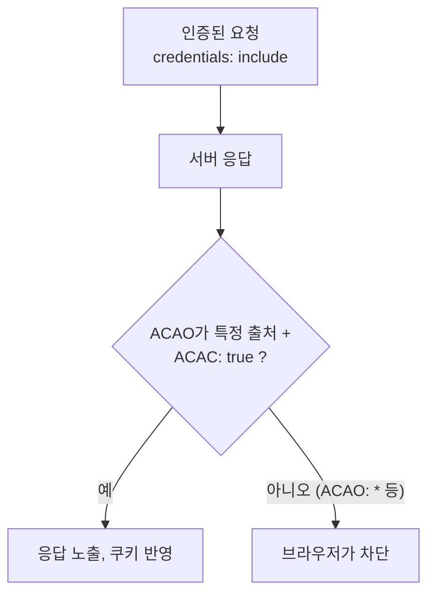

# 단순 요청과 인증된 요청에서 Access-Control-Allow-Origin의 차이

> - 인증된 요청(Credentialed)은 쿠키, HTTP 인증, 클라이언트 인증서를 함께 보내는 요청
> - 자격 증명을 보내지 않는 요청은 `Access-Control-Allow-Origin: *`(와일드카드)로 허용 가능
> - 자격 증명을 보내는 요청은 와일드카드를 쓸 수 없어, 정확한 출처를 명시하고 `Access-Control-Allow-Credentials: true`를 함께 써야 허용

## 자격 증명(Credentials)

인증된 요청은 메서드나 본문이 아니라 요청에 자격 증명을 실어 보내느냐로 구분된다.

- 자격 증명: 쿠키, HTTP 인증(Authorization 기반 Basic 등), TLS 클라이언트 인증서
- 브라우저는 교차 출처 요청에 쿠키를 기본적으로 싣지 않으며, 명시적으로 켜야 전송

```javascript
// Fetch API
fetch(url, {credentials: "include"});
// XMLHttpRequest
xhr.withCredentials = true;
```

## Access-Control-Allow-Origin 차이

|                 구분                 |     비자격 요청      |      인증된 요청       |
|:----------------------------------:|:---------------:|:-----------------:|
|   `Access-Control-Allow-Origin`    | `*` 또는 특정 출처 가능 | `*` 불가, 특정 출처만 명시 |
| `Access-Control-Allow-Credentials` |       불필요       |   `true` 함께 필요    |
|               쿠키 전송                |       안 됨       | 됨 (양쪽 헤더 조건 충족 시) |

### 비자격 요청

자격 증명이 없어 응답이 노출돼도 사용자 세션이 위험해지지 않으므로, 와일드카드(`*`)로 모든 출처를 허용할 수 있다.

```http
Access-Control-Allow-Origin: *
```

- 어떤 출처에서 와도 응답을 읽을 수 있게 허용
- 누구나 호출하는 공개 API처럼 인증이 필요 없는 리소스에 적합

### 인증된 요청

쿠키 등 자격 증명이 함께 가므로, 응답을 잘못 노출하면 다른 사이트가 사용자의 인증 정보로 접근한 데이터를 훔쳐볼 수 있다.

```http
Access-Control-Allow-Origin: https://app.example
Access-Control-Allow-Credentials: true
```

- `Access-Control-Allow-Origin`에 `*`를 쓸 수 없고, 요청을 보낸 정확한 출처를 그대로 명시
- `Access-Control-Allow-Credentials: true`가 함께 있어야 하며, 없으면 자격 증명을 보냈더라도 브라우저가 응답을 차단
- 둘 중 하나라도 어긋나면 응답은 스크립트에 노출되지 않음



## 인증된 요청 와일드카드 금지 이유

`*`는 아무 출처나 허용한다는 뜻이라, 여기에 자격 증명까지 더해지면 임의의 악성 사이트가 사용자의 로그인 쿠키로 받아 온 응답을 읽을 수 있게 된다.

- 브라우저는 자격 증명이 실린 요청에 `Allow-Origin: *` 응답이 오면 의도적으로 거부
- 서버가 정확히 이 출처만 허용한다고 강제하여 허용 범위를 좁히도록 유도

## 와일드카드 금지는 다른 헤더에도 적용

인증된 요청에서는 `Access-Control-Allow-Origin`뿐 아니라 다른 허용 헤더에서도 `*`가 와일드카드로 작동하지 않고 문자 그대로 해석된다.

|               헤더                |                인증된 요청에서의 제약                |
|:-------------------------------:|:------------------------------------------:|
|  `Access-Control-Allow-Origin`  |             `*` 불가, 특정 출처만 명시              |
| `Access-Control-Allow-Methods`  |          `*` 불가, `PUT, POST` 등 명시          |
| `Access-Control-Allow-Headers`  | `*` 불가, `content-type, authorization` 등 명시 |
| `Access-Control-Expose-Headers` |             `*` 불가, 노출할 헤더 명시              |
