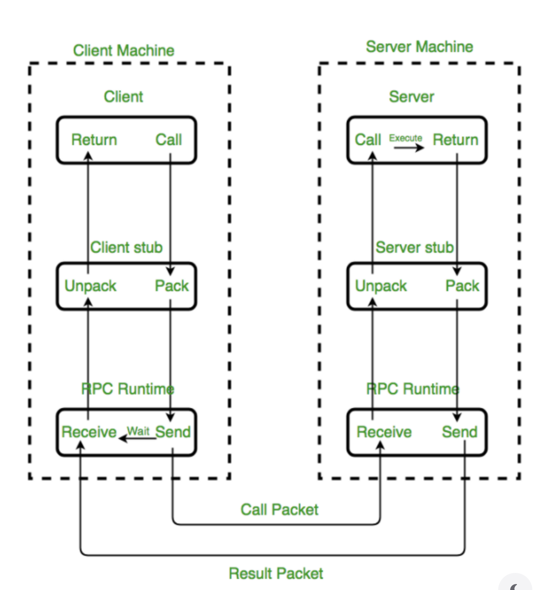

# RPC는 무엇이고 gRPC는 무엇인가요?

## RPC

> Remote Procedure Call의 약자

현재 실행 중인 프로세스의 주소 공간 내부가 아니라 **외부의 프로세스 또는 원격지의 프로세스**와 상호작용하기 위한 기능

- 네트워크 상에서 떨어져 있는 다른 컴퓨터의 프로그램(함수나 메서드)를 **마치 내 컴퓨터에 있는 로컬 함수를 호출하듯** 쉽게 사용할 수 있게 해주는 프로토콜

- 이를 통해 네트워크 세부 구현(소켓 통신, 패킷 직렬화 등)을 신경 쓰지 않고 비즈니스 로직에 집중 가능

✅ 장점

- 고유 프로세스 개발에 집중할 수 있다.

- 프로세스 간 통신 기능을 비교적 쉽게 구현하고 제어가 가능하다.

❎ 단점

- **호출 실행과 반환 시간이 보장되지 않는다.** 
    - 특히 네트워크가 끊겼을 때 치명적이다.

- 보안이 보장되지 않는다.

***

### RPC 사용의 이유 (간략히)

- 일반적인 통신 패턴은 `Client-Server` 구조일 것이다.
- 이를 구현하기 위해 `HTTP` 와 `Socket` 이 가장 많이 사용된다.

- 하지만 MSA 구조로 서비스를 만들다보면 다양한 언어/프레임워크로 개발이 된다.

- 우리는 RPC를 통해 언어에 구애받지 않고 원격 프로시저를 호출해 비즈니스 로직에 집중할 수 있다.

이에 대해 구현한 것중 가장 유명한 것이 2015년 구글에서 RPC + 웹 기술을 혼합한 gRPC 이다.

## gRPC

> HTTP/2 를 기반으로 하는 RPC 프레임워크

- 기존 RPC 시스템의 단점을 보완해 HTTP/2 프로토콜 기반으로 통신해 데이터 직렬화 포맷 (Protocol Bufferes)를 사용한다.

- 간략히 이야기하면 RESTful API를 대체할 수 있는 무언가 정도이다

REST 와 간략히 비교 하자면,

- REST는 자원 중심이라면 gRPC 는 **행위**중심이다.

- REST는 JSON 을 대부분 기반으로 하지만, gRPC는 컴퓨터가 읽기 쉬운 바이너리 기반의 Protobuf 를 사용해서 페이로드가 더 작다.

- REST는 요청마다 커넥션을 맺거나 중복이 가능하지만, gRPC는 하나의 커넥션에서 여러 요청을 동시에 처리하고 헤더 압축, 양방향 스트리밍을 지원한다.

## 마무리

gRPC 가 장점인 경우는 payload 가 큰 경우, 지속적 응답(스트림)이 필요한 경우, 플랫폼별 차이가 있는 경우, 대규모 시스템 등등에서 유리할 수 있다.

그런데 굳이 바꿀 필요는 전혀 없어보인다.
일단 postman 등 같은 툴을 사용할 수가 없고
서킷 브레이킹이나 로드 밸런싱 등을 큰 장점이라고 어디서 이야기 했는데, 이도 REST 에서 충분히 가능하다.

특정 상황에서 사용할 수 있는 카드 정도로 이해하면 될 것 같다.

## 나의 경우?

- 본인의 경우 모니터링을 구축하면서 OTel Java Agent 를 써서 조금 편하게 MSA 환경에서 추적하기 위해 도입했는데 ..

- HTTP로 위를 보내게 되면 데이터가 너무 많고 네트워크 커넥션으로 인해 gRPC 를 선택했다.

- 여기서 문제는 gRPC 가 단일 커넥션을 오래 유지해서 문제가 있었는데 gRPC 의 로드 밸런서를 도입하든 아니면 완전 실시간은 아니고 열었다가 닫는 등의 행위로 회피할 수 있을 것 같다.