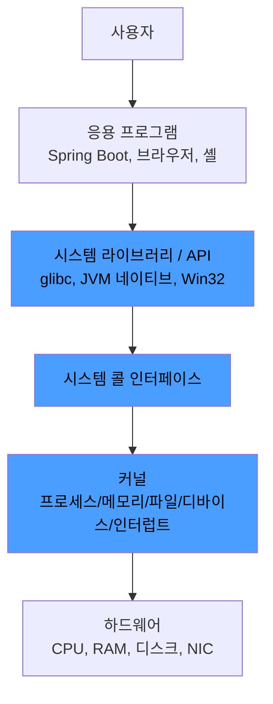

# 운영체제(OS)란

> - OS는 하드웨어와 응용 프로그램 사이에 있는 시스템 소프트웨어로, 자원 관리자 + 인터페이스 제공자 역할 수행
> - 자원 관리자: CPU·메모리·디스크·네트워크 같은 한정된 자원을 여러 프로세스에 공정·효율적으로 분배
> - 인터페이스 제공자: 하드웨어 차이를 시스템 콜로 추상화해, 응용 프로그램이 디바이스 사양과 무관하게 동작하도록 함
> - 컴퓨터 시스템은 하드웨어 → 커널 → 시스템 라이브러리/유틸리티 → 응용 프로그램의 계층 구조로 구성되며, OS는 커널과 그 주변 시스템 소프트웨어를 묶어 부르는 개념

운영체제는 자원을 통제하면서 그 통제를 응용 프로그램에 가리는 두 역할을 동시에 한다.

## 두 가지 본질적 역할

|    역할     | 책임                          | 구체 예                                  |
|:---------:|:----------------------------|:--------------------------------------|
|  자원 관리자   | 한정된 하드웨어 자원을 여러 프로세스에 분배·보호 | CPU 스케줄링, 메모리 할당·회수, 파일 디스크립터 관리      |
| 인터페이스 제공자 | 하드웨어 다양성을 추상화해 공통 API 제공    | `read`/`write` 시스템 콜이 디스크 종류와 무관하게 동작 |

애플리케이션 개발자가 NVMe SSD인지 SATA SSD인지 모르고 `FileOutputStream.write()`를 호출할 수 있는 이유는, OS가 디바이스별 차이를 단일 시스템 콜 인터페이스로 노출하기 때문이다.

## OS의 주요 목적

크게 효율성·공정성·보안·일관성으로 요약된다.

- 효율성: 하드웨어 자원을 놀리지 않도록 다중 프로그래밍(Multi-Programming), 시분할(Time Sharing) 수행
- 공정성: 한 프로세스가 자원을 독점하지 못하도록 스케줄링 적용
- 보안·고립: 사용자 모드/커널 모드 구분 및 프로세스 간 메모리 격리
- 일관된 인터페이스: 응용 프로그램이 하드웨어 사양 변화에 영향을 받지 않도록 추상화

## 컴퓨터 시스템의 계층 구조

OS는 하드웨어와 응용 프로그램 사이에 끼어 있으며, 이 계층 어느 부분까지를 OS라 부르는지가 좁고 넓음의 차이를 만든다.

- 좁은 의미의 OS = 커널
- 넓은 의미의 OS = 커널 + 시스템 라이브러리 + 유틸리티(셸, init 시스템 등)

응용 프로그램은 직접 커널을 호출하지 않고, 보통 시스템 라이브러리를 통해 시스템 콜로 진입한다.

## 부팅과 OS

OS는 컴퓨터 부팅 직후부터 자원 관리를 시작한다.

1. CPU가 펌웨어(BIOS/UEFI) 시작 주소부터 실행
2. 펌웨어가 하드웨어 점검 후, 부팅 디바이스에서 부트로더 적재
3. 부트로더(GRUB 등)가 디스크에서 커널 이미지를 메모리에 적재하고 점프
4. 커널이 자체 초기화 — 페이지 테이블, 인터럽트 디스크립터 테이블, 디바이스 드라이버 로드
5. 커널 모드에서 마지막 단계로 첫 사용자 프로세스(PID 1)로 실행
6. 이후부터 모든 사용자 프로세스는 `init`의 자손으로 생성

응용 프로그램은 이 모든 단계가 끝난 뒤에야 비로소 시스템 콜을 통해 OS의 서비스를 받을 수 있게 된다.

## 커널 구조 - 모놀리식 vs 마이크로커널

OS의 핵심인 커널을 어떻게 설계할지는 두 갈래로 나뉘며, 현대 OS는 대개 두 방식의 절충형을 채택한다.

| 구분  |           모놀리식 커널           |                마이크로커널                 |
|:---:|:---------------------------:|:-------------------------------------:|
| 구성  | 파일시스템·드라이버·네트워크 스택 모두 커널 공간 | 핵심(스케줄링·IPC·메모리)만 커널, 나머지는 사용자 공간 서비스 |
| 통신  |         함수 호출 (빠름)          |        메시지 전달 (Mode Switch 누적)        |
| 안정성 |      한 모듈 버그가 커널 전체 영향      |       서비스 격리, 한 서비스 죽어도 재시작 가능        |
| 대표  |       Linux, 전통 Unix        |           Mach, MINIX, seL4           |
| 절충형 |              —              |  macOS(XNU = Mach 기반 + BSD 모놀리식 요소)   |

Linux는 모놀리식이지만 로드 가능한 커널 모듈(LKM) 로 드라이버를 동적으로 끼우고 빼는 방식을 채택해, 모놀리식의 효율과 마이크로커널의 유연성을 확보하는 설계다.

## 백엔드 관점에서의 OS

서버 애플리케이션이 OS와 맺는 관계를 보면 OS의 두 역할이 실제로 어떻게 작동하는지가 보인다.

- JVM은 OS로부터 메모리·스레드·파일 디스크립터·소켓을 할당받는 응용 프로그램
    - Java 스레드는 결국 OS 스레드 1:1로 매핑(플랫폼 스레드 O)
- Linux와 macOS에서 같은 자바 코드가 실행 가능한 이유는 JVM이 OS별 시스템 콜 차이를 숨기는 또 다른 추상화 계층
