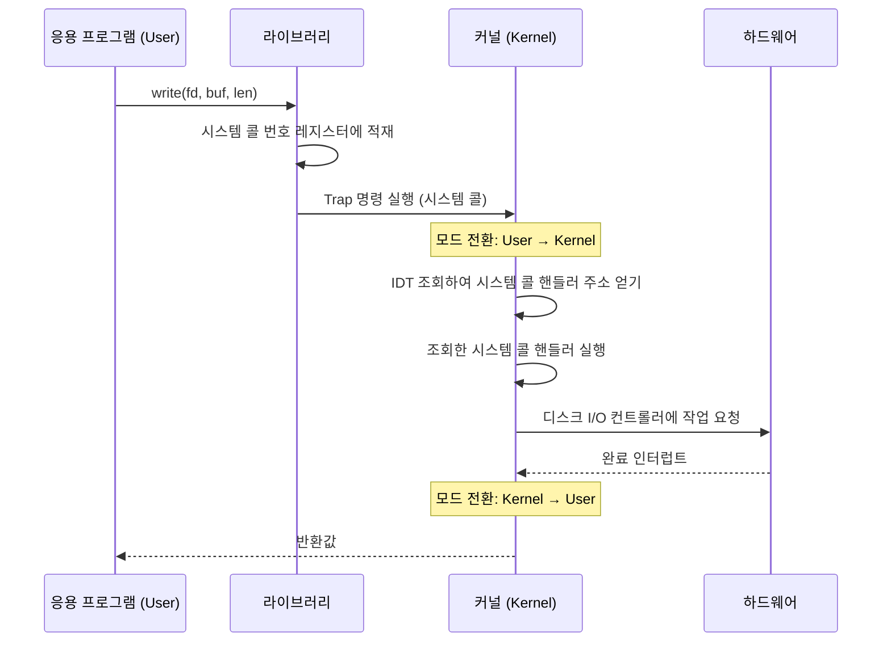

# 커널(Kernel)이란

> - 커널은 OS의 가장 핵심 부분으로, 부팅 직후 메모리에 상주하며 종료 시까지 내려가지 않는 코드
> - 프로세스 관리, 메모리 관리, 파일시스템 관리, 디바이스 제어, 인터럽트 처리 수행
> - 인터럽트는 하드웨어 인터럽트(외부 디바이스)와 소프트웨어 인터럽트(트랩, 예외)로 나뉨

커널은 운영체제의 가장 작고 가장 핵심적인 부분으로, 응용 프로그램이 하드웨어에 접근하기 위해 반드시 거쳐야 하는 통로이자 자원 분배의 최종 결정권자다.

## 커널의 역할

|    역할    |          책임          |       대표 자료 구조        |
|:--------:|:--------------------:|:---------------------:|
| 프로세스 관리  | 생성·종료, CPU 스케줄링, 동기화 |    PCB, Run Queue     |
|  메모리 관리  | 물리 메모리 할당·회수, 가상 메모리 |     페이지 테이블, TLB      |
| 파일시스템 관리 | 파일/디렉토리 추상화, 권한, 버퍼링 | inode, dentry, 페이지 캐시 |
| 디바이스 제어  |  드라이버를 통한 하드웨어 I/O   |  디바이스 파일, 디바이스 드라이버   |
| 인터럽트 처리  |  외부 이벤트와 예외에 대한 반응   |     IDT, 인터럽트 핸들러     |

단순한 `read()` 시스템 콜 하나에도 커널의 여러 역할이 수행하게 된다.

- 프로세스 상태 변경(블로킹)
- 메모리(페이지 캐시)
- 파일시스템(inode 조회)
- 디바이스(디스크 I/O)
- 인터럽트(I/O 완료 인터럽트)

## 이중 모드(Dual Mode)

CPU는 하드웨어 수준에서 두 모드를 구분하는데, 이 덕분에 커널과 응용 프로그램이 서로 다른 권한으로 실행될 수 있다.

|         모드          |              권한               |      실행 주체       |
|:-------------------:|:-----------------------------:|:----------------:|
| 사용자 모드 (User Mode)  | 제한된 명령어만 실행 가능, 직접 하드웨어 접근 불가 |  응용 프로그램, 라이브러리  |
| 커널 모드 (Kernel Mode) |   모든 CPU 명령어와 메모리 영역 접근 가능    | 커널 코드, 디바이스 드라이버 |

- CPU 내부의 모드 비트(특권 플래그)로 구분
- 응용 프로그램이 권한 외 명령(예: 페이지 테이블 변경)을 시도하면 예외 발생
- 이중 모드 덕분에 한 프로세스의 잘못된 동작이 OS의 안정성을 해치지 않도록 격리 가능

## 시스템 콜 - 사용자 모드에서의 커널 모드 진입 방법

응용 프로그램이 파일 읽기, 네트워크 송수신, 새 프로세스 생성 같은 커널 기능을 쓰려면 반드시 시스템 콜을 통해서만 들어갈 수 있다.

## 인터럽트 - 커널의 대표적 동작 방식

커널은 평소 잠들어 있다가 인터럽트가 발생할 때마다 깨어나 일하는 이벤트 기반 시스템이다.

|        종류         |       발생 원인        |             예시             |
|:-----------------:|:------------------:|:--------------------------:|
|     하드웨어 인터럽트     |  외부 디바이스가 CPU에 신호  | 키보드 입력, 네트워크 패킷 도착, 타이머 만료 |
| 소프트웨어 인터럽트 (Trap) | 실행 중인 명령이 의도적으로 발생 |     시스템 콜, `int 0x80`      |
|   예외(Exception)   |   명령 실행 중 실패 감지    |    페이지 폴트, 0 나누기, 권한 위반    |

세 종류 모두 같은 메커니즘으로 처리된다.

1. CPU가 현재 PC와 일부 레지스터를 스택에 저장
2. 사용자 모드였다면 커널 모드로 전환
3. IDT(Interrupt Descriptor Table)에서 인터럽트 번호에 해당하는 핸들러 주소 조회
4. 핸들러 실행 → 처리 종료 후 `iret`로 원래 위치 복귀

## 백엔드 관점에서의 커널

실제 운영 및 개발 중엔 커널의 결정이 응답 시간과 가용성에 직접 영향을 준다.

- OOM: 시스템 메모리가 부족하면 커널이 점수가 높은 프로세스를 강제 종료
    - Spring Boot 컨테이너의 JVM이 갑자기 죽는 흔한 원인
- 파일 디스크립터 한도: 커널은 프로세스당 열 수 있는 fd 수 제한
    - fd 부족 → `Too many open files` 예외
- 페이지 캐시: 모든 파일 I/O는 커널의 페이지 캐시를 경유
