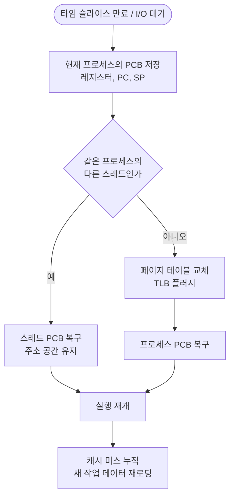

# Mode Switch와 Context Switch

> - Mode Switch: CPU 권한 모드(사용자↔커널)만 변경
> - Context Switch: CPU 위에서 실행되는 프로세스/스레드 자체가 변경
> - Mode Switch는 PCB 저장 없이 모드 비트와 일부 레지스터만 갱신 → 비용 작음
> - Context Switch는 PCB 저장·복구 + TLB·캐시 무효화 동반 → 비용 큼

`Mode Switch`와 `Context Switch`는 모두 CPU의 실행 상태가 바뀐다는 공통점이 존재하며, 바뀌는 대상과 비용 측면에서 차이가 존재한다.

|   구분   |        Mode Switch         |          Context Switch           |
|:------:|:--------------------------:|:---------------------------------:|
| 바뀌는 대상 | CPU의 실행 모드 (User ↔ Kernel) |      CPU 위에서 실행 중인 프로세스/스레드       |
|  트리거   |      시스템 콜, 인터럽트, 예외       |    타임 슬라이스 만료, I/O 대기, 우선순위 변경    |
| 저장 대상  |     일부 레지스터, PC, 모드 비트     | PCB 전체 (레지스터, 메모리 매핑, 파일 디스크립터 등) |
| 주소 공간  |        동일 (같은 프로세스)        |    변경 가능 (다른 프로세스면 페이지 테이블 교체)    |
|   비용   |          작음 (~ns)          |        큼 (~μs + 캐시 미스 누적)         |

## Mode Switch

CPU의 권한 수준을 사용자 모드와 커널 모드 사이에서 전환하는 작업이다.

- 같은 프로세스가 그대로 실행되며, 단지 권한만 바뀜
- 시스템 콜·인터럽트·예외 발생 시 트랩(Trap) 명령으로 진입
- CPU의 모드 비트와 PC, 일부 레지스터만 갱신
- 페이지 테이블·TLB·캐시는 그대로 유지되므로 비용이 작음

```java
void example() {
    // 사용자 모드에서 실행
    FileOutputStream fos = new FileOutputStream("data.txt");
    fos.write(buf);  // write() 시스템 콜 → Mode Switch (User → Kernel)
    // 커널이 디스크 I/O 처리 후 Mode Switch (Kernel → User)
}
```

## Context Switch

CPU가 실행하던 프로세스/스레드의 상태를 PCB에 저장하고, 다른 프로세스/스레드의 상태를 PCB에서 복구해 실행을 이어가는 작업이다.

- 저장 대상이 많고 복구도 필요하기 때문에 작업 비용(오버헤드)이 큼
    - 다음 실행 위치(프로그램 카운터), 메모리 사용 위치(스택 포인터), 현재 계산 상태(레지스터) 등 PCB 전체 저장 및 복구 필요
- 프로세스가 바뀌면 작업 환경(주소 공간)이 완전히 달라짐
    - 기존 페이지 테이블을 새 프로세스용으로 교체 필요
    - 이때, 이전에 쓰던 메모리 단축키 목록인 TLB(Translation Lookaside Buffer)도 초기화(Flush) 필요
- 초기 구동 시 캐시 미스 누적
    - 새로 실행할 프로세스의 데이터가 당장 CPU 내부 캐시에 없기 때문에 초기 실행 속도 저하

### TLB(Translation Lookaside Buffer)

가상 메모리 주소를 실제 물리 메모리 주소로 변환하는 속도를 높여주는, MMU(메모리 관리 장치) 내부의 고속 단축키 캐시이다.

- 프로세스 간 Context Switch가 발생하면, 각자 사용하는 가상 메모리 공간이 아예 다르기 때문에 이전 프로세스가 남겨둔 TLB 데이터를 쓸 수 없음
- 이로 인해 교체 직후 메모리 접근 시 TLB 미스가 대량으로 발생하여 Context Switch의 비용 증가

### 비용을 키우는 요인



같은 프로세스 내 스레드 간 전환은 주소 공간이 동일하므로 TLB 플러시가 없거나 작지만, 프로세스 간 전환은 풀 비용이 발생한다.

## 모드 스위치와 컨텍스트 스위치의 관계

시스템 콜이 항상 Context Switch를 동반하는 것은 아니며, 모든 Context Switch는 Mode Switch를 동반하지만, 그 반대는 아니다.

|               시나리오               |   Mode Switch    |   Context Switch    |
|:--------------------------------:|:----------------:|:-------------------:|
|      `getpid()` 같은 빠른 시스템 콜      |        O         |          X          |
| `read()`인데 데이터가 페이지 캐시에 있어 즉시 반환 |        O         |          X          |
|   `read()`인데 디스크에서 읽어야 해서 블로킹    |        O         | O (다른 프로세스에 CPU 양보) |
|       타임 슬라이스 만료로 스케줄러 개입        | O (타이머 인터럽트로 진입) |          O          |
|     페이지 폴트 후 디스크에서 페이지 로드 대기     |        O         |          O          |

### 모든 Context Switch가 Mode Switch를 동반하는 이유

Context Switch(문맥 교환)는 운영체제의 핵심 기능인 스케줄러(Scheduler)에 의해 수행된다.

- 스케줄러의 코드는 커널 공간에 존재
- 이를 실행하려면 반드시 CPU의 권한이 커널 모드 필요
- 사용자 프로세스는 임의로 CPU 제어권을 다른 프로세스에게 넘길 수 없음

따라서 프로세스나 스레드를 교체하기 위해서는 다음과 같은 흐름을 필연적으로 거쳐야 한다.

1. Mode Switch (User → Kernel): 타임 슬라이스 만료(타이머 인터럽트) 또는 I/O 블로킹(시스템 콜) 발생으로 커널 모드 진입
2. Context Switch: OS 스케줄러가 실행되어 기존 프로세스의 상태를 저장하고, 새 프로세스의 상태를 적재
3. Mode Switch (Kernel → User): 교체된 새 프로세스가 실행을 재개할 수 있도록 다시 사용자 모드로 전환

이처럼 스케줄러 자체가 커널 권한을 요구하기 때문에, Context Switch는 필연적으로 그 전후에 Mode Switch를 동반할 수밖에 없다.

## Java 가상 스레드의 Context Switch 회피

JDK 21의 가상 스레드는 Context Switch 비용을 회피하기 위한 설계다.

- 플랫폼 스레드(OS 스레드)는 블로킹 시 OS가 Context Switch로 다른 스레드를 올림 → 비용 큼
- 가상 스레드는 블로킹 시 JVM이 캐리어 스레드에서 언마운트(unmount)하고 다른 가상 스레드를 마운트 → 사용자 공간에서 처리되어 OS Context Switch 발생 안 함
- 시스템 콜 자체는 여전히 Mode Switch를 발생시키지만, 블로킹 동안의 Context Switch 비용이 사라짐
