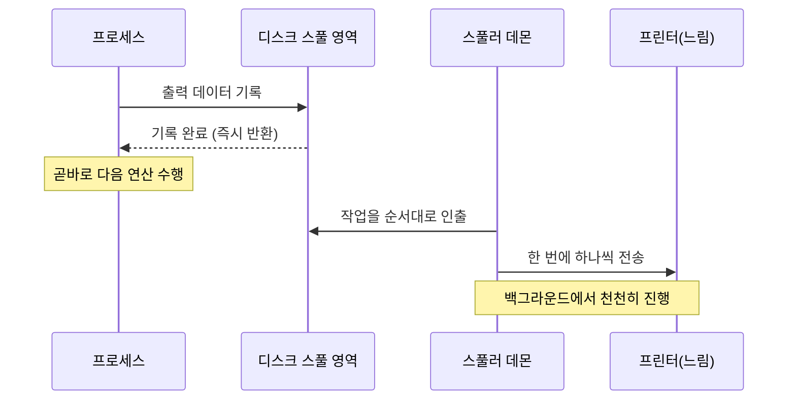
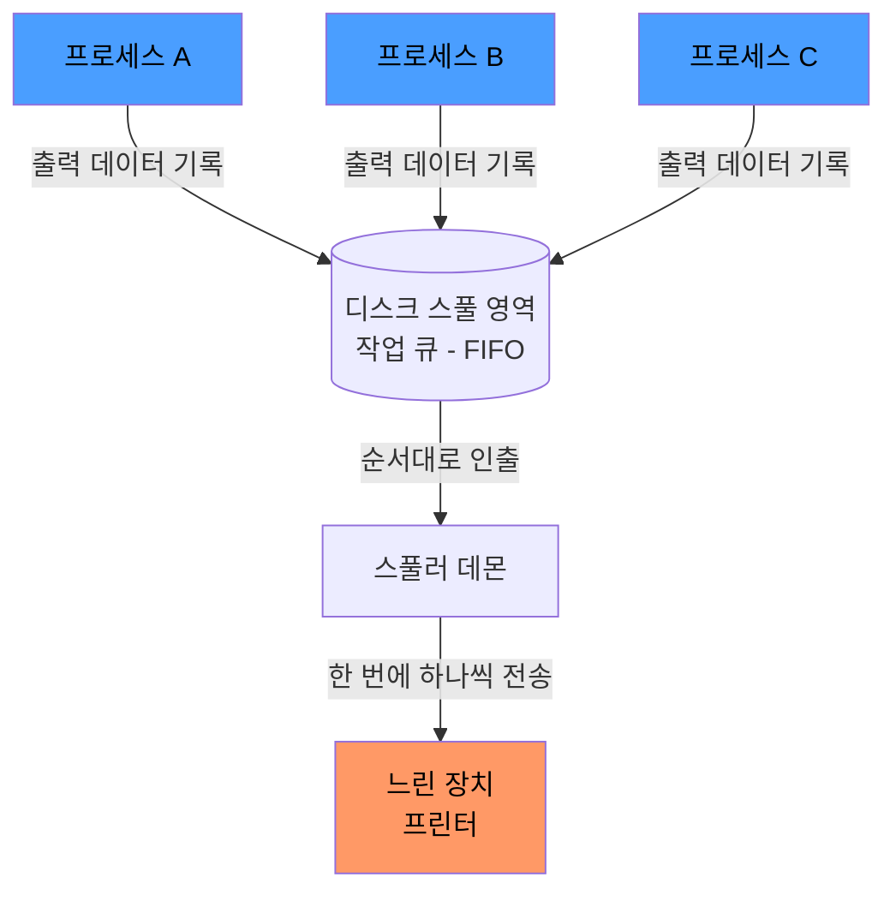

# 스풀링(Spooling)이란

> - 빠른 CPU가 느린 I/O 장치를 기다리지 않도록, 출력을 디스크에 먼저 쌓아두는 기법
> - 프로세스는 디스크에 데이터를 빠르게 기록하고 바로 다음 일을 진행 → 실제 장치 전송은 스풀러가 알아서 처리

스풀링은 빠른 CPU가 느린 장치의 처리 속도에 묶이지 않도록, 출력을 디스크에 먼저 맡겨두고 장치가 알아서 따라오게 만드는 기법이다.

## 스풀링의 개념

SPOOL은 Simultaneous Peripheral Operations On-Line의 약자로, 주변 장치 입출력을 CPU 연산과 동시에 처리한다는 뜻이다.

- CPU는 매우 빠르지만 프린터 같은 장치는 그에 비해 훨씬 느림
- 장치가 데이터를 다 받을 때까지 프로세스가 블로킹되면, 그동안 CPU는 놀게 되고 전체 시스템 효율이 떨어짐
- 출력 데이터를 디스크의 스풀 영역(spool area)에 빠르게 기록하고, 프로세스는 즉시 다음 연산으로 복귀
- 실제 장치 전송은 백그라운드 프로세스인 스풀러(spooler) 가 담당

프로세스가 장치를 직접 기다리지 않고 곧바로 복귀하는 흐름을 시간순으로 보면 다음과 같다.

## 동작 원리

스풀링의 핵심은 디스크를 작업 대기 줄(큐)로 사용한다는 점이다.

1. 프로세스는 장치로 직접 출력하지 않고, 디스크 스풀 영역에 빠르게 기록하고 바로 반환
2. 여러 프로세스의 출력이 스풀 영역에 줄지어 쌓임
3. 스풀러가 들어온 순서(FIFO)대로 작업을 하나씩 꺼냄
4. 장치가 처리할 수 있는 속도에 맞춰 천천히 전송
5. 이 동안 CPU와 프로세스는 다른 일을 자유롭게 수행

RAM 대신 디스크에 쌓는 데에는 이유가 있다.

- 대용량 수용: RAM 버퍼보다 훨씬 많은 작업을 큐에 적재 가능
- 영속성: 작업 완료 전 장애가 발생해도 디스크 큐에 남은 작업을 복구 가능

## 대표 예시 - 프린터 스풀링

프린터는 스풀링의 가장 대표적인 예시다.

- 프린터는 한 번에 하나의 출력만 처리할 수 있는 장치
- 여러 프로세스가 동시에 인쇄를 요청하면, 출력이 뒤섞이지 않도록 순서를 정해야 함
- OS는 각 인쇄 요청을 스풀 디렉터리에 파일로 저장하고 큐에 등록
- 프린터 데몬이 큐에서 작업을 하나씩 꺼내 인쇄

덕분에 사용자는 인쇄 버튼을 누르는 즉시 다시 작업을 이어갈 수 있고, 실제 인쇄는 백그라운드에서 진행된다.

## 백엔드 관점에서의 스풀링

"느린 쪽을 빠른 쪽으로부터 큐로 분리한다"는 스풀링의 발상은 현대 백엔드에서도 자주 보인다.

- 비동기 로깅(Logback `AsyncAppender`): 애플리케이션 스레드는 로그를 큐에 넣고 바로 복귀하고, 별도 스레드가 느린 파일 쓰기를 담당
- 메시지 큐(Kafka, RabbitMQ): 생산자는 메시지를 디스크 기반 큐에 빠르게 쌓고, 느린 소비자는 자신의 속도로 가져가 처리 (디스크에 영속화하므로 소비자 장애 시에도 메시지 유실 없음)

빠른 생산자와 느린 소비자를 큐로 떼어놓는다는 점에서, 이 구조들은 프린터 스풀러와 본질적으로 같은 아이디어다.
