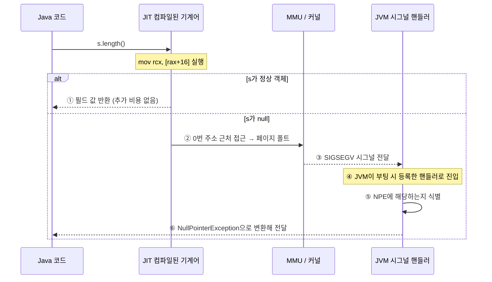

# NPE와 OS 커널 하드웨어 예외

> - JVM은 같은 `NullPointerException`을 두 가지 방식으로 처리한다 — 명시적(explicit) 검사와 암묵적(implicit) 검사
> - 명시적 검사는 JIT가 객체 접근 직전마다 null 비교 분기를 박아두는 정공법 → 커널을 거치지 않음
> - 암묵적 검사는 null 검사를 아예 생략하고, 하드웨어와 OS의 페이지 폴트를 NPE로 변환시키는 최적화 수행

HotSpot은 상황에 따라 두 방식을 골라 쓰며, 두 번째 방식은 OS 커널까지 경유한다.

## 명시적 Null 체크 (Explicit Null Check)

가장 직관적인 방식으로, JIT가 객체 접근 직전에 null 비교 분기를 직접 끼워 넣는다.

```java
String s = null;
int len = s.length();
```

위 자바 코드는 대략 다음과 같은 기계어로 컴파일된다.

```asm
test  rax, rax        ; s가 null인지 검사
jz    throw_npe       ; null이면 throw_npe로 점프
mov   rcx, [rax+16]   ; 정상 경로: 객체 필드 접근
...
throw_npe:
    call  jvm_throw_NullPointerException
```

- 모든 객체 접근 앞에 `test`/`jz` 두 명령이 호출되며, 매 호출마다 분기 한 번을 수행
- null이면 곧장 JVM 내부 예외 처리 루틴으로 점프 → OS 커널은 관여하지 않음
- 인터프리터 모드, 또는 처음 실행되는 콜드 패스에서 기본적으로 사용

null이 거의 들어오지 않는 핫 패스에서도 분기 명령을 계속 실행하기 때문에, 호출 횟수가 누적될수록 비용이 매번 발생한다는 약점이 있다.

## 암묵적 Null 체크 (Implicit Null Check)

HotSpot은 핫 패스에서 이 분기 비용을 아끼기 위해, 다음 세 가지 사실을 활용해 null 검사를 코드에서 아예 빼버리는 최적화를 한다.

- 자바의 `null`은 JVM 내부에서 메모리 주소 `0`으로 표현 → null인 참조의 필드를 읽으려 하면 사실상 0번 주소 근처에 접근하는 것
- 현대 OS는 보안과 디버깅 편의를 위해, 0번 주소 근처 페이지를 어떤 프로세스에도 매핑하지 않은 상태로 비워둠 → 이 영역에 접근하는 순간 페이지 폴트가 발생하도록 보장
- 페이지 폴트가 발생하면 이를 잡아내고, 커널은 `SIGSEGV` 시그널로 프로세스에 통보

즉, null인 참조에 접근하는 코드는 별다른 검사 없이도 자연히 아래의 순서대로 이어지게 된다.

1. 0번 주소 접근
2. 페이지 폴트
3. SIGSEGV 시그널 발생

덕분에 HotSpot은 분기 명령을 박아두는 대신 발생한 SIGSEGV를 가로채 NPE로 변환만 하면 된다.

```asm
mov rcx, [rax+16]    ; null 검사 없이 곧장 필드 접근
```

실제로 JIT가 만들어내는 기계어는 위와 같이 단순하게 진행되고, 이후 일어나는 일은 객체가 정상인지 null인지에 따라 갈린다.



1. 정상 객체면, 그대로 필드 읽기에 성공하여 추가 비용 없음
2. null이면, MMU가 매핑되지 않은 페이지로의 접근을 감지하고 페이지 폴트를 발생
3. 커널은 이 폴트를 처리할 수 없는 접근으로 판단하고, 프로세스에 `SIGSEGV` 시그널을 전달
4. JVM은 부팅 시 자신만의 `SIGSEGV` 핸들러를 미리 등록해 두었기 때문에, 시그널이 JVM 핸들러로 들어옴
5. JVM 핸들러는 이 폴트가 NPE에 해당하는지 식별
6. 맞다면 `NullPointerException` 객체를 만들어 자바 흐름에 전달

### 암묵적 경로 사용 이유

겉으로는 시그널까지 다녀오는 암묵적 경로가 훨씬 비싸 보이지만, 핫 패스 통계를 보면 그렇지 않다.

|       경로        |  발생 빈도  |       한 번의 비용       |
|:---------------:|:-------:|:-------------------:|
|     명시적 검사      | 모든 접근마다 |  분기 명령 1개 (~수 사이클)  |
|   암묵적 검사 (정상)   | 모든 접근마다 |   없음 (검사 자체가 없음)    |
| 암묵적 검사 (NPE 발생) |  매우 드묾  | SIGSEGV 핸들링 (~수 μs) |

null이 거의 들어오지 않는 핫 패스에서는, 매 호출마다 사라지는 분기 비용의 이득이 가끔 한 번 발생하는 시그널 처리 손해를 압도한다.

## Uncommon Trap

암묵적 검사는 null이 거의 안 들어온다는 가정을 하고 있기 때문에, 그 가정이 빗나가 NPE가 자주 발생하면, HotSpot은 가정 자체를 뒤집어 명시적 검사로 되돌린다.

- JIT는 시그널 발생 빈도를 카운트하는 메커니즘을 가짐
- 임계치를 넘으면 해당 메서드를 deoptimize 처리하여 컴파일된 기계어를 폐기하고 인터프리터로 전환
- 다음 번 JIT 컴파일에서는 명시적 검사 버전으로 다시 생성

## NPE는 커널 인터럽트를 거치는가

원래 질문으로 돌아가서 "Spring Boot에서 NPE가 발생하면 OS 커널 인터럽트를 거치는가?"는 한 줄로 답할 수 없다.

- JVM 인터프리터 또는 JIT의 명시적 null 체크 경로라면, 커널을 거치지 않고 자바 레벨에서 예외 객체가 생성
- JIT가 핫 패스에 대해 적용한 암묵적 null 체크 경로라면, MMU의 페이지 폴트 → 커널의 SIGSEGV → JVM 시그널 핸들러를 거쳐 NPE로 변환
- HotSpot이 두 경로를 통계 기반으로 자동 전환하므로, 같은 자바 코드라도 실행 시점에 따라 어느 쪽인지 달라질 수 있음
