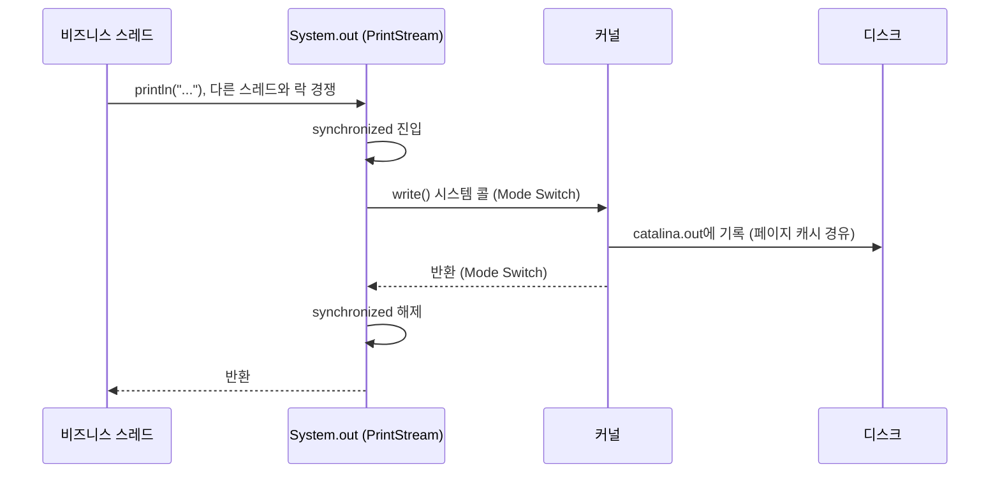
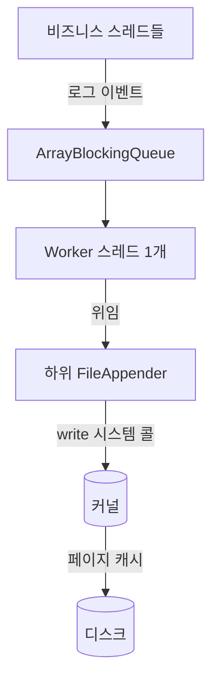

# System.out.println과 AsyncAppender — OS I/O 관점

> - `System.out.println`은 PrintStream을 동기·라인 단위로 호출 → 매 호출이 사실상 시스템 콜 → Mode Switch가 매번 발생
> - `PrintStream`은 내부 `synchronized` 락으로 모든 스레드를 직렬화 → 멀티스레드 톰캣에선 락 경합까지 추가
> - Logback의 동기 FileAppender는 `immediateFlush=false`로 두면 8KB 버퍼로 시스템 콜 횟수 절감 (기본값 `true`는 이벤트마다 flush)
> - AsyncAppender는 큐 + 워커 스레드를 둬서 비즈니스 스레드가 직접 I/O를 하지 않도록 분리 → 응답 시간에서 디스크 지연 영향 제거

로그 한 줄 찍는 사소해 보이는 작업이 실제로는 OS의 입출력 비용이 계속해서 발생할 수 있으므로, 최적화된 로깅 프레임워크를 사용하는 것이 중요하다.

## System.out.println의 비용 구조

`System.out`은 `PrintStream` 객체로, 다음과 같은 특성을 갖는다.

```java
public class PrintStream extends FilterOutputStream {

    public void println(String x) {
        synchronized (this) {       // 1. 전체를 synchronized로 감쌈
            print(x);
            newLine();              // 2. 줄바꿈 후 autoFlush이면 flush 호출
        }
    }
}
```

- 모든 `println` 호출이 `synchronized(this)`로 직렬화 → 멀티스레드 환경에서 락 경합
- `autoFlush = true`로 생성되어, 한 줄마다 내부 버퍼를 비우고 시스템 콜 발생

### 한 줄 출력 시 일어나는 일



- Mode Switch 두 번 발생
- 락 진입·해제 비용 발생
- 페이지 캐시까지의 디스크 I/O

API 한 번 호출에서 로그 줄이 수십~수백 개 찍히면, 이 비용이 응답 시간에 그대로 쌓인다.

## Logback의 동기 FileAppender

Logback의 `FileAppender`는 `System.out`과 같은 동기 출력 어펜더지만, 락 범위·버퍼링·포맷팅 측면에서 다음과 같은 차이가 있다.

|    항목     | `System.out.println` |               Logback `FileAppender`                |
|:---------:|:--------------------:|:---------------------------------------------------:|
|   락 범위    | 전역 (단일 PrintStream)  |                        어펜더별                         |
| 사용자 공간 버퍼 |  autoFlush로 사실상 무효화  |      8KB 버퍼 보유 (`immediateFlush=false`일 때 효과)       |
| 시스템 콜 빈도  |      라인당 1회 이상       | 기본(`immediateFlush=true`)은 이벤트마다, `false`면 버퍼가 찰 때만 |
|    포맷팅    |     호출자 스레드에서 즉시     |                    인코더가 효율적으로 처리                    |

`immediateFlush` 기본값이 `true`인 이유는 비정상 종료 시 사용자 공간 버퍼에 머문 로그가 소실되는 것을 막기 위해서다.

- 기본(`true`): 매 이벤트마다 `flush()` → `write()` 시스템 콜이 라인당 1회 발생
- 처리량 우선(`false`): 8KB 버퍼가 찰 때까지 누적 → Mode Switch 급감, 단 크래시 시 버퍼 내용 손실 감수

## AsyncAppender

비즈니스 스레드와 I/O 스레드를 분리해, 응답 시간에서 I/O 부담을 떼어내는 구조다.



- 비즈니스 스레드는 큐에 이벤트만 넣고 즉시 반환 → 디스크 지연이 응답 시간에 영향 없음
- Worker 스레드가 큐에서 꺼내 하위 어펜더로 위임 → I/O는 특정 스레드가 전담

대신 큐가 가득 찼을 때의 동작은 옵션으로 골라야 한다.

|                          설정                          |                   큐 가득참 시 동작                   |
|:----------------------------------------------------:|:----------------------------------------------:|
| `discardingThreshold`=큐의 20%(기본), `neverBlock=false` | 잔여 < 20%면 TRACE/DEBUG/INFO 드롭, WARN/ERROR는 블로킹 |
|     `discardingThreshold=0`, `neverBlock=false`      |             모든 레벨 블로킹 → 동기 어펜더와 유사             |
|                  `neverBlock=true`                   |             큐 가득차면 즉시 드롭, 로그 손실 허용             |

## Appender 선택 기준

대부분의 앱은 동기 `FileAppender`(또는 그 하위 `RollingFileAppender`)를 그대로 사용한다.

- 일반 웹 앱은 로그 빈도가 초당 수백 줄 수준이라, 동기 `write()` 비용이 응답 시간에 큰 영향을 주지 않음
- Spring Boot의 기본 로깅 설정도 동기 `RollingFileAppender`
- AsyncAppender는 측정상 로깅이 병목으로 드러난 뒤 도입하는 도구 → 초당 수천 건 이상의 고볼륨 로깅, p99 latency가 빡빡한 서비스, NFS·암호화 볼륨 같은 느린 디스크 환경 등

세 방식의 특성을 정리하면 다음과 같다.

|      항목      | `System.out.println` |         Logback `FileAppender`         | `+ AsyncAppender` |
|:------------:|:--------------------:|:--------------------------------------:|:-----------------:|
|     락 범위     |          전역          |                  어펜더별                  |     어펜더별 + 큐      |
|   시스템 콜 빈도   |        라인당 1회        | 기본 라인당 1회, `immediateFlush=false`면 버퍼당 |  Worker 스레드에 집중   |
| 비즈니스 스레드 블로킹 |          O           |                   O                    |  X (큐 enqueue만)   |
| 크래시 시 로그 손실  |        거의 없음         |               거의 없음(기본)                |    큐 잔여분 손실 가능    |
|    실무 사용도    |          지양          |                   표준                   |    측정 후 선택적 도입    |

- 락 범위
    - `System.out`은 JVM에 단 하나뿐인 `PrintStream` 객체에 `synchronized` 락이 걸려 어디서 호출하든 모든 스레드가 한 줄로 직렬화
    - FileAppender는 어펜더 인스턴스마다 락이 별도라 어펜더를 분리(에러용·액세스용 등)하면 락이 자연히 분산
- 시스템 콜 빈도: `System.out`은 autoFlush로 매 라인 `write()` 강제, FileAppender는 `immediateFlush=false`로 8KB 버퍼링 가능
- I/O 블로킹: 동기 어펜더는 호출 스레드가 디스크 완료까지 묶임, AsyncAppender는 호출 스레드를 큐로 분리해 Worker가 대신 부담
