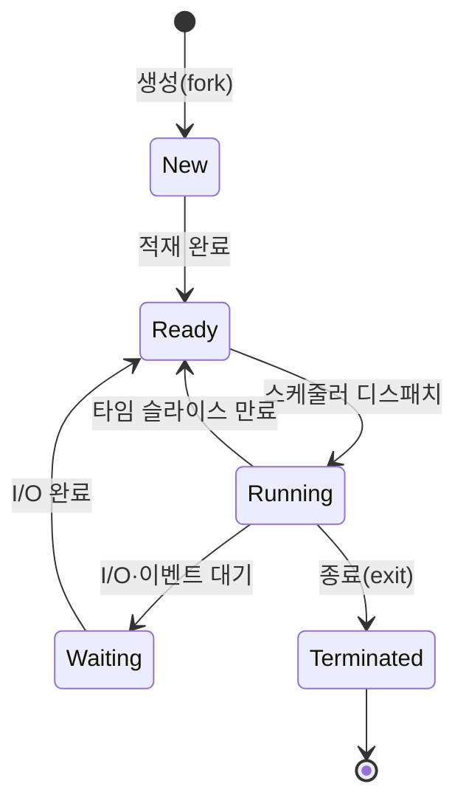

# 프로세스(Process)란

> - 프로세스는 실행 중인 프로그램으로, 디스크의 정적 프로그램이 메모리에 적재되어 CPU에 의해 실행되는 동적 인스턴스
> - 커널은 프로세스마다 PCB(Process Control Block)를 두어 상태·레지스터·메모리 매핑·자원을 관리
> - 프로세스 간에는 메모리가 격리되어, 한 프로세스의 오류가 다른 프로세스를 침범하지 못함

프로세스는 단순한 코드 덩어리가 아니라, 커널이 자원을 할당하고 격리하는 단위이자 보호의 경계다.

## 프로그램 vs 프로세스

같은 코드라도 디스크에 정적으로 놓여 있는지, 메모리에 적재되어 실행 중인지에 따라 부르는 이름이 다르다.

| 구분 |      프로그램      |            프로세스            |
|:--:|:--------------:|:--------------------------:|
| 상태 | 디스크에 저장된 정적 파일 |  메모리에 적재되어 실행 중인 동적 인스턴스   |
| 자원 |    자원 점유 없음    | 주소 공간, CPU 시간, 파일 디스크립터 점유 |

## 프로세스의 메모리 구조

프로세스가 메모리에 적재되면 용도에 따라 영역이 나뉘며, 이 독립된 주소 공간이 프로세스 격리의 핵심이다.

|     영역      |             용도              |
|:-----------:|:---------------------------:|
| Text (Code) |         실행할 기계어 명령          |
|    Data     |        초기화된 전역·정적 변수        |
|     BSS     |      초기화되지 않은 전역·정적 변수      |
|    Heap     | 동적 할당 메모리 (`new`, `malloc`) |
|    Stack    |   함수 호출 프레임, 지역 변수, 복귀 주소   |

- Stack은 `RLIMIT_STACK`으로 상한이 정해지며, 한도를 넘어서면 가드 페이지를 건드려 Stack Overflow 발생
- Heap은 `brk`/`mmap` 시스템 콜로 필요한 만큼 영역 확장

## PCB(Process Control Block)

커널이 프로세스를 관리하기 위해 유지하는 자료 구조로, Context Switch 시 저장·복구의 대상이 된다.

|    항목    |          내용           |
|:--------:|:---------------------:|
| 프로세스 식별  |      PID, 부모 PID      |
|    상태    | ready/running/waiting |
| CPU 컨텍스트 |     레지스터, PC, SP      |
|  메모리 정보  |    페이지 테이블, 메모리 한계    |
|    자원    | 열린 파일 디스크립터, 시그널 핸들러  |
| 스케줄링 정보  |   우선순위, 누적 CPU 사용량    |

프로세스를 교체할 때 커널이 PCB 전체를 저장·복구해야 하므로, 이 과정이 곧 Context Switch 비용으로 이어진다.

## 프로세스의 상태 전이

프로세스는 생성부터 종료까지 여러 상태를 오가며, 이 전이를 결정은 커널의 스케줄러가 담당한다.

- Ready: 실행 가능하지만 CPU를 배정받지 못해 대기 중인 상태
- Running: 실제로 CPU를 점유해 명령을 실행 중인 상태
- Waiting(Blocked): I/O 완료 같은 외부 이벤트를 기다리며 CPU를 양보한 상태

`read()`로 디스크를 읽는 동안 프로세스가 Waiting으로 내려가고, 그 사이 다른 프로세스가 Running으로 올라오는 멀티프로그래밍의 핵심 메커니즘이 된다.

## 프로세스 생성 - fork

Unix 계열에서 새 프로세스는 기존 프로세스를 복제하는 방식으로 만들어진다.

- `fork()`: 부모 프로세스의 주소 공간을 복제해 자식 프로세스 생성
- 복제 직후엔 부모와 자식이 같은 메모리 내용을 가지지만, 주소 공간은 분리
- Copy-on-Write(CoW): 실제 복사는 미루고, 어느 한쪽이 쓰기를 시도할 때만 해당 페이지를 복제 → 생성 비용 절감
- `exec()`: 자식이 자신의 메모리 이미지를 새 프로그램으로 덮어씀

## 좀비 프로세스와 고아 프로세스

프로세스의 종료는 단순히 사라지는 것이 아니라, 부모가 종료 상태를 회수(reap)해야 완전히 소멸하는데, 이 과정이 지켜지지 않으면 좀비와 고아 프로세스가 발생한다.

|     구분     |               정의                |              처리               |
|:----------:|:-------------------------------:|:-----------------------------:|
| 좀비(Zombie) | 자식이 종료했지만 부모가 아직 종료 상태를 회수하지 않음 | 부모가 `wait()` 호출 시 PCB 정리되어 소멸 |
| 고아(Orphan) |       부모가 자식보다 먼저 종료한 상태        |    `init`(PID 1)이 관리하여 회수     |

- 좀비는 종료된 프로세스의 종료 코드만 PCB에 남은 상태로, CPU·메모리는 이미 반환했지만 PID와 PCB 슬롯을 점유
- 좀비가 대량으로 쌓이면 PID 고갈로 새 프로세스 생성이 막힐 수 있음
- 부모가 `wait()`를 호출하지 않고 계속 자식을 만드는 코드가 흔한 원인

고아는 입양 메커니즘 덕분에 문제가 되지 않지만, 좀비는 부모의 회수 책임이 지켜지지 않을 때 누적되어 장애로 이어진다.
