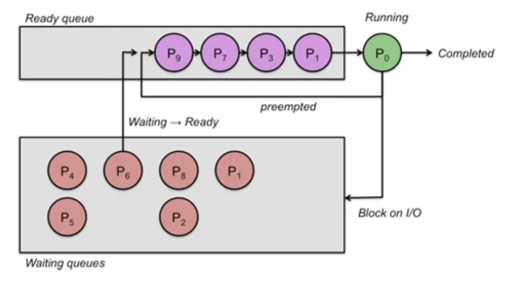
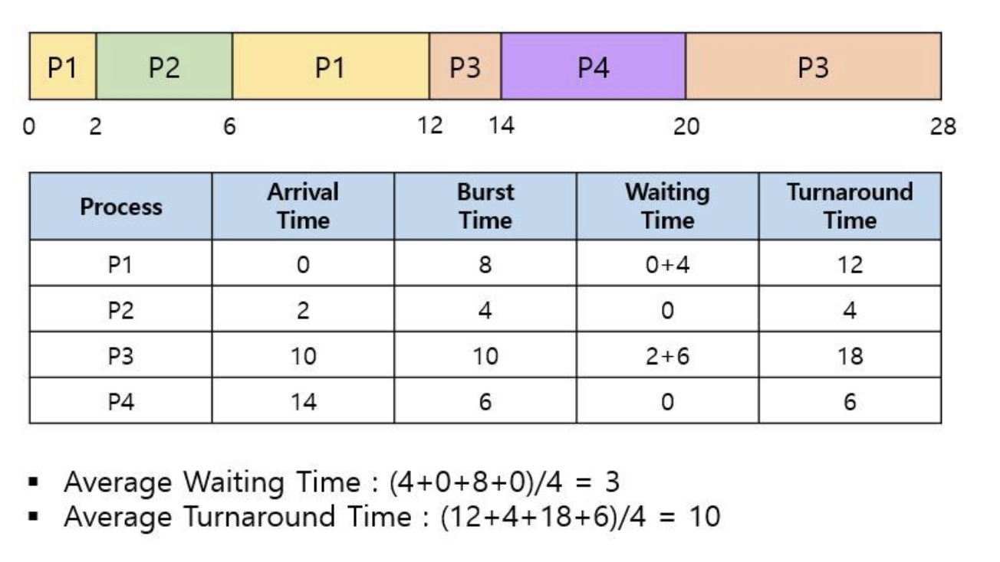
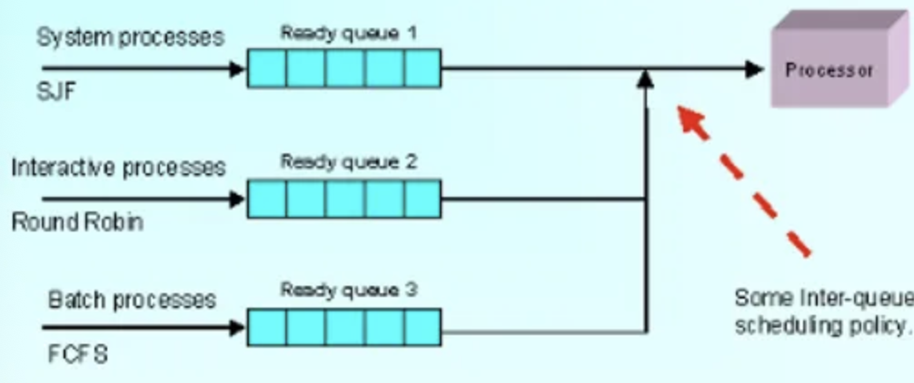
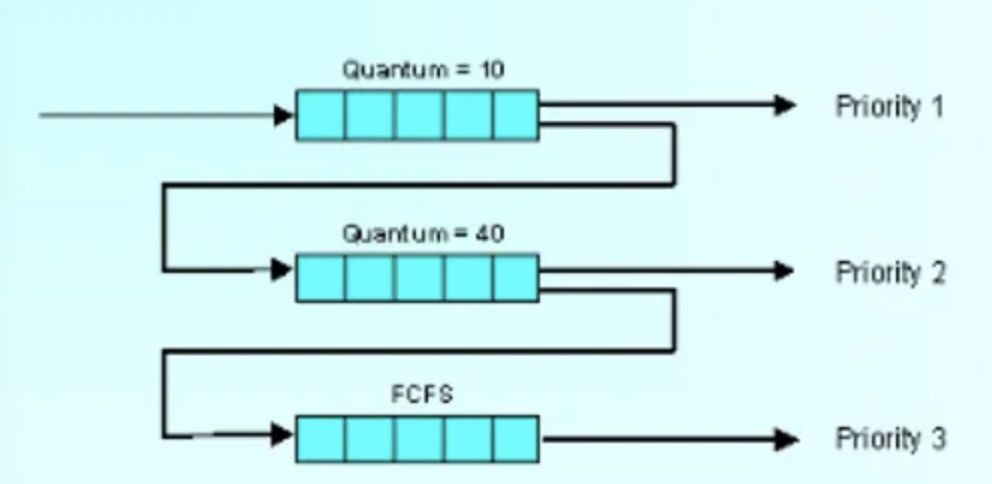
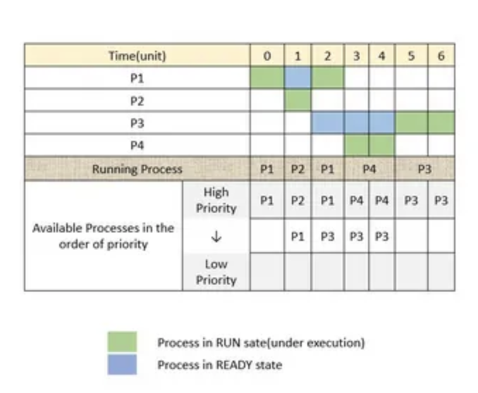
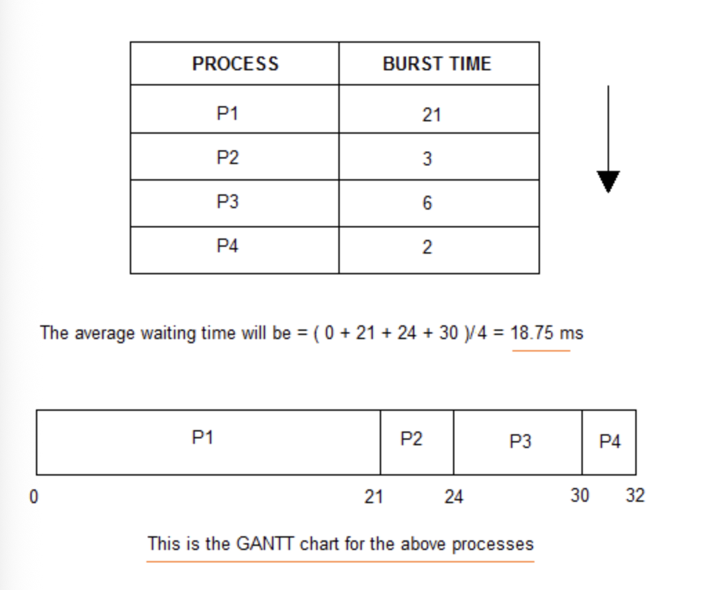
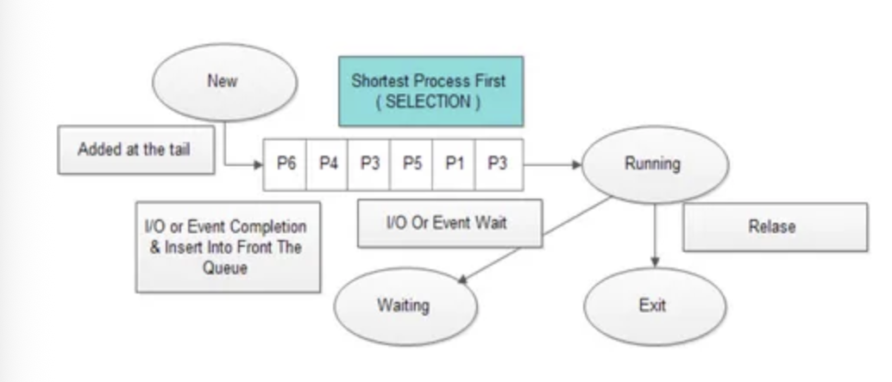
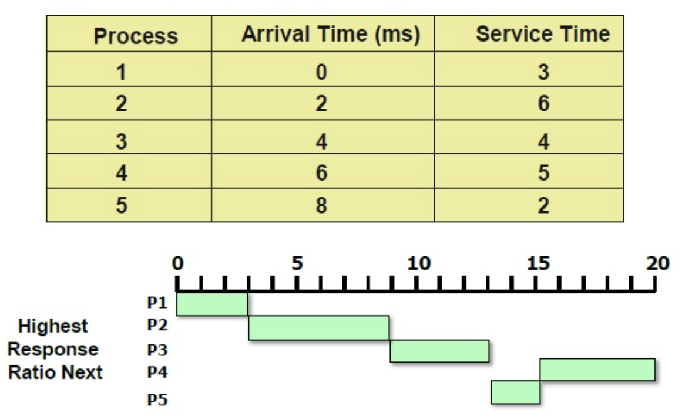

## CPU 스케줄링 알고리즘의 대표적인 종류(FCFS, SJF, RR 등)를 간단히 설명해 주세요.

> 선점형의 경우 일정한 시간을 할당하는 Roud-Robin, 가장 짧은 시간이 소요되는 프로세스를 먼저 수행하는 SRT 등이 있고,
> 비선점형의 경우 대기 큐 순서에 따른 FCFS, 도착 시점 기준 가장 짧은 수행 시간 순으로 처리하는 SJF 등이 있습니다.

### 선점형 스케줄링의 알고리즘 대표적인 알고리즘 종류

### 라운드 로빈 (Round Robin, RR)

- 프로세스마다 같은 크기의 CPU 시간을 할당한다.

- 프로세스가 할당된 시간 내에 처리 완료하지 못하면 준비 큐 리스트의 가장 뒤로 보내지고, CPU는 대기 중인 다음 프로세스로 넘어간다.

- 균등한 CPU 점유 시간을 보장하고, 시분할 시스템을 사용한다.

> 시분할 시스템은 CPU 스케줄링과 다중 프로그래밍을 이용해 각 사용자들에게 컴퓨터 자원을 시간적으로 분할해 사용할 수 있게 해주는 대화식 시스템이다.

### SRT (Shortest Remaining Time First)

- 가장 짧은 시간이 소요되는 프로세스를 먼저 수행한다.

- 남은 시간이 더 짧다고 판단되는 프로세스가 준비 큐에 생기면 언제라도 프로세스가 선점된다.

### 다단계 큐 (Multi Level Queue)

- 작업들을 여러 종류 그룹으로 분할, 여러 개의 큐를 이용해 상위 단계 작업이 선점된다.

- 각 큐는 자신만의 독자적인 스케줄링을 가진다.

### 다단계 피드백 큐 (Multi level Feedback Queue)

> 우선 순위가 높은 프로세스를 먼저 처리해야 하는데 계속 밀리는 상황이 발생할 것이다.

- 입출력 위주와 CPU 위주인 프로세스 특성에 따라 큐마다 서로 다른 CPU 시간 할당량을 부여한다. (FCFS + RR 혼합)

- CPU burst와 중요도의 상관 관계를 파악해서 우선순위를 처리한다.

- 사용자와 상호 작용을 보고 우선 순위가 높은 프로세스가 계속 들어오면 낮은 우선순위 프로세스는 계속 할당을 못하기 때문에 기아 현상이 발생할 수 있다. -> Aging 방식을 도입할 수 있다.

### 비선점형 스케줄링의 알고리즘 대표적인 알고리즘 종류

### 우선순위 (Priority)

- 각 프로세스 별로 우선순위가 있어서 이에 따라서 CPU를 할당한다. (같다면 FCFS로 해결)

- 사실 이는 선점형으로 쓰이기도 한다.

- 만약 우리가 배치 작업이나 알림 발송 같은 작업이 필요할 때 이를 사용하면 중요 작업 먼저 수행할 수 있을 것이다.

### DeadLine

- 명시된 기간 내에 완료되도록 계획한다.

### FCFS(First Come First Served)

- 프로세스가 대기 큐에 도착한 순서에 따라서 CPU를 할당한다.

- 실행 시간이 긴 프로세스가 오면 뒤는 계속 기다려야 한다.

### SJF (Shortest Job First)

- 프로세스가 도착한 시점에 따라 그 당시 가장 작은 서비스 시간을 가지는 프로세스가 종료 시까지 자원을 선점한다.

- 준비 큐 작업 중 가장 짧은 작업부터 수행하므로 평균 대기 시간이 최소이다.

- 당연히도 **기아 현상**이 발생가능하다.

- 비슷한 SRTF 도 있다. 이는 선점형 방식이다.

### HRN (Highest Response Ratio Next)

- 대기 중인 프로세스 중 현개 Response Ratio 가 가장 높은 것을 택한다. (Response Ratio = (대기 시간 + 서비스 시간) / 서비스 시간)

#### 참고

Linux는 CFS가 기본 스케줄러로 "모든 프로세스가 CPU 자원을 공평하게 할당" 하는 철학으로 동작한다네요. 

Windows/Mac 의 경우는 MLFQ를 사용해 동적으로 우선순위를 조정하는 방식을 택한다고 합니다.