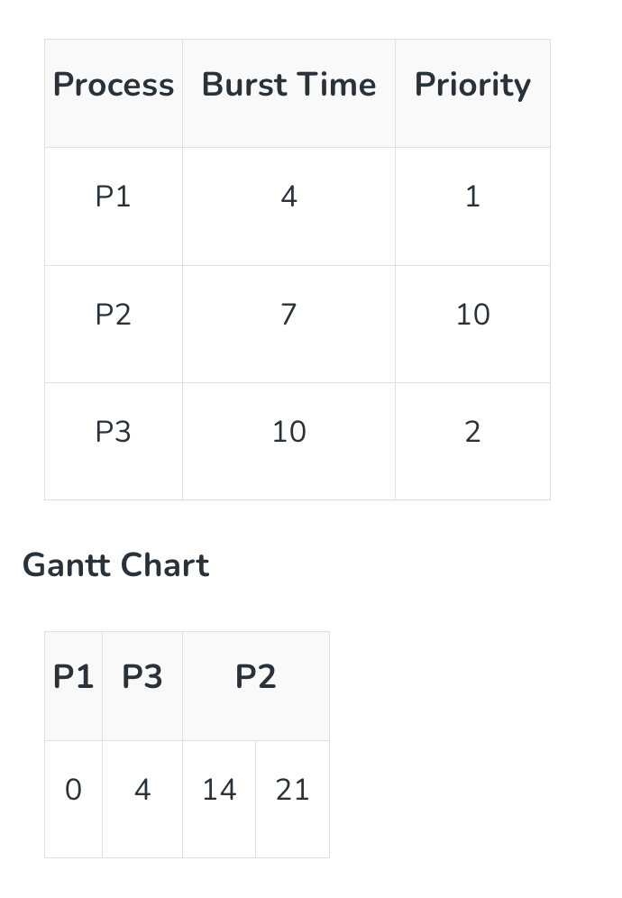
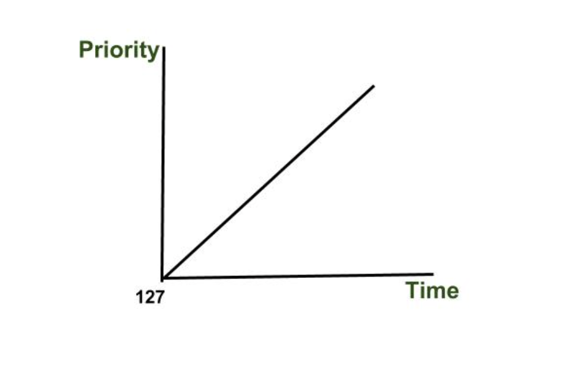

## 스케줄링에서 발생하는 기아(Starvation) 현상의 정의와 이를 해결하기 위한 에이징(Aging) 기법의 원리는 무엇인가요?

### Starvation(기아) 상태란?

***

특정 프로세스의 우선 순위가 낮아서 원하는 자원을 계속 할당받지 못하는 상태이다.

> 20개의 프로세스가 있는데 19개의 우선순위는 1, 나머지 1개는 2의 우선순위라 하자.
> 해당 프로그램은 10번의 실행 과정을 거치면 종료될때
> 2번 우선순위는 어떠한 경우든 자원을 할당받을 수 없다.

#### Starvation 의 원인

1. **공평하지 않은 스케줄링**
    높은 우선순위가 있다는 것은 항상 낮은 우선순위도 존재한다는 것이다. 
    굳이 우선순위 뿐 아니라 Random 의 경우에도 항상 선택에서 빠지는 프로세스가 있을 수 있다. (희생자)

2. **적은 자원**
    자원 제한으로 인해 다른 프로세스가 기다리는 시간이 늘어날 수 있다.

#### Starvation 이 발생하는 스케줄링

1️⃣ SJF (Shortest Job First)

- 계속해서 CPU 사용이 짧은 일을 먼저 수행하기에 CPU 사용 시간이 길다면 계속해 할당 받을 수 없을 것이다.

2️⃣ SRT(Shortest Remaing Time first)

- 새로운 프로세스가 도달할 때마다 남은 burst time보다 더 짧은 CPU burst time 이 있으면 선점하기에 긴 burst time 의 경우 계속해 할당 받을 수 없을 것이다.

3️⃣ 우선순위

- 우선 순위가 낮으면 계속해 할당 받을 수 없을 것이다.

4️⃣ SPN, Feed-back 등 우선순위와 관련이 있다면 기아 상태가 발생한다.

#### 해결 방법

- 프로세스 우선 순위를 변경해 우선 순위가 높아도 수행할 기회를 나누어 준다.

- 오래 기다린 프로세스의 우선 순위를 높인다. (Aging)

- 우선 순위가 아닌 요청 순서대로 처리하는 큐를 사용한다. (FCFS)

### Aging?

> 시스템에서 너무 오래 대기한 프로세스의 우선 순위를 **점진적**으로 높여 기아 상태를 방지하는 스케줄링 기법이다.

- 오래 대기한 프로세스도 결국 CPU 시간을 할당받게 되므로 공정성을 보장해준다.

- 단기적인 효율성과 장기적인 공정성 간 균형을 맞추기 위해 우선순위 스케줄링 or RR을 섞어서 쓰게 된다.

그림처럼 우선 순위 범위가 127(낮) -> 0 (높)까지 일때, 대기 중인 프로세스의 우선순의를 15분 마다 한 단계씩 올려서 결과적으로 반드시 실행되도록 보장해준다.

#### 참고

기아 현상과 교착 상태는 다른데,

기아 현상은 특정 프로세스가 CPU 할당을 못 받는 상태

교착 상태는 모든 프로세스가 CPU 할당을 못 받는 상태입니다. (상호 배제, hold and wait, 비선점, 순환대기의 특징을 가져야 함.)

[Starvation 참고 자료](https://www.geeksforgeeks.org/operating-systems/starvation-and-aging-in-operating-systems/)