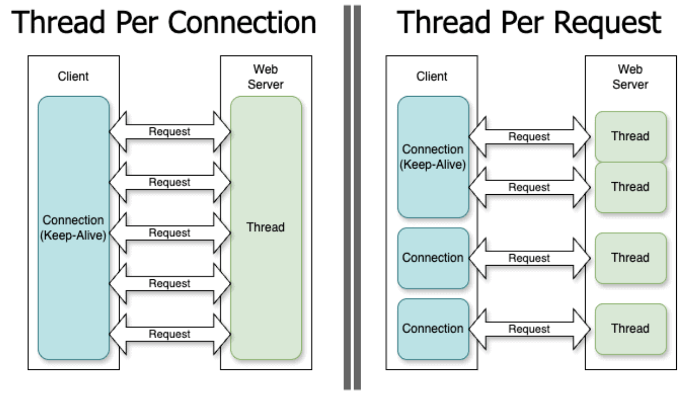

## Spring Boot의 기본 서블릿 모델(Thread-per-request)과 Java 21 가상 스레드(Virtual Thread) 모델의 차이를 OS 커널 스레드 스케줄링 관점에서 비교해 주세요.

### Thread per Connection vs Thread per Request

***

- 스레딩 모델은 동시성과 multitasking 을 위해 스레드를 언제 어떻게 생성하고 동기화할지에 대한 프로그램 설계 방식이다.

- thread-per-connection 은 웹 서버가 연결 하나당 하나의 스레드를 사용한다.

- thread-per-request 은 웹 서버가 해당 요청이 기존 연결에 속해 있는지 여부와 관계 없이 요청 하나당 하나의 스레드를 사용한다.

### 기존 서블릿 모델의 OS 커널 스케줄링

1. HTTP 요청이 들어오면 Tomcat 의 Thread Pool 에서 스레드를 하나 할당 한다.

2. 스레드가 DB 조회나 외부 API 호출같은 IO 작업을 수행하면, 해당 OS 스레드는 WAITING 상태로 블로킹된다.

3. OS 커널은 다른 스레드를 수행하기 위해 context switching 을 수행한다. (오버헤드 발생)

### Java 21 가상 스레드

- 스레드는 OS에 의해 관리되고 스케줄링이 되는데, 가상 스레드는 가상 머신이 관리하고 스케줄링된다.

> 새로운 커널 스레드를 생성하려면 시스템 call 을 해야 한다. (비용이 높다.)

그래서 스레드를 재할당하고 해제하는 대신 스레드 풀을 사용하는 것이다. 

> 가상 스레드 할당 시 시스템 콜이 필요하지 않고, OS의 컨텍스트 스위치가 발생하지 않는다.

그래서 NIO(new input/output) 이나 비동기 API 작업이 필요 없고 디버깅 하기 쉬워진다.

### Java 21 가상 스레드 모델

이는 JVM 이 스케줄링을 수행한다.

1. 요청이 들어오면 가벼운 가상 스레드가 생성된다. 이는 약간의 OS 스레드(케리어 스레드라 함) 위에서 실행된다.

2. 가상 스레드가 IO 작업 때문에 블로킹되면 OS 스레드를 멈추는 것이 아니라 대신 가상 스레드 상태를 JVM heap 에 저장하고 Carrier Thread 에서 내려온다.

3. 비워진 Carrier Thread는 OS 컨텍스트 스위칭 없이 바로 다른 가상 스레드를 올려(Mount) 실행한다,

4. IO가 끝나면 대기하던 가상 스레드가 다시 캐리어 스레드에 올라가 멈춰진 시점부터 다시 실행한다.

> 참고로 가상 스레드를 쓸 때 `stnchronized` 내부에서 IO를 수행하면 Carrier Thread 에서 나오지 못하기에 OS 스레드를 블로킹하는 Pinning 현상이 발생할 수 있다.

### 참고 자료

[Virtual Thread에 봄(Spring)은 왔는가](https://tech.kakaopay.com/post/ro-spring-virtual-thread/)

[Spring MVC 의 기본 요청 처리 방식 - Thread Per Request Model](https://0soo.tistory.com/140)

[Virtual Thread](https://docs.oracle.com/en/java/javase/21/core/virtual-threads.html)