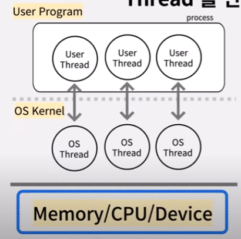
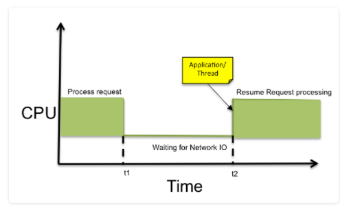

## 대규모 트래픽 발생 시 Tomcat의 최대 스레드 풀 크기 설정을 무작정 크게 잡으면 발생하는 CPU 컨텍스트 스위칭 병목 현상을 설명해 주세요.

***

### 내가 실제로 겪었던 사항

***

- k6로 부하 테스트를 진행했는데, 200vu 기준으로 `http_req_duration`의 평균이 360.28ms인데, `http_req_waiting`이 360.11ms 이였다.

- 단순히 현재 DB 커넥션 풀을 50으로 늘렸더니 모든 성능이 좋아지긴 했다.

- 그런데 이게 답이 맞을까? 실 운영에서 문제가 있나?

### 스레드가 많으면 좋은거 아닌가요?

- 저번에 이야기 했듯 Java 는 `thread per request` 로 요청에 따라서 스레드를 생성합니다. (One-to-One Threading-Model)

- User 스레드를 생성하고 OS 스레드를 연결해야 합니다.
- 따라서 새로운 스레드를 생성할 때마다 OS 커널의 작업이 필요하기에 **스레드 생성 시 OS 커널 작업**이 필요합니다.

### 스레드 풀이란?

- 그렇기에 스레드 생성 비용이 많이 들어 `Pool` 이라는 아이디어를 사용하게 된 것인데, `미리 Thread를 만들어둔 뒤 재사용` 할 수 있게 되는 것이다.

- 요청이 올 때마다 새로운 스레드를 생성하는 것이 아닌 이미 대기 중인 스레드에게 할당하고 이 사용할 스레드를 제한하기에 추가로 생성되는 것을 방지할 수 있다.

- 스레드 풀이 필요한 상황은 다음과 있다.

1. CPU 프레임 작업이 많을 때 (데이터 변환, 파일 처리 등)

2. IO 프레임 작업이 많을 때 (외부 API 호출)

3. 멀티 스레드 환경에서 실제로 제어가 필요할 때

### Tomcat 의 최대 스레드 풀을 늘리면 발생하는 일?

- 서버 요청 -> Tomcat 설정 최대 스레드까지 새로운 스레드 생성/풀에서 꺼내 요청을 1:1로 매핑 -> OS는 모든 스레드가 모두 조금씩이라도 실행되게 하려고 계속해 스레드를 교체한다. -> 교체 과정에서 PCB에 저장/복원을 해 메모리 접근 비용이 증가한다. -> CPU 사용률은 100%가 되는데 전체 Latency 가 늘어나 타임 아웃이 발생한다.

즉, Trade-Off 가 존재한다.

- DB 쿼리 응답 대기 등 I/O 대기 시간이 긴 App 의 경우 어느 정도 스레드 수를 늘리면 동시에 대기할 수 있는 요청이 많아져 (특정 임계점까지는) Throughput 이 상승한다.

- Java 는 기본적으로 1MB의 스택 메모리를 할당받는데, 스레드를 2000개로 한다면 2GB의 메모리를 사용하게 되어 OOM의 원인이 될 수 있다.

### 그러면 어떻게 설정해야 하나요?

[리틀의 법칙](https://namu.wiki/w/%EB%A6%AC%ED%8B%80%EC%9D%98%20%EB%B2%95%EC%B9%99)

- 적정 스레드 개수 = cpu 수 * (1+대기, 유휴 시간/서비스 시간)

CPU 대기 시간이 서비스 시간보다 짧으면 CPU 개수보다 스레드가 적어야 성능이 좋다. (대기가 짧기에 스레드 개수가 적어도 상관 없음)

하지만, 반대로 대기 시간이 서비스 처리 시간보다 길다면 스레드 수는 CPU 보다 많아야 성능이 좋다.

위 블로그를 참고하는 것을 추천한다.

### 그렇다면 나의 상황에서?

- Tomcat 스레드 풀 => 클라의 HTTP 요청을 받아들임.

- DB 커넥션 풀(HikariCP) => DB 과 통신하기 위한 사전 연결 통로

위의 상태에서 나는 Virtual Thread 를 도입했다. (Feign 처리가 필요했기에)

그런데 DB 커넥션이 30개라면 요청이 들어와도 처리할 수 없을 것이기에 50개로 늘리고 connection-timeout 을 늘렸더니 500 에러가 줄었다.

🤔 그러면 커넥션 풀을 늘리면 좋은거 아닌가?

- App 에서 대기 시간은 줄겠지만, DB에서 문제가 터진다. 

- 나는 단일 DB였기 때문에, 동시에 쿼리를 넣으면 DB 서버의 CPU 컨텍스트 스위칭으로 인해 DB가 다운될 수 있다. (DB 락 경험 및 디스크 IO 스레딩 발생)

- `connections = ((core_count * 2) + effective_spindle_count)`

를 추천한다. -> 이 때 권장 커넥션 풀 사이즈가 16~20이다.

- 결론적으로 지금 요청 테스트 상황에서는 괜찮을 수 있지만, VU 가 늘어나면 DB가 다운될 수 있다.

- 즉 그냥 나는 응급처치를 한 것이다.....

- 우리가 해야 하는 것은 쿼리 자체를 튜닝해 DB 커넥션을 빨리 반환하게 해야한다.

`#No-Offset paging`, `#Redis`, `#Explan_으로 DB쿼리 확인`, `#Scale-out` 등 여러 기술을 살펴보는 것을 더 추천

### 참고 자료

***

[Thread-pool 정리](https://velog.io/@mooh2jj/Tomcat-Thread-Pool-%EC%A0%95%EB%A6%AC)

[카카오 테크 가상 스레드 설명](https://www.youtube.com/watch?v=vQP6Rs-ywlQ&t=1272s)

