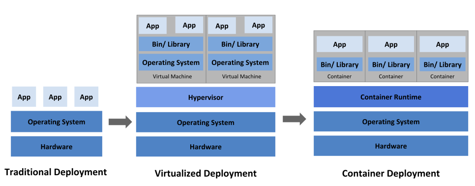

## 쿠버네티스(k8s) 환경에서 자바 컨테이너의 CPU Limit을 설정했을 때, 리눅스 커널 스레드(CFS)의 어떤 메커니즘 때문에 CPU Throuttling(성능 제한)이 유발되나요?

***

### 쿠버네티스 (k8s)

> 컨테이너화된 애플리케이션의 대규모 배포, 스케일링 및 관리를 간편하게 만드는 오픈 소스 기반 컨테이너 오케스트레이션 도구



- 과거의 배포: 컴퓨터 한 대에 하나의 OS를 깔고 그 곳에 여러 프로그램을 설치하는 방식

- 그 다음의 배포(가상화 배포): 가상 머신(VM)을 기반으로 전용 컴퓨터를 만들어 컴퓨터를 설치하는 방식

- 컨테이너 중심의 배포: 위의 VM 에 하이퍼바이저라고 중간을 연결하는게 있는데 이를 대신에 컨테이너 기반으로 되었다. (매번 OS를 설치할 필요 없이)

k8s는 자동 복구, 로드 밸런싱, 서비스 발견, 확장성 등을 제공해주고,

파드(Pod), 서비스(Service), 볼륨(Volume), 네임 스페이스로 구성되어 있다.

-> 그냥 알 것은 컨테이너가 너무 많아져 관리의 어려움 -> 이를 자동으로 도와주는 것이 쿠버네티스이다.


### 자바 컨테이너 CPU Limit 설정

모든 앱은 CPU와 메모리를 사용하게 된다.

다만 Docker 은 가상화 기술이기에 (컨테이너는 격리된 공간에서 실행) => 프로세스가 사용할 수 있는 리소스를 제한할 수 있다.

자바 애플리케이션은 JVM 런타임 환경에서 실행되는데, 이 때 사용하는 메모리가 다양하게 있다.

이 중 App 사용량에 따라 크게 변하는 부분이 `메모리 영역의 Heap` 이다.

> 자바 객체가 동적으로 할당되는 공간

객체가 많이 사용될수록 힙 메모리 영역도 많이 사용하게 되어 애플리케이션이 실행될 때 힙 메모리 사용량을 지정해주어야 한다.

> 힙 메모리는 보통 전체 서버 메모리의 50~80% 를 힙 메모리 사용량으로 설정하는 것이 일반적

DockerFile 에서 다음과 같이 지정 시 App 실행 시의 최대 힙 메모리 사용량을 지정할 수 있다.

```
ENV JAVA_OPTS="-XX:+UnlockExperimentalVMOptions -XX:+UseCGroupMemoryLimitForHeap"
```

(다만 Java 10 이상부터는 기본으로 활성화이기에 우리는 고민할 필요는 없다.)


### 리눅스 커널 스레드(CFS)

> Completely Fair Scheduler

- 모든 Runnable 프로세스에게 수학적으로 완벽하게 공정한 CPU 시간을 분배하겠다.

더 궁금하시면 아래 참고자료 4를 살펴보는 것을 추천합니다.

K8s 컨테이너의 CPU limit 를 걸면, 리눅스 커널의 cgroups(control groups, 대충 컨테이너)와 CFS Bandwidth control 매커니즘에 의해 자원이 제어된다.

아래는 설정값이다.

1. `cfs_period_us` : CPU 시간을 할당하는 주기

2. `cfs_quota_us` : 한 주기동안 해당 컨테이너가 사용할 수 있는 최대 CPU

우리가 CPU Limit 을 1로 제한하면 100ms 주기마다 100ms의 실행 시간(quota)를 할당 받는다는 것이다.


### CPU Throuttling (성능 제한)이 어떻게 일어나는 거지?


1. k8s Pod 에 CPU 제한을 1로 설정한다. 
    - 이 뜻은 커널이 이 컨테이너에게 100ms 마다 CPU Quota 를 부여한다는 것이다.

2. 트래픽이 들어와서 자바 App 내에 4개의 스레드가 동시 작업을 한다.

3. 4개의 스레드가 각 CPU 코어에서 동시에 실행되면, 실제 시간은 25ms가 지났는데, 전체 시간을 합치면 100ms 가 된다. 즉, 20ms만에 Quota 가 모두 소진된다.

4. 남은 75ms 동안 해당 컨테이너에 속한 모든 스레드의 실행이 커널에 의해 강제 일시 정지가 된다.

5. 이 75ms 동안은 어떤 요청이나 GC 작업 등을 못하기에 응답 시간이 튀는 것 처럼 보인다. 즉, 평균 CPU 사용률은 낮아보이더라도 100ms 구간에서는 Throuttling 이 빈번하게 일어날 수 있다.


그러면 어떻게 해결해야 하나요? 

- 가장 기본적인 것은 그냥 건들이지 않는 것이다. 필요 상황에서만 튜닝하는 것이다.

[Best Practices]

> Java Memory Arguments for Containers

1. 힙 크기 구성에 사용하는 옵션에 관계없이 항상 컨테이너에 최소 25% 더 많은 메모리를 할당한다.

2. 초기 힙 크기와 최대 힙 크기를 동일하게 한다. (힙 크기가 초기 할당 크기보다 커질 때 JVM 이 중지되어서 둘을 같이 하면 GC 중지 시간이 줄어든다.)

3. CPU, Memory Limit 을 너무 낮게 설정하지 마라.

4. k8s 에서 앱 실행 전에 최소 예상 로드에서 앱이 소비하는 메모리 량을 측정해라.

5. 그 외에도 다양한 이야기가 아래에 담겨있다.

[java-application-on-kubernets](https://eottabom.github.io/post/java-application-on-kubernetes/)

### 참고 자료

***

[쿠버네티스란?](https://kubernetes.io/ko/docs/concepts/overview/)
[쿠버네티스란?2](https://jdcyber.tistory.com/46)
[컨테이너 최적화하기(컨테이너에 CPU, 메모리 한도 지정)](https://nijy.tistory.com/128)
[CFS란?](https://sundaland.tistory.com/517)
