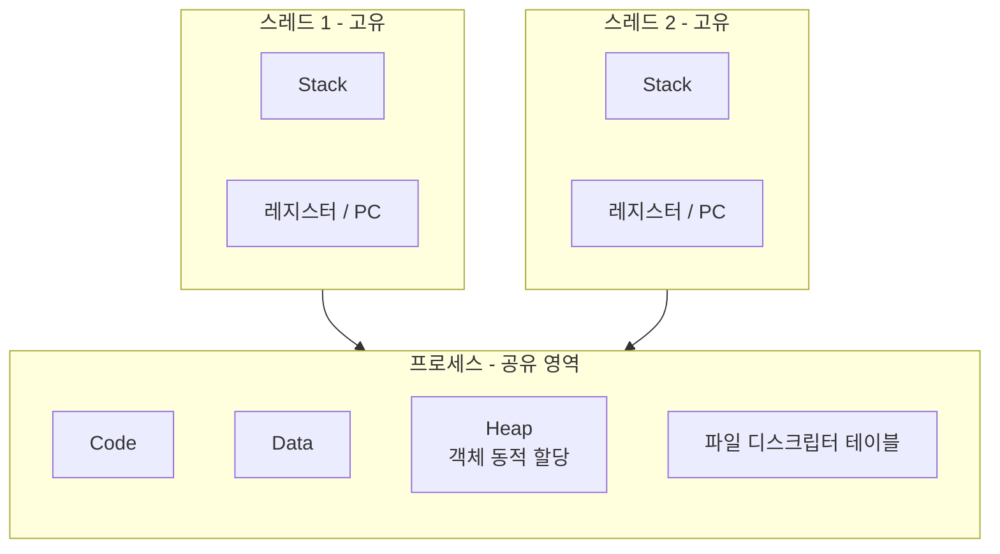

# 스레드(Thread)란

> - 스레드는 프로세스 내부의 실행 흐름 단위이며, CPU 스케줄링이 이뤄지는 기본 단위
> - 자원을 공유하므로 생성·전환 비용이 프로세스보다 작지만, 공유 자원에 대한 동기화 문제가 따름

프로세스가 자원을 소유하는 단위라면, 스레드는 그 자원 위에서 실제로 명령을 실행하는 단위다.

## 스레드의 정의

하나의 프로세스는 최소 하나의 스레드(메인 스레드)를 가지며, 필요에 따라 여러 스레드를 만들어 동시에 여러 작업 흐름을 진행할 수 있다.

- CPU 스케줄러가 디스패치하는 실제 대상은 프로세스가 아니라 스레드
- 같은 프로세스 안의 스레드들은 같은 주소 공간 위에서 실행됨
- 스레드를 경량 프로세스(LWP, Lightweight Process)라 부르는 이유는 프로세스의 자원을 공유하며 가볍게 생성되기 때문

## 프로세스 내부에서 공유하는 것과 고유한 것

스레드와 프로세스의 차이는 무엇을 공유하고 무엇을 따로 갖는가로 구분할 수 있다.

Heap에 생성된 객체는 모든 스레드가 함께 접근할 수 있지만, 각 스레드의 지역 변수와 메서드 호출 정보는 자기 Stack에만 존재한다.

## Stack을 스레드마다 따로 두는 이유

스레드가 독립적으로 함수를 호출하고 반환하려면, 호출 흐름을 기록하는 공간이 서로 분리되어 있어야 한다.

- Stack에는 함수의 지역 변수, 매개변수, 복귀 주소가 쌓임
- 스레드마다 실행 위치(PC)와 호출 경로가 다르므로 Stack을 공유하면 호출 정보가 뒤섞임
- 따라서 Stack과 PC·레지스터는 스레드 고유 자원으로 분리되어야 독립적 실행 흐름이 성립

반대로 Heap을 공유하기 때문에, 한 스레드가 만든 객체를 다른 스레드가 그대로 참조할 수 있어 가시성·경합 문제가 발생할 수 있다.

## 백엔드 관점에서의 스레드

서버의 요청 처리량과 동시성 모델이 모두 스레드 위에서 결정된다.

- Java의 플랫폼 스레드는 OS 스레드와 1:1로 매핑되어, `Thread` 하나가 곧 커널 스레드 하나
- Tomcat은 스레드 풀(기본 최대 200개)을 두고 요청마다 스레드를 할당하는 Thread-per-Request 모델로 동작
    - 동시 요청이 풀 크기를 넘으면 대기 큐에 쌓이고, 한도 초과 시 거절
- 공유 Heap 위의 싱글톤 빈에 가변 상태를 두면 여러 요청 스레드가 동시에 접근해 경합 발생 → Spring 빈을 상태 없이(stateless) 설계하는 이유
