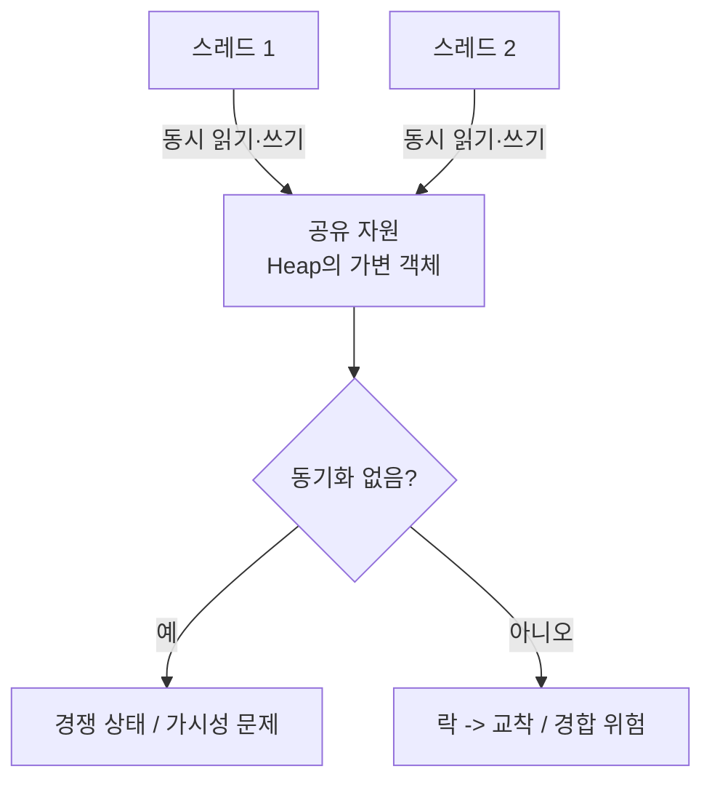

# 멀티스레딩의 장단점

> - 멀티 스레드는 프로세스의 자원을 공유하므로 생성·전환 비용이 작고, 메모리를 통한 통신이 빠름
> - 단점은 공유 자원에 대한 동기화 문제(경쟁 상태·교착 상태)와, 한 스레드 장애가 프로세스 전체로 전파

## 멀티 프로세스 vs 멀티 스레드

같은 동시성을 달성하더라도 무엇을 공유하느냐에 따라 멀티 프로세스와 멀티 스레드로 나뉜다.

|    구분    |      멀티 프로세스       |      멀티 스레드       |
|:--------:|:------------------:|:-----------------:|
|    자원    |    프로세스마다 독립 자원    |    프로세스 자원 공유     |
| 생성·전환 비용 |         큼          |        작음         |
|    통신    | IPC 필요 (커널 경유, 느림) | 공유 메모리 직접 접근 (빠름) |
|   안정성    |   격리되어 장애 전파 없음    | 한 스레드 장애가 전체에 전파  |
|   동기화    |      상대적으로 적음      |   공유 자원 동기화 필수    |

## 멀티 스레딩 장점

자원 공유에서 비롯되는 효율이 멀티 스레드의 핵심 이점이다.

- 자원 효율: 프로세스를 새로 만드는 것보다 가벼운 비용으로 작업 흐름을 추가 (Code·Data·Heap 공유, Stack만 추가 할당)
- 빠른 통신: 같은 주소 공간의 Heap을 직접 공유하므로 IPC 없이 데이터 교환
- 낮은 전환 비용: 같은 프로세스 내 스레드 전환은 주소 공간이 유지되어 빠른 작업 흐름 전환 가능

## 멀티 스레딩 단점

공유의 대가로 안정성과 정확성에 영향을 주는 여러 단점이 존재한다.

- 동기화 문제: 여러 스레드가 공유 자원에 동시에 접근하면 경쟁 상태(Race Condition) 발생 → 락 등 동기화 필요
- 장애 전파: 한 스레드의 처리되지 않은 예외·메모리 오염이 프로세스 전체를 종료시킴
- 동기화 부작용: 락 사용은 교착 상태(Deadlock), 경합(Contention)으로 인한 성능 저하를 유발

## 경쟁 상태(Race Condition)

가장 대표적인 단점으로, 공유 자원에 대한 비원자적 연산에서 발생한다.

- `count++`는 읽기 → 증가 → 쓰기의 세 단계로 나뉘는 비원자적 연산
- 두 스레드가 같은 값을 읽은 뒤 각자 증가시키면, 두 번 증가해야 할 값이 한 번만 수행
- 해결: `synchronized`·`Lock`으로 임계 영역 보호하거나, `AtomicInteger` 같은 원자적 연산 사용

가시성 문제도 함께 따르는데, 한 스레드가 변경한 값이 CPU 캐시에 머물러 다른 스레드에게 즉시 보이지 않을 수 있다. (`volatile`이나 메모리 배리어로 해결)

## 백엔드 관점에서의 멀티스레딩

서버는 멀티스레딩의 장점을 적극 활용하되, 단점을 설계로 회피한다.

- Tomcat은 스레드 풀로 요청마다 스레드를 할당하는 Thread-per-Request 모델 → 공유 커넥션 풀·캐시를 함께 활용하며 가볍게 동시성 확보
- 공유 Heap 위의 싱글톤 빈에 가변 상태를 두면 요청 스레드 간 경쟁 상태 발생 → Spring 빈을 상태 없이(stateless) 설계해 동기화 문제를 원천 차단
- 블로킹 I/O가 많은 워크로드에서 OS 스레드 1:1 모델은 스레드 수가 곧 메모리·전환 비용 → JDK 21 가상 스레드로 적은 OS 스레드에 다수 작업을 매핑해 한계 완화
- 안정성이 중요한 영역은 스레드가 아닌 별도 프로세스·인스턴스로 격리해, 한 작업의 장애가 전체로 전파되지 않게 함
