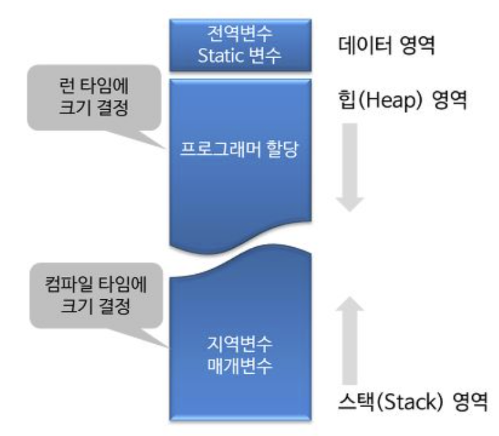
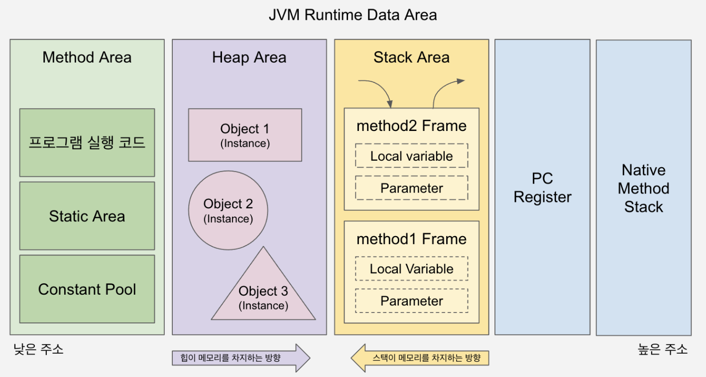

## 프로세스 주소 공간 중 힙(Heap) 영역과 스택(Stack) 영역의 데이터 저장 목적과 관리 방식의 차이를 설명해 주세요.

프로세스의 메모리 공간에서 스택(Stack) 영역은 메서드 호출과 관련된 데이터를 저장하는 영역입니다.

지역 변수, 매개변수, 반환 주소 등이 저장되며, 메서드 호출 시 스택 프레임이 쌓이고 메서드가 종료되면 자동으로 제거됩니다.

LIFO 구조로 관리되기 때문에 할당과 해제가 빠르다는 특징이 있습니다.

반면 힙(Heap) 영역은 런타임 중 동적으로 생성되는 객체나 데이터를 저장하기 위한 영역입니다. 

필요한 시점에 메모리를 할당받아 사용하며, 스택과 달리 사용이 끝났다고 자동으로 제거되지 않습니다.

C/C++ 같은 언매니지드 언어에서는 개발자가 직접 해제해야 하고, 해제하지 않으면 메모리 누수가 발생할 수 있습니다. 반면 Java나 Python 같은 매니지드 언어에서는 가비지 컬렉터(GC)가 더 이상 참조되지 않는 객체를 자동으로 회수합니다.

</br>
</br>

### 메모리 구조



메모리 구조를 보면 데이터 영역 + 힙 영역 + 스택 영역으로 나누어져 있는 것을 볼 수 있다.

따라서 힙과 스택 영역은 같은 프로세스 주소 공간을 공유하는걸 확인할 수 있다.

보통 스택은 높은 주소에서 낮은 주소 방향으로, 힙은 낮은 주소에서 높은 주소 방향으로 자라나며 서로 마주 보는 구조를 가진다 

이는 한정된 메모리 공간을 유연하게 활용하기 위함이다.

</br>

### 힙 영역

사용자가 직접 관리하는 동적 메모리 영역이다.


| 저장 목적 |   • 프로그램 실행 중(Runtime) 크기가 결정되는 동적 데이터를 저장 • 클래스 객체, 큰 배열 등이 여기에 해당 |
| --- | --- |
| 관리 방식 |   • 개발자가 직접 메모리를 할당하고 해제해야 함 (C의 malloc, Java/C++의 new) • 단, Java, Python 같은 언어는 가비지 컬렉터가 대신 관리해줌  |
| 특징 |   • 런타임에 크기가 결정됨 • 스택보다 할당/해제 속도가 느림 • 사용 후 해제하지 않으면 메모리 누수가 발생하며, 파편화 문제가 생길 수 있음 |

 </br>


### 스택 영역

함수 호출과 관련된 지역 변수와 매개변수가 저장되는 임시 메모리 영역이다.

| 저장 목적 |   • 함수 내부에서 선언된 지역 변수, 매개변수, 함수가 종료된 후 돌아갈 복구 주소를 저장함 |
| --- | --- |
| 관리 방식 |   • LIFO (Last-In First-Out) 방식으로 운영 • 함수가 호출될 때 할당되고, 함수가 종료되면 자동으로 제거됨 |
| 특징 |   • 컴파일 타임에 크기가 결정됨 • 매우 빠름 → CPU가 스택 포인터를 통해 직접 관리 • 공간이 한정되어 있어 너무 깊은 재귀 호출 시 Stack Overflow가 발생할 수 있음 |

</br>

---

### 두 영역이 충돌하면 어떻게 될까요??

힙과 스택은 서로 마주보는 방향으로 메모리를 확장해나가기 때문에, 언젠가 두 영역이 만나는 상황이 발생할 수 있다.

이 상태는 Out Of Memory 상황이며, 시스템은 이를 방지하거나 오류로 처리한다.

</br>

**스택 오버플로우 (Stack Overflow)**

스택이 힙 영역을 침범하려고 할 때 발생

주로 너무 깊은 재귀 호출이나 스택 내에 너무 큰 지역 변수를 선언했을 때 나타난다.

→ 현대의 OS는 이를 감지하여 해당 프로세스에 Segmentation Fault 같은 신호를 보내고 프로그램을 강제 종료시킨다.

</br>

**힙 오버플로우 (Heap Overflow)**

힙 영역이 스택영역을 침범하려고 할 때 발생

동적 할당을 너무 많이 해서 가용 메모리가 없을 때 발생

→ 메모리 할당 함수가 NULL을 반환하거나, 언어에 따라 OutOfMemoryException을 발생

</br>

### **충돌 방지 메커니즘**

운영체제는 두 영역이 서로를 오염시키지 않도록 몇 가지 안전장치를 둔다.

**가드 페이지**

스택과 힙 사이에는 접근할 수 없는 특별한 메모리 구역인 '가드 페이지'를 둔다.

프로그램이 이 구역에 접근하려 하면 OS가 즉시 개입하여 실행을 중단시킨다.

**가상 메모리**

실제 물리 메모리보다 훨씬 큰 가상 주소 공간을 각 프로세스에 할당한다.

덕분에 웬만해서는 두 영역이 만날 정도로 메모리를 다 쓰기 전에 OS 차원에서 메모리 부족 경고를 먼저 보낸다.

Ex) 페이징(Paging) 기법을 통해 가상 주소를 실제 물리 메모리에 매핑하여 관리

</br>
</br>

---

### JVM의 Stack과 Heap



- Stack 영역
    - 스레드가 생성될 때 마다 하나씩 생성됨
    - 메서드 안의 지역 변수들이 저장되며, 다른 스레드는 접근할 수 없음
- Heap 영역
    - 모든 스레드가 공유하는 부분
    - `new` 키워드로 생성된 모든 객체가 여기에 들어감
    - 가비지 컬렉터가 관리

</br>

**예시**

```java
public class Example {

	// 메서드 안에서 객체를 생성, 할당하면 어떻게 될까?
	public void method () {
	
			Person p = new Person()
	}

}
```

- 메서드 안에서 선언된 p 는 지역변수 ⇒ 따라서 p 는 스택 영역에 저장됨
- 하지만 p는 객체 그 자체가 아니라 객체가 어디에 있는지 알려주는 주소값을 담고있음
- `new` 키워드를 사용하자마자, 힙 영역의 빈 공간에 실제 Person 객체를 위한 메모리가 할당됨
- 이 객체는 메서드가 종료되어도 바로 사라지지 않고 힙에 남아 있음

</br>

**왜 이렇게 나눠서 저장하나요?**

데이터의 수명과 공유 때문이다.

스택의 특징은 함수가 끝나면 스택 프레임이 통째로 날아간다는 것이다. 만약 객체 전체가 스택에 있다면, 함수가 끝나는 순간 객체도 사라지게 된다.

하지만 우리가 만든 객체는 다른 함수에 인자로 넘겨줄 수도 있고, 함수의 결과로 반환할 수도 있다.

즉, 객체는 함수가 끝나도 살아있어야 할 때가 많다. 

→ 따라서 주소(스택)만 지우고, 실체(힙)는 가비지 컬렉터가 아무도 이 주소를 모른다고 판단할 때까지 유지하는 방식을 채택했다.

</br>

### 탈출 분석

최신 JVM은 ‘탈출 분석(Escape Analysis)’이라는 최적화 기법을 사용한다.

객체가 현재 메서드나 스레드 내부에서만 사용되고 외부로 참조가 전달되지 않는다고 판단되면, JVM은 해당 객체를 굳이 힙에 할당하지 않도록 최적화할 수 있다 → 이러면 GC의 부담이 줄어들어 성능이 비약적으로 향상된다고 한다.

이 과정에서 스택 할당(Stack Allocation), 동기화 제거(Lock Elision), 스칼라 교체(Scalar Replacement) 같은 최적화가 수행된다.

</br>

**탈출 분석을 위한 3단계**

- 스택 할당
    - 객체가 메서드 내에서만 쓰인다면, 힙(Heap)이 아닌 스택(Stack)에 할당
    - 함수 종료와 동시에 메모리가 자동 해제되므로 GC 부담 0
- 동기화 제거
    - 객체가 하나의 스레드에서만 사용된다면, `synchronized` 키워드가 있어도 무시
- 스칼라 교체
    - 객체를 통째로 생성하지 않고, 객체 안의 필드(int, double 등)를 개별 지역 변수로 쪼개서 스택에 저장

</br>

**탈출 분석 판정 기준**

| 탈출 상태 | 설명 | 가능한 최적화 |
| --- | --- | --- |
| NoEscape | 메서드 내부에서 생성되고 소멸함 | 스택 할당, 스칼라 교체, 동기화 제거 |
| ArgEscape | 메서드 인자로 넘어가지만, 외부로 노출 안 됨 | 동기화 제거, (제한적인 스칼라 교체) |
| GlobalEscape | 반환값으로 쓰이거나 static 변수에 저장됨 | 최적화 불가 (무조건 힙 할당) |