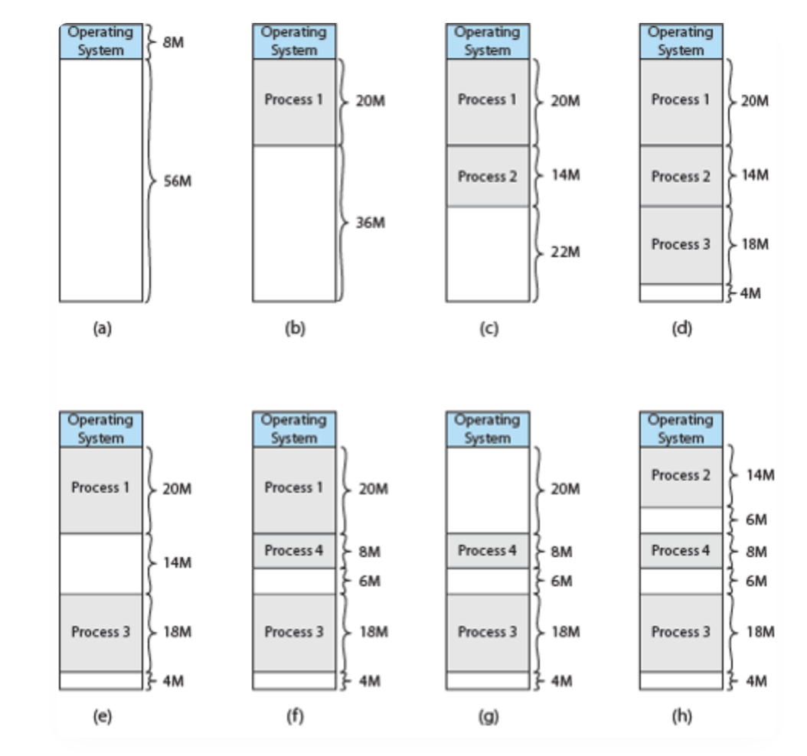

## 메모리 단편화(Memory Fragmentation)란 무엇이며, 내부 단편화와 외부 단편화의 차이는 무엇인가요?

메모리 단편화는 메모리를 할당하고 해제하는 과정에서 사용 가능한 메모리가 비효율적으로 나뉘어 활용도가 떨어지는 현상입니다.

내부 단편화는 고정 크기 메모리 할당 방식에서 발생하며, 프로세스가 실제로 사용하는 크기보다 더 큰 메모리를 할당받아 할당된 메모리 내부에 낭비 공간이 생기는 현상입니다.

반면 외부 단편화는 메모리 할당과 해제가 반복되면서 빈 공간이 메모리 곳곳에 흩어지는 현상입니다.

전체 남은 메모리 크기는 충분하더라도, 연속된 큰 공간이 없어서 새로운 프로세스를 할당하지 못할 수 있습니다.

즉, 내부 단편화는 할당된 메모리 내부의 낭비이고, 외부 단편화는 메모리 블록 사이에 빈 공간이 흩어지는 문제입니다.

 
 

### 메모리 단편화란?

프로세스가 수행되기 위해서는 메모리에 적재되어야 하는데, 이 과정에서 프로세스는 일정 크기의 메모리를 요청한다.

이렇게 메모리를 할당하고 해제하는 과정이 반복되면서, 사용 가능한 메모리가 비효율적으로 쪼개지는 현상을 ‘메모리 단편화’라고 한다.

이로 인해 전체 여유 메모리 용량은 충분하더라도, 실제로는 필요한 크기의 메모리를 할당하지 못하는 문제가 발생할 수 있다.

 

### 1️⃣ 내부 단편화 (Internal Fragmentation)

할당된 메모리 블록 내부에서 사용되지 못하고 낭비되는 공간

주로 메모리를 고정 크기 단위로 할당할 때 발생한다. → 프로세스보다 더 큰 메모리를 할당했을 때 발생

예를 들어, 운영체제가 메모리를 8KB 단위로 할당한다고 가정하자.

하지만 프로세스의 크기가 6KB라면 2KB라는 남는 공간이 생긴다. → 이것이 내부 단편화이다.

이런 낭비를 줄이기 위해 ‘동적 분할 기법’이 나왔다.

동적 분할 기법은 메모리를 프로세스의 크기에 맞게 가변적으로 나누어 할당하는 방식이다.

이를 도입함으로써 내부 단편화는 없어졌지만 새로운 ‘외부 단편화’라는 문제점이 생겼다.

 

### 2️⃣ 외부 단편화 (External Fragmentation)

메모리 할당과 해제가 반복되면서 사용 가능한 빈 공간이 군데군데 흩어지는 현상이다.

즉, 프로세스가 메모리에서 해제될 때, 더 작은 프로세스가 그 자리에 들어오면 남는 공간이 생기게 되는데 이게 ‘외부 단편화’이다.

외부 단편화를 해결하기 위해 Compaction 이라는 작업을 할 수 있다.

Compaction은 빈 공간을 합쳐 큰 공간으로 만드는 작업이다. (큰 프로세스가 적재될 수 있도록)

하지만 이는 CPU가 읽고 쓰기를 반복해서 재배치하는 과정이기에 CPU 처리 시간이 증가하여 처리 효율이 크게 감소한다. (오버헤드가 큼)