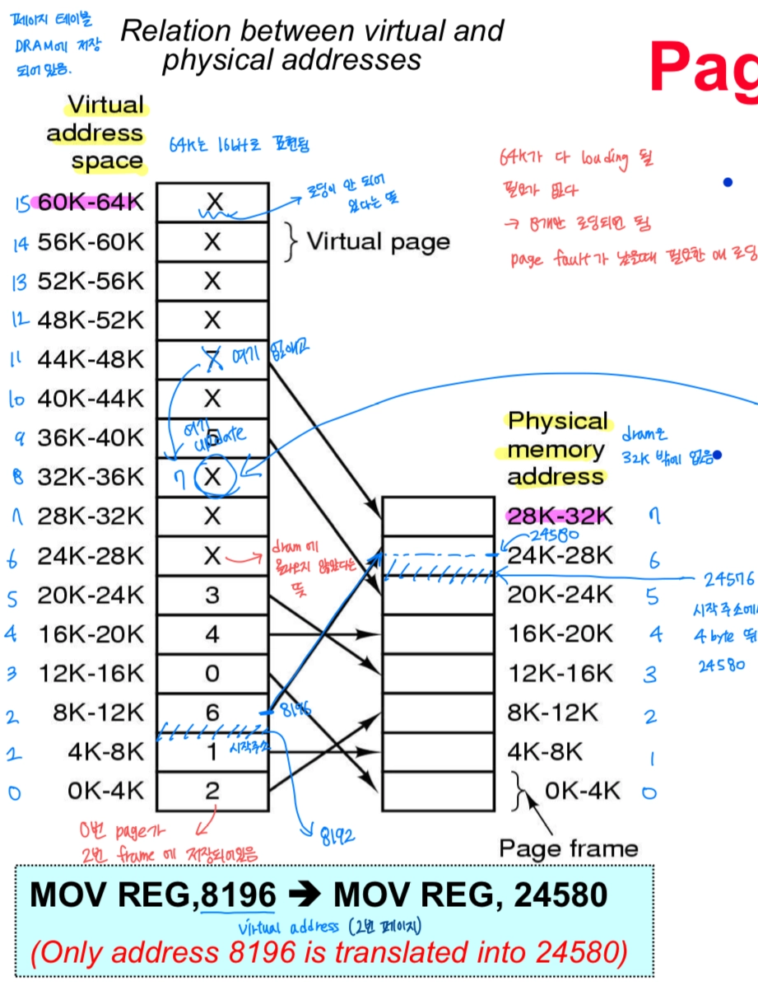
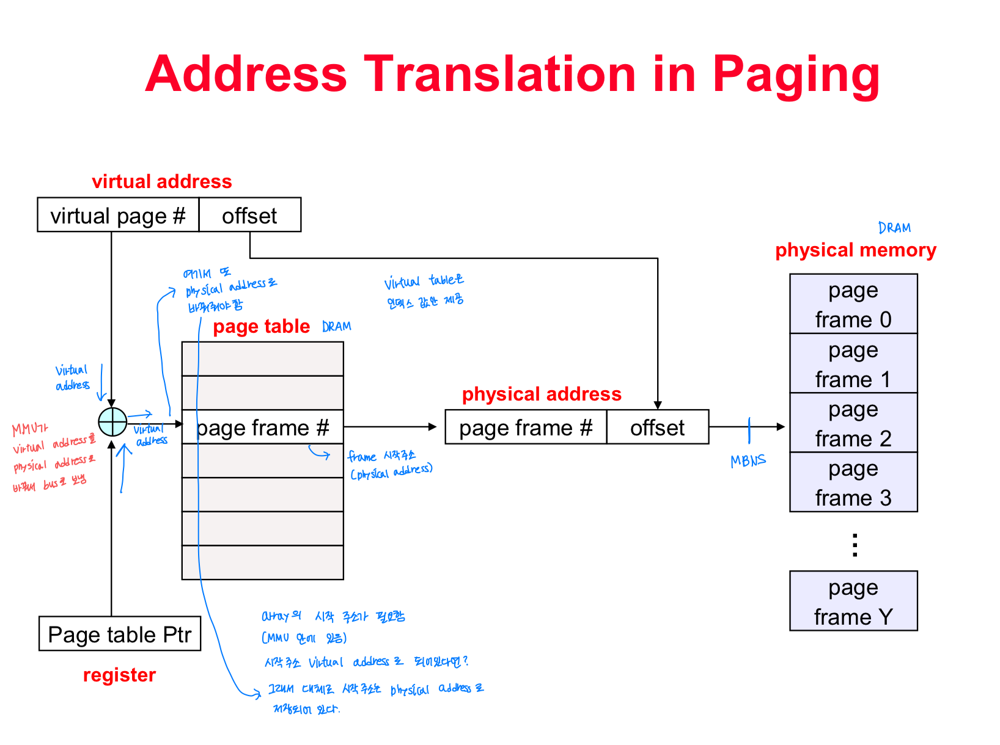
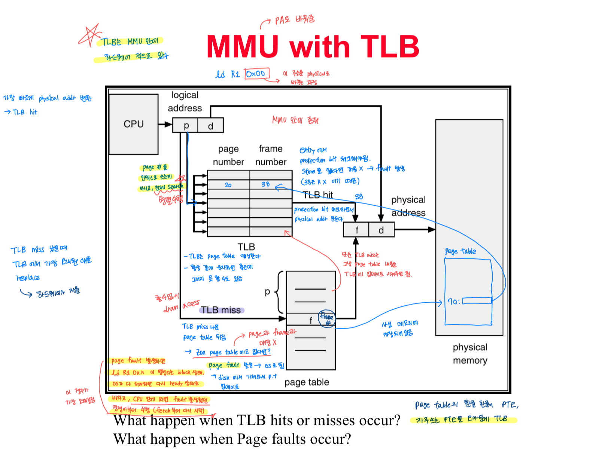
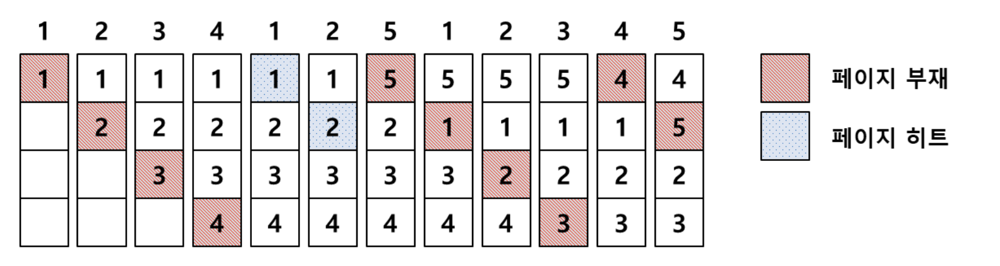
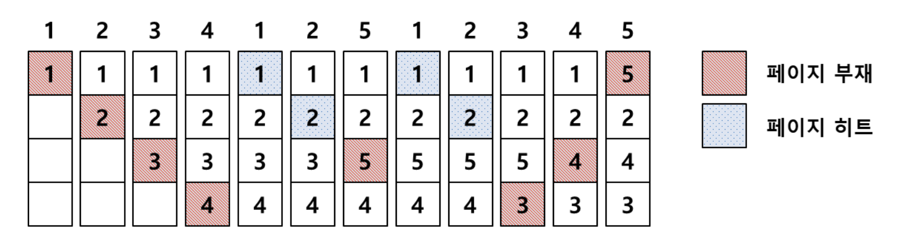
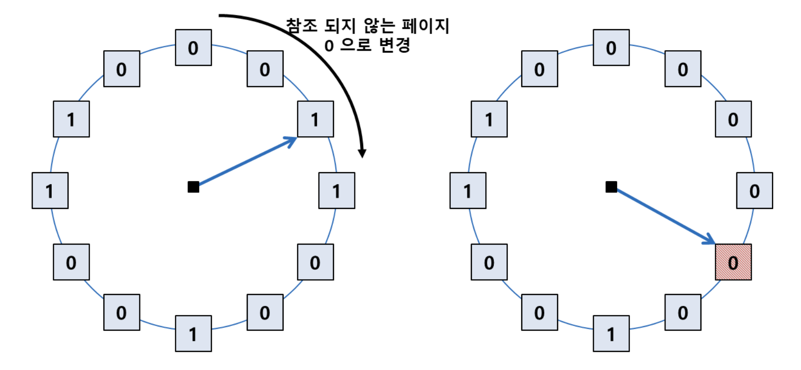

## 가상 메모리(Virtual Memory)의 정의와 이를 통해 실제 물리 RAM보다 큰 프로그램을 실행할 수 있는 원리는 무엇인가요?

가상 메모리는 운영체제가 각 프로세스마다 독립적인 가상 주소 공간을 제공하여, 실제 물리 메모리보다 더 큰 메모리를 사용하는 것처럼 동작하게 하는 메모리 관리 기법입니다.

운영체제는 가상 주소를 실제 물리 주소로 변환하여 관리하며, 프로그램 전체를 한 번에 메모리에 올리지 않고 필요한 페이지만 메모리에 적재합니다.

따라서 현재 사용 중인 부분만 메모리에 올리고 나머지는 나중에 필요할 때 불러오는 방식으로 동작하기 때문에, 실제 물리 메모리보다 큰 프로그램도 실행할 수 있습니다.

</br>
</br>

### 가상 메모리

운영체제가 각 프로세스마다 독립적인 가상 주소 공간(Virtual Address Space)을 제공하는 메모리 관리 기법이다.

프로세스는 실제 물리 메모리(RAM)를 직접 사용하는 것이 아니라, 자신만의 연속된 메모리 공간이 존재하는 것처럼 동작한다.

운영체제는 가상 주소를 실제 물리 주소로 변환하여 관리하며, 이를 통해 메모리 보호와 효율적인 메모리 사용이 가능해진다.

</br>

### 사용 이유

**1. 프로세스 간 메모리 보호**

각 프로세스는 독립적인 가상 주소 공간을 가지므로, 다른 프로세스의 메모리에 직접 접근할 수 없다.

이를 통해 프로세스 간 메모리 충돌을 방지할 수 있다.

**2. 실제 RAM보다 큰 프로그램 실행 가능**

운영체제는 프로그램 전체를 한 번에 RAM에 올리지 않고, 현재 필요한 부분만 메모리에 적재한다.

당장 사용하지 않는 메모리는 디스크(Swap 영역)에 저장해두고, 필요할 때 다시 RAM으로 가져온다.

따라서 프로그램 전체 크기가 실제 RAM보다 크더라도 실행이 가능하다.

</br>

### 대표적인 방법 : 페이징

가상 메모리를 구현하기 위한 대표적인 메모리 관리 기법이다.

가상 메모리를 일정 크기의 페이지(Page) 단위로 나누고, 물리 메모리(RAM) 역시 동일한 크기의 프레임(Frame) 단위로 나누어 관리한다.

운영체제는 페이지를 비어있는 프레임에 매핑하여 저장한다.

즉, 프로세스 메모리가 반드시 연속된 물리 메모리에 저장될 필요가 없다.



- 사진도 보면 가상 메모리는 64KB인데 실제 메모리는 32KB인걸 확인할 수 있다.
- → 프로세스는 자신만의 연속된 64KB 메모리 공간이 존재한다고 생각하지만, 실제로는 필요한 페이지들만 물리 메모리에 적재되어 실행된다.

</br>

### MMU가 주소 변환

CPU는 실행 시 Virtual Address를 사용하며,

MMU(Memory Management Unit)가 페이지 테이블을 참고하여 이를 실제 Physical Address로 변환한다.



</br>

**V.A → P.A 변환 과정**

```
가상 주소
[ Page 2 | Offset 100 ]
      ↓
페이지 테이블 조회
Page 2 → Frame 5
      ↓
물리 주소
[ Frame 5 | Offset 100 ]
```

</br>

**페이지 테이블**

가상 페이지와 물리 프레임의 매핑 정보를 저장하는 테이블이다.

페이지-프레임 매핑정보 뿐만 아니라 여러 제어 비트도 함께 저장되어 있다.

(그리고 페이지 테이블의 한 row를 PTE라고 함 ⇒ Page Table Entry)

| 정보 | 설명 |
| --- | --- |
| Physical Frame Number | 실제 물리 메모리 위치 |
| Valid Bit | 현재 메모리에 존재하는지 여부 |
| Protection Bit | 읽기/쓰기 권한 |
| Dirty Bit | 수정된 적 있는지 |
| Reference(Access) Bit | 최근 접근 여부 |
| Present Bit | 메모리에 적재 여부 |

</br>
</br>

### TLB(Translation Lookaside Buffer)

페이지 테이블 역시 메모리에 존재하기 때문에, 주소 변환 과정에서 페이지 테이블 접근과 실제 데이터 접근까지 총 2번의 메모리 접근이 발생한다.

이를 줄이기 위해 자주 사용하는 페이지 테이블 엔트리(PTE)를 캐싱한 것이 TLB이다.

즉, 주소 변환 속도를 높이기 위한 캐시 메모리이다. 자주 사용하는 페이지 테이블 정보를 CPU 근처에 저장하여 페이지 테이블 접근 비용을 줄인다.



</br>

### Page Fault 처리 과정

- CPU가 페이지 접근
- 해당 페이지가 RAM에 없음 (valid bit = 0)
- Page Fault 발생
- **OS가 디스크(Swap)에서 해당 페이지 로드**
- 빈 프레임 없으면 → 교체 알고리즘 실행
- 페이지 테이블 업데이트
- 다시 명령 실행

</br>

### 페이지 교체 알고리즘

페이지 교체 알고리즘은 물리 메모리에 빈 프레임이 없을 때 어떤 페이지를 제거할지를 결정하는 방법이다.

이상적으로는 앞으로 가장 오랫동안 사용되지 않을 페이지를 제거하는 것이 가장 좋지만, 실제로는 미래의 접근 패턴을 알 수 없기 때문에 과거의 지역성(locality) 기반으로 이를 근사한다.

</br>

**FIFO (First In First Out)**



- 가장 먼저 들어온 페이지를 먼저 제거
- 페이지 향후 참조 가능성을 고려하지 않음 → 비효율적인 상황 발생 가능
- 분명 페이지 프레임을 더 많이 사용하는데, 오히려 page fault가 증가하는 이상 현상 발생 가능

</br>

**LRU (Least Recently Used)**



- 가장 오랫동안 사용되지 않은 페이지 제거
- 지역성이 반영 되어 일반적으로 page fault가 가장 적게 발생함
- 하지만 최근 사용 순서를 계속 추적해야 해서 구현 비용이 크다

</br>

**Clock (=NRU, Not Recently Used)**



- LRU를 단순화한 근사 알고리즘 (Reference Bit 사용)
- 원형 리스트를 돌며 최근에 사용된 흔적이 보이면 한번 봐주고, 없으면 바로 교체하는 방식
    - reference bit = 1인 페이지를 보면 0으로 바꾸고 다음을 확인
    - reference bit = 0인 페이지를 보면 바로 교체