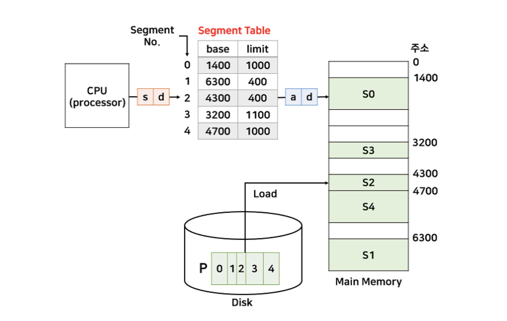

## 논리적 단위로 메모리를 분할하는 세그먼테이션(Segmentation)이란 무엇이며 페이징과의 차이는 무엇인가요?

세그먼테이션은 프로세스를 코드, 데이터, 힙, 스택과 같은 논리적인 단위로 나누어 메모리에 적재하는 방식입니다. 반면 페이징은 메모리를 고정 크기의 페이지 단위로 나눕니다.

세그먼테이션은 논리 단위 기준으로 메모리를 관리하기 때문에 보호 비트 설정이나 메모리 공유가 더 직관적이라는 장점이 있습니다. 반면 페이징은 하나의 페이지 안에 서로 다른 논리 영역이 함께 포함될 수 있습니다.

하지만 세그먼테이션은 세그먼트마다 크기가 다른 가변 크기 구조이기 때문에 메모리 중간에 빈 공간이 생기는 외부 단편화 문제가 발생할 수 있습니다.

 
 

### **세그먼테이션**

세그먼테이션은 프로세스를 의미있는 논리적 단위로 나누어 메모리에 적재하는 방식이다. 

보통 프로그램은

- Code
- Data
- Heap
- Stack

영역으로 구성되는데, 세그먼테이션은 이러한 영역을 각각 하나의 세그먼트(Segment)로 보고 관리한다.

또는 필요에 따라 더 작은 논리 단위로 세분화할 수도 있다.

 

**세그먼테이션 테이블**

- Base : 세그먼트의 시작 물리 주소
- Limit : 세그먼트의 크기(범위)
- CPU는 논리 주소를 (세그먼트 번호, 오프셋) 형태로 생성하며 os는 세그먼트 테이블의 Base와 Limit을 이용해 물리 주소로 변환한다.

- 논리주소(2, 100) = 물리주소 4400
- 논리주소(1, 500) = 인터럽트로 인해 프로세스 강제 종료(범위를 벗어남)

 

**보호와 공유**

세그먼테이션은 세그먼트 단위로 접근 권한을 관리할 수 있다.

페이지와 동이랗게 세그먼테이션도 r, w, x 비트를 테이블에 추가한다.

페이징은 고정 크기 페이지 단위로 나누기 때문에, 하나의 페이지 안에 서로 다른 논리 영역(Code/Data 등)이 섞일 수 있다. 그래서 보호 비트를 설정하기 어렵고 공유도 어려워진다.

하지만 세그먼트는 영역별로 나눠진 세그먼트로 관리하기 때문에 비트 설정과 공유가 쉽다.

 

**치명적인 단점**

세그먼트는 크기가 모두 다른 가변 크기이기 때문에 외부 단편화가 발생한다.

즉 메모리 중간중간 작은 빈 공간들이 생기게 되고, 총 여유 공간은 충분하더라도 연속된 큰 공간이 부족하면 새로운 세그먼트를 적재하지 못할 수 있다.

이러한 외부 단편화 문제 때문에, 세그먼테이션은 보호와 공유 측면에서는 장점이 있지만 실제 운영체제에서는 페이징 기법이 더 널리 사용된다.

 

**페이징과의 차이**

| 항목 | 세그먼테이션 | 페이징 |
| --- | --- | --- |
| 분할 기준 | 논리적 단위 | 고정 크기 |
| 크기 | 가변 | 동일 |
| 주소 구조 | (Segment 번호, Offset) | (Page 번호, Offset) |
| 단편화 | 외부 단편화 발생 | 내부 단편화 발생 |
| 보호/공유 | 논리 단위 기준이라 직관적 | 상대적으로 덜 직관적 |
| 사용자 관점 | 프로그램 구조가 보임 | 보이지 않음 |