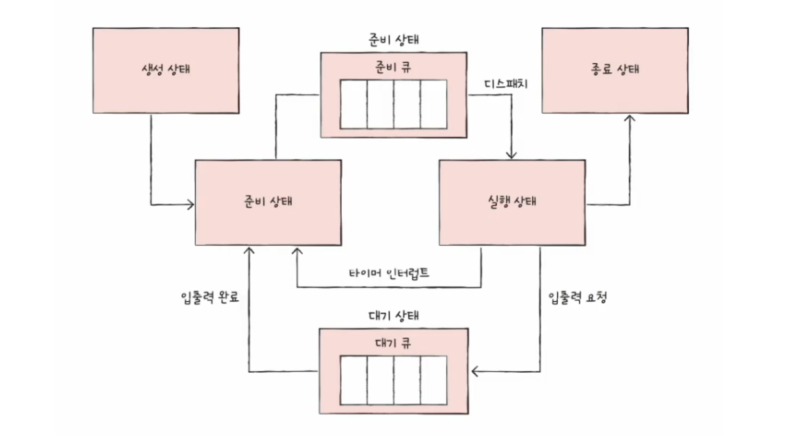

## JVM의 가비지 컬렉션(GC) 과정 중 'Stop-The-World'가 발생할 때, OS 레벨의 프로세스/스레드 상태와 스케줄링 큐에서는 어떤 일이 일어나나요?

STW가 발생하면 JVM은 GC 스레드를 제외한 모든 Java 스레드를 Safepoint까지 유도합니다.

실행 중인 스레드는 Safepoint에 도달한 뒤 Waiting 상태로 전환되고, Runnable 상태로 준비 큐에 있던 스레드들도 CPU를 할당받아 Safepoint에 도달한 뒤 중단됩니다.

JVM은 모든 Java 스레드가 중단된 것을 확인한 뒤, GC 스레드에게 CPU를 할당하여 GC 작업을 수행합니다.

이후 GC가 완료되면 중단되었던 스레드들이 다시 Runnable 상태로 복귀하여 실행됩니다.

</br>
</br>

**GC**

더 이상 참조되지 않는 객체를 찾아서 메모리를 회수하는 작업

</br>

**Stop-The-World**

GC가 실행되는 동안 GC 스레드를 제외한 모든 Java 스레드를 강제로 멈추는 것

GC가 객체 참조 관계를 추적하는 도중에 다른 스레드가 객체를 수정하면 추적 결과가 틀어지기 때문이다. (일관된 스냅샷을 찍기 위한)

</br>

**프로세스 상태 다이어그램**



- 준비 상태 (Runnable) : CPU를 받을 준비를 하는 프로세스들
- 실행 상태 (Running) : CPU를 받은 상태
- 대기 상태 (Waiting) : I/O, 락, sleep 등 특정 이벤트가 완료될 때까지 기다리는 상태. 이벤트가 완료되면 다시 준비 상태(Runnable)로 이동

</br>

**Safe point**

각 스레드가 멈추는 약속된 지점

OS가 강제로 스레드를 죽이거나 멈추는 게 아니라, 각 스레드가 Safepoint에 도달하는 순간 스스로 멈춘다

- JVM 역할 → Safepoint 플래그를 세워서 "멈춰" 신호
- 각 스레드 역할 → 주기적으로 Safepoint를 지나다가 플래그 확인 후 스스로 대기 상태로 전환

STW 발생하면 Java 스레드들이 Safepoint에서 스스로 Running/Runnable → Waiting으로 전환한다.

```
// JVM이 내부적으로 이런 느낌으로 동작
void methodA() {
    doSomething();
    // ← 여기가 Safepoint (플래그 확인)
    doSomethingElse();
    // ← 여기도 Safepoint
}
```

</br>

### **스케줄링 큐 변화**

1. STW 발생, GC 스레드가 준비큐에서 대기
2. Running 중인 Java 스레드가 Safepoint 도달 → Waiting으로 전환
3.  준비큐의 Java 스레드가 CPU 받음 → Safepoint 도달 → Waiting으로 전환
4. 모든 Java 스레드가 Waiting 상태가 됨을 확인
5. GC 스레드가 CPU 받아서 GC 수행
6. GC 완료 → Waiting 상태 스레드들을 Run Queue로 이동

STW가 발생하면 바로 스레드들이 멈추는줄 알았지만 사실 CPU 할당 → SafePoint 도달 → 스스로 Waiting 전환이라는 과정을 전부 거친다.

그래서 STW은 사실 두 구간으로 나뉜다. 

- Time To Safepoint : 모든 java 스레드가 safepoint에 도달하기를 기다림
    - 따라서 특정 스레드가 safepoint에 늦게 도달하면 GC 전체가 지연된다 → 그래서 STW 시간 줄이는게 어려운거임
- GC : GC 작업 시간