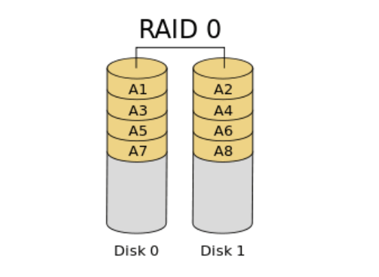
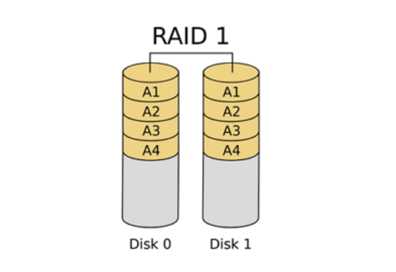
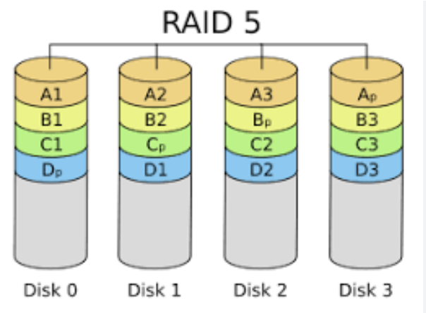
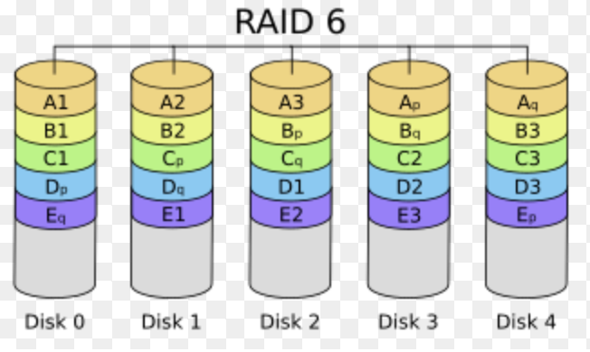
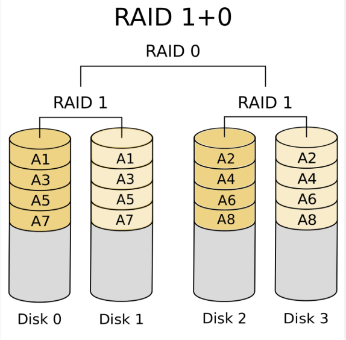

## 여러 개의 디스크를 묶어 성능과 안정성을 높이는 RAID의 정의와 주요 종류(RAID 0, 1, 5, 10 등)의 특징을 설명해 주세요.

RAID는 여러 개의 물리 디스크를 하나의 논리 디스크처럼 묶어 성능 향상이나 장애 허용성을 높이는 기술입니다.

RAID 0은 데이터를 여러 디스크에 분산 저장하는 스트라이핑 방식으로 성능은 가장 좋지만 장애 복구 기능이 없습니다.

RAID 1은 동일한 데이터를 두 디스크에 저장하는 미러링 방식으로 장애 복구가 가능하지만 저장 공간 효율이 50%입니다.

RAID 5는 스트라이핑과 패리티를 함께 사용하여 디스크 1개 장애를 허용하면서도 비교적 높은 저장 공간 효율을 제공합니다.

RAID 10은 RAID 1과 RAID 0을 결합한 구조로, 높은 성능과 빠른 복구가 장점이지만 저장 공간의 절반만 사용할 수 있습니다.

따라서 RAID는 성능, 가용성, 저장 공간 효율 사이의 트레이드오프를 고려하여 선택해야 합니다.

</br>
</br>

### RAID란?

- 여러 개의 물리 디스크를 하나의 논리 디스크처럼 묶어 사용하는 기술이다.
- 성능, 가용성, 저장 공간 효율성을 높이기 위해 사용한다.
    - 병렬 IO로 성능 향상
    - 디스크 고장 대비가 되어 가용성이 향상됨
    - 저장 공간 효율성이 좋아짐

</br>

### 왜 등장했을까?

- 과거에는 성능과 용량을 높이기 위해 비싼 고성능 디스크를 사용해야 했다.
- 하지만 저렴한 디스크 여러개를 묶으면 성능 향상, 가용성 향상, 용량 증가를 얻을 수 있다는 아이디어가 등장했다 → 이게 RAID

</br>

### RAID의 핵심 개념

1. Striping : 데이터를 여러 디스크에 분산 저장
- 장점
    - 병렬 I/O 가능
    - 읽기/쓰기 성능 향상
1. Mirroring : 동일 데이터를 여러 디스크에 복제
- 장점
    - 장애 발생 시 데이터 보존
    - 복구가 쉬움
1. Parity : 데이터 복구를 위한 정보 저장
- 장점
    - 전체 복제 없이도 복구 가능
    - 저장 공간 효율 향상

RAID의 다양한 레벨은 결국 이 세 가지 개념을 어떻게 조합하느냐의 차이이다.

</br>

### **RAID 0 (Striping)**



- 데이터를 최소 2개의 디스크에 나누어 저장하는 방식이다.
- 장점
    - 읽기, 쓰기 성능이 가장 좋음
    - 모든 디스크가 동시에 작업 가능
- 단점
    - 장애 복구 불가능 (서버실에서는 사용하지 않는다고 한다)
    - 디스크 하나만 고장 나도 전체 데이터 손실
- 사용 예시
    - 임시 데이터 + 캐시 서버 + 성능이 최우선인 환경

</br>

**의문?? 디스크 하나 고장나는게 왜 전체 데이터 손실일까?**

데이터 A를 저장한다고 했을 때, A는 사실 ‘0101000100000011... ‘같은 2진수이다.

그리고 이 데이터는 A1[0101] A2[0001] A3  [0000] A4[..] 이런 식으로 나누어지게 된다.

따라서 Disk 1이 고장나면 A2와 A4의 정보를 알 수 없기 때문에 결론적으로 데이터 A의 완전한 내용을 알 수 없게 된다.

</br>

### **RAID 1 (Mirroring)**



- 최소 2개의 디스크에 동일한 데이터를 복제해 저장하는 방식
- 장점
    - 디스크 하나가 고장나도 정상 동작
    - 복구가 매우 쉬움
- 단점
    - 저장 공간 효율이 50%
    - 디스크를 2배 사용해야 함
- 사용 예시
    - 운영체제 디스크 + 중요한 데이터 저장

</br>

### **RAID 5 (Striping + Parity)**



- 최소 3개의 디스크를 사용하고 데이터와 패리티(복구 정보)를 분산 저장
    - 패리티 : 디스크가 고장 났을 때 데이터를 복구하기 위한 정보 (XOR 연산으로 계산한다)
- 장점
    - 읽기 성능 우수
    - 디스크 1개 장애 허용
    - 저장 공간 효율 좋음
- 단점
    - 패리티 계산 때문에 쓰기 성능 저하
    - 복구 시간이 오래 걸림
- 사용 예시
    - NAS + 파일 서버 + 백업 서버

**왜 쓰기가 느릴까?**

데이터를 수정하거나 쓸 때 다음과 같은 과정을 거친다.

1. 기존 데이터 블록 읽기
2. 기존 패리티 블록 읽기
3. XOR로 새로운 패리티 계산하기
4. 새 데이터 블록 쓰기
5. 새 패리티 블록 쓰기

→ 디스크에 읽기 2번, 쓰기 2번으로 Disk I/O가 총 4번 발생한다. 데이터 한번 쓰는데 4번은 I/O가 발생하니 느릴수밖에!

</br>

**XOR 연산으로 데이터를 어떻게 복구하는걸까?**

| Disk1 | Disk2 | Disk3(Parity) |
| --- | --- | --- |
| 1010 | 1100 | ? |

이런 식으로 있을 때 패리티 비트는 1010 XOR 1100 으로 계산된다. 따라서 패리티 비트는 0110

XOR의 중요한 성질 중 하나가

```
A XOR B XOR B = A
```

이다.  따라서 나중에 Disk 1이 고장나서 데이터가 유실되었을 때

Disk 1 XOR Disk 2 XOR Disk 2 = Disk1 인데, Disk 1 XOR Disk 2 = Parity 니깐

Parity XOR Disk 2 = Disk 1이 되어서 유실된 데이터를 구할 수 있게 된다.

</br>

### **RAID 6 (Striping + Dual Parity)**



- 데이터와 2개의 패리티를 분산 저장
- 패리티
    - P 패리티 : XOR 연산으로 계산
    - Q 패리티 : Reed-Solomon(Galois Field) 연산으로 계산
- 장점
    - 읽기 성능 우수
    - 디스크 2개 장애 허용
    - 대용량 스토리지 환경에서 안정성이 높음
- 단점
    - 패리티 2개 계산으로 인해 쓰기 성능 저하
    - 사용 가능한 저장 공간 감소
    - 복구 시간 오래걸림
- 사용 예시
    - 매우 중요한 데이터를 다루는 환경
    - 대용량 NAS + 백업 서버 + 데이터 아카이브 시스템

</br>

### **RAID 10 (RAID 0 + RAID 1)**



- 먼저 미러링을 하고, 그 위에 스트라이핑을 적용
- 장점
    - 매우 빠른 읽기/쓰기 성능
    - 높은 장애 허용성
- 단점
    - 저장 공간 효율 50%
- 사용 예시
    - 데이터베이스 서버 + 금융 시스템 + 고성능 서비스

</br>

### RAID 활용 방식의 변화

**과거**

- 물리 디스크(HDD)의 가격이 비싸고 용량이 상대적으로 작았기 때문에, 제한된 디스크 자원을 얼마나 효율적으로 활용할 것인가가 중요한 문제였다.
- 따라서 용량 효율과 성능, 장애 허용 범위 사이에서 적절한 균형을 맞추기 위해 RAID 구성이 널리 사용되었다.
- 파일 서버, NAS (대용량 저장 공간이 중요한 환경) → RAID 5 사용
    - 디스크 1개 분량만 패리티로 사용하면서도 1개의 디스크 장애를 허용할 수 있어, 저장 공간 효율이 우수했기 때문
- 데이터베이스 서버 (I/O 성능과 빠른 복구가 중요한 환경) → RAID 10 주로 사용
    - 디스크 용량의 절반만 사용할 수 있지만, 패리티 계산이 필요 없어 쓰기 성능이 뛰어나고 장애 발생 시 단순 미러 복사만으로 빠르게 복구할 수 있기 때문

**현재**

- 최근에는 HDD 용량이 수 TB에서 수십 TB 수준까지 증가하고, 대용량 디스크 환경에서는 RAID 5의 재빌드 시간이 매우 길어지고 재빌드 도중 추가 장애가 발생할 위험도 커졌다.
- 이러한 이유로 스토리지 시스템에서는 RAID 5보다 RAID 6을 사용하는 경우가 많아짐
    - RAID 6은 두 개의 패리티를 사용하여 최대 2개의 디스크 장애를 허용하므로, 대용량 스토리지 환경에서 더 높은 안정성을 제공한다.
- 성능이 중요한 데이터베이스 서버는 여전히 RAID 10 많이 사용
- 클라우드 환경이 보편화되면서 사용자가 RAID를 직접 구성하는 경우가 많이 줄었들었다. 예를 들어 AWS EBS, GCP Persistent Disk와 같은 관리형 스토리지 서비스는 내부적으로 이미 데이터 복제와 장애 복구 기능을 제공하기 때문에, 사용자는 RAID 구성보다 서비스의 가용성과 성능 특성을 고려하는 경우가 많다.
