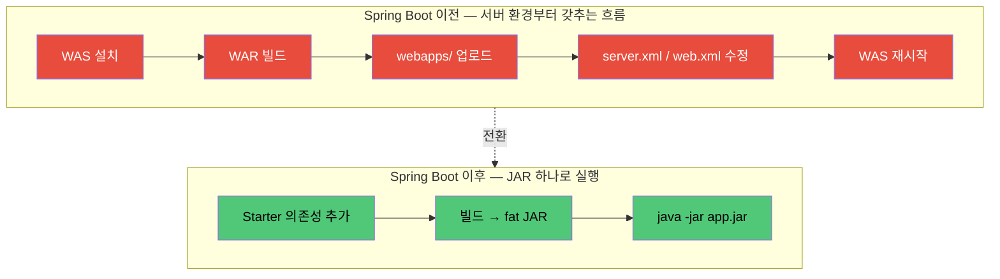

# Spring이란

> - 자바 엔터프라이즈를 위한 POJO 기반 프레임워크, EJB 컨테이너 종속 모델을 끊어내려 등장
> - IoC/DI(객체 조립) + AOP(횡단 관심사 분리) + PSA(외부 기술 일관 추상화) 세 축이 본질이고, 이를 통해 객체와 기술 사이의 결합도를 낮춤
> - Spring Boot는 그 위에 자동 구성·내장 톰캣·Starter를 얹어 만든 실행 환경

Spring은 자바 엔터프라이즈 애플리케이션 개발을 위한 프레임워크로, IoC 컨테이너를 중심으로 객체 조립·트랜잭션·웹·데이터 접근 등 영역별 모듈을 묶어 제공한다.

- EJB 컨테이너에 강하게 종속되던 기존 모델을 대체하는 POJO 기반 설계를 제시
- 이후 Spring Framework → Spring Boot → Spring Cloud → Spring Data 등의 생태계로 확장

## 사용 이유

Spring 등장 이전의 J2EE는 EJB 컨테이너에 강하게 종속되어, 단위 테스트가 어렵고 기술 교체 비용도 매우 컸다.

|   영역    |                     EJB의 부담                      |           Spring의 해결           |
|:-------:|:------------------------------------------------:|:------------------------------:|
| 컴포넌트 모델 | `EJBObject`/`SessionBean` 직접 구현, 한 컴포넌트당 4~5개 파일 |  POJO + IoC/DI, 그냥 자바 객체로 동작   |
|   테스트   |          컨테이너에 배포해야만 동작 → 단위 테스트 사실상 불가          |  컨테이너 없이 객체 생성 + Mock 주입으로 검증  |
|  부가 기능  |            트랜잭션·보안은 EJB 컨테이너 안에서만 가능             | AOP로 핵심 로직과 분리, PSA로 외부 기술과 무관 |
|  기술 교체  |            벤더 종속이 깊어 교체 시 컴포넌트 전반 수정             |    인터페이스 + DI로 구현체 교체가 가벼움     |
| 개발 사이클  |            빌드·배포가 분 단위, 검증마다 컨테이너 기동             |       로컬 JVM에서 즉시 실행·디버그       |

결과적으로 모듈 교체 비용·테스트 부담·기술 종속도가 모두 줄었다.

## Spring Framework와 Spring Boot의 차이

Spring Boot는 Spring Framework를 대신하는 별개 프레임워크가 아니라, Spring을 더 쉽게 쓰도록 자주 쓰는 설정을 미리 깔아둔 실행 환경이다.

### Spring Boot 이전의 배포

Spring Framework만 쓰던 시절, 웹 애플리케이션을 띄우려면 서버 환경부터 직접 갖춰야 했다.

1. 운영 서버에 Tomcat·Jetty·JBoss 같은 WAS(Web Application Server)를 먼저 설치
2. 애플리케이션은 WAR(Web Application Archive) 파일로 빌드
3. WAR를 WAS의 `webapps/` 디렉토리에 올리면 WAS가 압축을 풀고 실행
4. 포트·DataSource·세션은 WAS의 `server.xml`·`context.xml`을 수정해 설정
5. 서블릿·필터·리스너는 `web.xml`에 직접 등록
6. Spring 자체 설정은 XML로 별도 부트스트랩

이 구조의 한계는 다음과 같았다.

- 환경(dev/staging/prod)마다 WAS 설치·버전·설정이 따로 관리되어 동기화 비용 증가
- 한 WAS 위에 여러 앱이 같이 올라가면 라이브러리 버전 충돌 위험 존재
- 배포 시 "서버 준비 → WAR 업로드 → WAS 재시작"이 한 사이클이라, 자동화의 불편함

### Spring Boot가 풀어준 부분

Spring Boot는 이 흐름을 "실행 가능한 JAR 하나" 로 압축했다.

1. 의존성에 `spring-boot-starter-web`만 넣으면 내장 톰캣이 함께 패키징되어, 별도 WAS 설치가 불필요
2. 빌드 결과는 fat JAR — 운영 서버에 JVM만 있으면 `java -jar app.jar`로 바로 실행
3. 포트·DataSource·로깅은 `application.yml`의 표준 키로 한 파일에서 설정
4. 환경별 차이는 `application-{profile}.yml`로 분리, 실행 시 프로파일만 지정

### 흐름 비교



|   구분   |     Spring Framework     |        Spring Boot        |
|:------:|:------------------------:|:-------------------------:|
|   역할   |     IoC 컨테이너 + 라이브러리     |  Spring 위의 자동 구성 + 실행 환경  |
| 구성 방식  | XML 또는 JavaConfig로 직접 등록 | `application.yml` + 자동 구성 |
| 의존성 관리 |   개별 라이브러리 버전 직접 명시·검증   |  Starter + BOM으로 검증된 단위   |
| 서버 배포  |   외부 WAS에 WAR 배포가 일반적    |      내장 톰캣 + 단일 JAR       |
| 운영 도구  |            없음            |   Actuator, DevTools 등    |

## Spring Boot의 핵심 기능

### 자동 구성 (Auto Configuration)

Spring Boot의 핵심은 `@EnableAutoConfiguration`을 통한 조건부 빈 등록이다.

```java
// spring-boot-autoconfigure 내부 (단순화)
@Configuration
@ConditionalOnClass(DataSource.class)
@ConditionalOnMissingBean(DataSource.class)
public class DataSourceAutoConfiguration {

    @Bean
    public DataSource dataSource() {
        // HikariDataSource 등 기본 구현 반환
        return new HikariDataSource();
    }
}
```

- `@ConditionalOnClass`: 클래스패스에 해당 라이브러리가 있을 때만 활성
- `@ConditionalOnMissingBean`: 사용자가 같은 타입 빈을 정의하지 않은 경우에만 활성
- 사용자가 직접 빈을 정의하면 자동 구성이 비활성화되어, 덮어쓰기가 자연스러움

자동 구성의 본체는 `org.springframework.boot.autoconfigure.AutoConfiguration.imports` 파일에 나열된 클래스 목록이며, 부팅 시 일괄 평가된다.

### Starter 의존성

Starter는 특정 기능에 필요한 라이브러리를 묶은 의존성 단위로, Spring Boot에서 자주 쓰이는 조합을 미리 패키징하여 제공한다.

|            Starter             |                    포함 라이브러리                     |
|:------------------------------:|:-----------------------------------------------:|
|   `spring-boot-starter-web`    |          Spring MVC + Tomcat + Jackson          |
| `spring-boot-starter-data-jpa` |          JPA + Hibernate + JDBC + 트랜잭션          |
|   `spring-boot-starter-test`   | JUnit Jupiter + Mockito + AssertJ + Spring Test |

Spring Boot의 BOM(Bill of Materials)이 모든 모듈의 버전 호환성을 관리하므로, 사용자는 라이브러리 간 버전 충돌을 직접 해결할 필요가 거의 없다.
