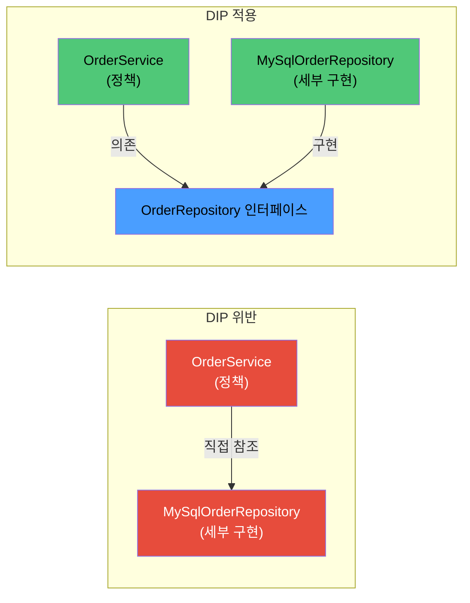

# DIP (Dependency Inversion Principle)

> - 상위 모듈은 하위 모듈이 아닌, 양쪽 모두 추상에 의존해야 한다는 원칙
> - 역전의 의미: 자연스러운 의존 방향(정책 → 구현)을 추상으로 뒤집어 양쪽이 모두 추상을 향하게 만드는 것
> - 구현 클래스 타입에 의존하면 DIP 위반
> - 인터페이스는 사용 측(정책) 모듈이 소유 — 헥사고날·클린 아키텍처의 Port 위치

상위 모듈은 하위 모듈에 의존해서는 안 되며, 양쪽 모두 추상화에 의존해야 한다는 설계 원칙이다.

- 상위 모듈(High-level Module): 정책(Policy)을 담은 코드 (비즈니스 규칙, 사용 측)
- 하위 모듈(Low-level Module): 세부 구현(Detail)을 담은 코드 (DB 접근, 외부 API, 파일 I/O 등)
- 추상화(Abstraction): 두 모듈 사이의 계약(Interface)

## 역전의 의미

원칙의 이름이 역전인 이유는, 자연스럽게 작성한 코드의 의존 방향이 정책 → 세부 구현으로 흐르는데, DIP는 이를 뒤집어 양쪽 모두 추상에 의존하도록 만들기 때문이다.



- 위반: 정책이 구현 클래스를 직접 참조하므로, DB 구현을 바꾸면 정책 코드가 함께 변경
- 적용: 정책과 구현 모두 인터페이스에 의존. 정책은 구현을 모르고, 구현은 정책의 요구사항(인터페이스)에 따라 구현

## 코드 예시

```java
class OrderService {

    private final MySqlOrderRepository repository;

    OrderService() {
        this.repository = new MySqlOrderRepository(); // 구현 클래스에 직접 의존
    }

    void place(Order order) {
        repository.save(order);
    }
}
```

- DB를 PostgreSQL로 바꾸면 `OrderService`의 코드까지 수정해야 함
- 단위 테스트 시 실제 MySQL이 필요
- `MySqlOrderRepository`의 변경이 `OrderService`로 그대로 전파

이를 DIP 적용하면 다음과 같이 된다.

```java
interface OrderRepository {

    void save(Order order);
}

class MySqlOrderRepository implements OrderRepository { ...
}

class OrderService {

    private final OrderRepository repository;

    OrderService(OrderRepository repository) { // 추상에 의존, 외부에서 주입
        this.repository = repository;
    }
}
```

- 구현 클래스를 교체해도 `OrderService`는 변하지 않음
- 테스트 시 `OrderRepository`의 Mock을 주입해 검증 가능
- 정책과 구현의 변경 주기 분리

## Spring DI와 DIP의 관계

Spring의 DI는 DIP를 실현하기 위한 도구이지, DIP 그 자체는 아니다.

| 구분  |          역할          |
|:---:|:--------------------:|
| DIP |   의존 방향에 대한 설계 원칙    |
| DI  | 의존성을 외부에서 주입하는 구현 패턴 |

따라서 다음과 같이 DI는 쓰지만 DIP는 지키지 않은 경우도 있으니, 주의해야 한다.

```java
class OrderService {

    private final MySqlOrderRepository repository; // 구현 클래스 그대로

    OrderService(MySqlOrderRepository repository) { // 외부에서 주입하긴 하지만
        this.repository = repository;
    }
}
```

## 인터페이스의 소유권

DIP를 제대로 적용하려면 인터페이스가 어느 모듈에 위치하는가가 중요하다.

- 일반적 직관: 인터페이스는 구현체가 있는 모듈에 위치
- DIP의 권고: 인터페이스는 그것을 사용하는 정책 모듈에 위치

```
[정책 모듈] OrderService, OrderRepository (interface)
                         ↑ 구현
[구현 모듈] MySqlOrderRepository implements OrderRepository
```

- 정책이 필요로 하는 계약을 정책 모듈에 두고, 구현 모듈이 이를 따라가는 구조
- 정책 모듈이 구현 모듈에 컴파일 시 의존하지 않게 되어, 헥사고날·클린 아키텍처의 골격
- 클린 아키텍처에서 말하는 "Port"가 이 위치의 인터페이스 담당

## DIP를 깨는 흔한 안티패턴

|                   패턴                    |              문제              |
|:---------------------------------------:|:----------------------------:|
|          구현 클래스의 정적 메서드 직접 호출           |    외부에서 교체 불가, 정책이 구현에 직결    |
| 인터페이스가 구현 세부 타입을 노출 (Leaky Abstraction) |   인터페이스 형식만 있고 실제로는 구현에 결합   |
|          `instanceof`로 구현체 분기           | 정책이 구현체 타입을 알게 됨, 추상화가 무의미해짐 |

```java
// 1) 구현 클래스의 정적 메서드 호출
class OrderService {

    void place(Order o) {
        MySqlConnectionPool.getInstance().getConnection()... // 구현에 직접 의존
    }
}

// 2) 인터페이스를 만들어도 구현 클래스의 세부 동작에 결합
interface OrderRepository {

    void save(Order order);

    Connection getRawConnection(); // 구현 누수 (Leaky Abstraction)
}

// 3) instanceof로 구현체 분기
class OrderService {

    private final OrderRepository repository;

    void place(Order o) {
        if (repository instanceof MySqlOrderRepository) { // 정책이 구현체를 알게 됨
            ...
        }
    }
}
```

## OCP와의 관계

DIP는 OCP(개방-폐쇄 원칙, Open-Closed Principle)와 한 쌍으로 동작한다.

- OCP: 확장에는 열려 있고, 수정에는 닫혀 있어야 한다
- DIP가 적용되면 새 구현체를 추가해도 정책 코드는 수정 없이 그대로 → OCP 충족
- 즉, DIP는 OCP를 가능하게 하는 구조적 토대

DB 구현체를 MySQL → PostgreSQL로 바꾸는 변화도, DIP가 적용된 코드에서는 새 구현 클래스만 추가하고 빈 구성을 바꾸면 끝나야 한다.

## 한계와 주의점

- 모든 의존을 추상화하는 것이 항상 옳지는 않음
    - 변경 가능성이 낮은 표준 라이브러리(`String`, `LocalDateTime`)까지 추상화하면 오히려 코드 복잡성만 증가
- "변경 가능성이 높고, 정책에 영향이 큰" 경계에만 추상화를 적용하는 것이 효과적
- 보통 테스트 더블이 필요한 경계 대부분이 DIP 적용 대상 (외부 시스템, 인프라).
- 인터페이스는 사용 측의 요구로 도출
    - 구현부터 만들고 동일한 시그니처를 인터페이스로 베껴 쓰면 추상화의 의미가 약해짐
