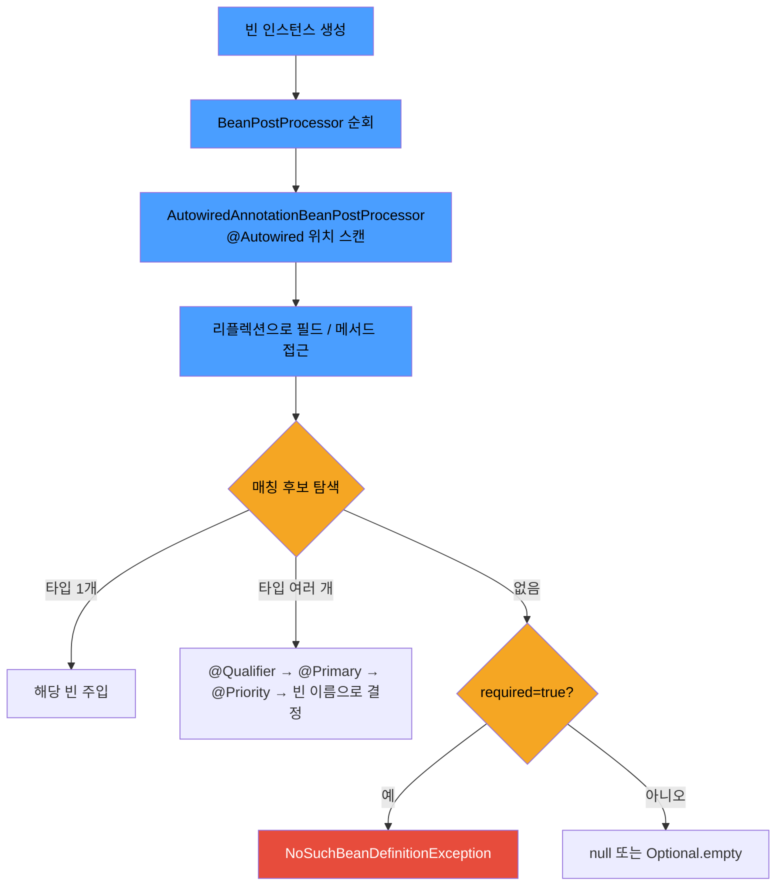

# @Autowired와 DI 방식

> - `@Autowired`는 `AutowiredAnnotationBeanPostProcessor`가 빈 생성 직후 리플렉션으로 처리
> - 매칭 순서: 타입 → @Qualifier → @Primary → @Priority → 빈 이름
> - 주입 방식 셋(생성자·세터·필드) 중 표준은 생성자 주입
> - 생성자 주입 권장 이유: final 불변성, 순환 의존 기동 시 검출, NPE 차단, 의존성 시그니처 노출, 컨테이너 없이 테스트 가능

`@Autowired`는 Spring 컨테이너가 등록된 빈 중에서 필요한 의존성을 찾아 주입하도록 지시하는 어노테이션이다. 작동 원리와 주입 방식(생성자/세터/필드), 그리고 생성자 주입이 권장되는 이유를 함께
살펴보면 Spring이 의존성을 어떻게 다루는지 전체 그림이 드러난다.

## @Autowired의 작동 방식

`@Autowired`의 처리는 `AutowiredAnnotationBeanPostProcessor`가 담당한다.



### 매칭 우선순위

1. 타입으로 후보 검색 (`BeanFactory#getBeansOfType`)
2. 후보가 둘 이상인 경우
    1) `@Qualifier`로 후보 필터링
    2) `@Primary` 빈
    3) `@Priority`(`jakarta.annotation.Priority`)의 가장 높은 우선순위
    4) 필드/파라미터 이름과 빈 이름 일치
3. 끝까지 결정하지 못하면 `NoUniqueBeanDefinitionException`
4. 후보가 없으면 `required` 값에 따라 예외 또는 null

### 컬렉션 주입 (List, Map, Set)

주입 대상이 컬렉션 타입이면, 단일 빈을 고르는 대신 **같은 타입의 빈 전부를 주입**한다.

```java
interface PaymentStrategy {

    void pay(int amount);
}

@Service
class CardPayment implements PaymentStrategy {

    @Override
    public void pay(int amount) {
        // 카드 결제 로직
    }
}

@Service
class BankPayment implements PaymentStrategy {

    @Override
    public void pay(int amount) {
        // 계좌이체 로직
    }
}

@Service
class PaymentService {

    private final List<PaymentStrategy> strategies;     // 두 빈 모두 주입
    private final Map<String, PaymentStrategy> byName;  // {"cardPayment": ..., "bankPayment": ...}

    PaymentService(List<PaymentStrategy> strategies,
            Map<String, PaymentStrategy> byName) {
        this.strategies = strategies;
        this.byName = byName;
    }
}
```

- `List<T>` / `Set<T>`: 같은 타입의 모든 빈을 컬렉션으로 주입
- `Map<String, T>`: 빈 이름을 key, 빈 인스턴스를 value로 묶어 주입
- 순서가 필요하면 `@Order` 또는 `Ordered` 인터페이스로 제어 (List·Set만 해당)
- 전략 패턴·플러그인 등록·이벤트 핸들러 모음 같은 구조에 자연스럽게 들어맞음
- 매칭 빈이 하나도 없으면 빈 컬렉션이 주입됨 (NoSuchBeanDefinitionException 아님)

## DI의 세 가지 방식

|   방식   |          예시          |   불변 가능   |  순환 의존 검출   |   테스트 용이성   |
|:------:|:--------------------:|:---------:|:-----------:|:-----------:|
| 생성자 주입 |    `Foo(Bar bar)`    | O (final) | 컴파일 또는 기동 시 |      O      |
| 세터 주입  |   `setBar(Bar b)`    |     X     |     런타임     |      △      |
| 필드 주입  | `@Autowired Bar bar` |     X     |     런타임     | X (리플렉션 필요) |

### 생성자 주입

```java

@Service
class OrderService {

    private final PaymentClient paymentClient;
    private final OrderRepository repository;

    OrderService(PaymentClient paymentClient, OrderRepository repository) {
        this.paymentClient = paymentClient;
        this.repository = repository;
    }
}
```

- 의존성이 객체 생성 시점에 모두 주입되어 이후 변하지 않음 (`final` 가능)
- 의존성이 생성자 시그니처에 명시되므로 누락 시 컴파일·기동 단계에서 즉시 드러남
- Spring 없이도 단위 테스트에서 직접 객체를 생성하여 의존성을 주입 가능

### 세터 주입

```java

@Service
class OrderService {

    private PaymentClient paymentClient;

    @Autowired
    void setPaymentClient(PaymentClient paymentClient) {
        this.paymentClient = paymentClient;
    }
}
```

- 객체 생성 후에 의존성을 주입하므로, 선택적(optional) 의존성 또는 변경 가능성이 있는 의존성에 적합
- 결국 `Setter`를 `public`으로 열어두어야 하기 때문에 실행 중에 의존 관계가 변경 가능성이 있어 위험

### 필드 주입

```java

@Service
class OrderService {

    @Autowired
    private PaymentClient paymentClient;
}
```

- 주입한 필드를 변경할 수 없어 외부에서 접근이 불가능하기 때문에 테스트 코드 작성에 어려움이 있음
- DI 프레임워크가 존재해야 동작하기 때문에 순수한 자바 코드로 테스트가 어려움
- 애플리케이션 실제 코드와 관계 없는 테스트 코드나 설정을 목적으로 하는 `@Configuration` 같은 곳에서만 특별한 용도로 사용하는것을 권장

## 생성자 주입이 권장되는 이유

### 1. 불변성과 NPE 방지

```java
class OrderService {

    private final PaymentClient client; // final 보장

    OrderService(PaymentClient client) {
        this.client = client;
    }
}
```

- 의존성이 누락되면 컴파일 또는 기동 시점에 즉시 드러나므로, 런타임 NPE 위험이 없음

### 2. 순환 의존성의 조기 검출

```java
class A {

    A(B b) {
    }
}

class B {

    B(A a) {
    }
}
// → 컨테이너 기동 시점에 BeanCurrentlyInCreationException
```

- 생성자 주입은 빈 생성 자체에 다른 빈이 필요하므로, 순환이 있으면 기동 단계에서 즉시 실패
- 세터·필드 주입은 일단 객체를 만든 뒤 주입하므로, 순환을 허용하고 런타임에 무한 호출로 드러나거나 잘못된 상태로 동작

### 3. 의존성의 명시성

```java
// 생성자만 봐도 이 클래스가 무엇에 의존하는지 즉시 파악
class OrderService {

    OrderService(PaymentClient client, OrderRepository repo, InventoryService inv) {
        // 의존성 할당
    }
}
```

- 의존성이 너무 많아져 생성자 파라미터가 길어지면, 그 자체가 "이 클래스가 너무 많은 책임을 진다"는 신호
- 필드 주입에서는 의존성이 흩어져 있어 같은 신호가 묻힘 → 단일 책임 원칙 위반을 놓치기 쉬움

### 4. 테스트 용이성

```java
// 생성자 주입 - Spring 없이 직접 객체 생성 가능
@Test
void test() {
    OrderService service = new OrderService(
            mock(PaymentClient.class),
            mock(OrderRepository.class)
    );
}

// 필드 주입 - Spring 컨테이너 또는 ReflectionTestUtils 필요
@Test
void test() {
    OrderService service = new OrderService();
    ReflectionTestUtils.setField(service, "paymentClient", mock(PaymentClient.class));
}
```

- 테스트 코드가 단순해지고, 컨테이너 기동 비용을 들이지 않아도 됨

### ETC - Lombok과의 결합으로 코드량 부담 해소

```java

@Service
@RequiredArgsConstructor
class OrderService {

    private final PaymentClient client;
    private final OrderRepository repository;
}
```
