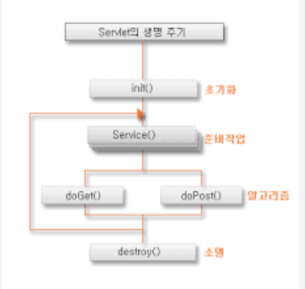

## Q.Servlet 이란?

Servlet이란 자바에서 HTTP 요청을 처리하기 위한 서버 측 자바 프로그램입니다.
서블릿 컨테이너에 의해 생성 및 관리되며, 클라이언트의 요청을 받아 응답을 생성하는 역할을 합니다.

</br>
</br>

**💡 Servlet이란?**

- **자바에서 HTTP 요청을 처리하기 위한 서버 측 자바 프로그램**
- 서블릿 컨테이너에 의해 생성-관리되는 자바 객체이며, **클라이언트의 요청을 받고 응답을 생성하는 역할**

</br>

**과거에는 웹 요청마다 Servlet이 직접 요청 처리**

```java
@WebServlet("/hello")
public class HelloServlet extends HttpServlet {

    @Override
    protected void doGet(HttpServletRequest request,
                         HttpServletResponse response) {

        response.getWriter().write("hello");
    }
}
```

- 브라우저가 `/hello` 요청
→ 톰캣이 요청 받음
→ 해당 Servlet 실행
→ 브라우저에 반환
- HelloServlet 클래스가 하나의 Servlet이다.

</br>

**서블릿의 특징**

- HTTP 요청/응답 처리
    - GET : doGet()
    - POST : doPost()
- Servlet은 직접 실행되는 것이 아니라 서블릿 컨테이너에 의해 관리된다.
- 대표적인 서블릿 컨테이너:
    - Apache Tomcat
    - Jetty

</br>

**스프링 MVC와의 관계**

- 스프링 MVC도 Servlet 기반으로 동작한다.
- Dispatcher Servlet 역시 하나의 Servlet이며, 스프링 MVC의 프론트 컨트롤러 역할을 수행한다.

</br>
</br>

### 🚨 Servlet 생명 주기

서블릿은 보통 최초 요청 시 또는 설정에 따라 서버 시작 시 한 번 생성되어 초기화 작업이 수행됩니다. 이후에는 하나의 서블릿 인스턴스가 여러 요청에 대해 재사용되며 요청을 처리합니다. 마지막으로 서버 종료나 재배포 시점에 서블릿이 제거되며 리소스가 정리됩니다.

즉, 서블릿은 생성 → 초기화 → 요청 처리 반복 → 종료의 흐름으로 동작하며, 하나의 인스턴스를 여러 스레드가 공유하기 때문에 thread-safe하게 설계되어야 합니다.

</br>

**핵심 메서드 3개**

- `init`
    - 서블릿을 초기화하며 처음 한번만 실행
    - 서버 시작 시 필요한 초기 작업을 수행함 (DB 연결 준비, 설정 파일 로딩, 캐시 초기화, 공통 데이터 준비)
- `service`
    - 요청 / 응답을 처리
    - doGet(), doPost()로 분기
- `destroy`
    - 서블릿 종료 요청이 있을 때 실행

**동작 과정**



1. 클라이언트 요청이 들어오면 메모리에서 서블릿 객체 찾음
2. 서블릿 객체가 없으면 생성하고 `init()` 메서드를 1번 호출해 초기화 (요청마다 생성 아님!!)
3. 이후 요청마다 `service()` 메서드를 호출해서 요청 처리하고, 내부적으로 HTTP Method에 따라 doGet(), doPost()를 실행
4. 서버 종료나 애플리케이션 재배포 시 `destroy()` 메서드를 1번 호출해 리소스 정리 (요청 끝나고 정리하는거 아님!!)

**주의할 점**

- 서블릿 객체는 보통 하나만 생성되어 여러 요청이 공유됨 (싱글톤처럼)
- 멀티스레드 환경에서 동작하므로 동시성 문제를 주의해야 함
- 따라서 상태를 가지는 인스턴스 변수 사용에 주의해야 함