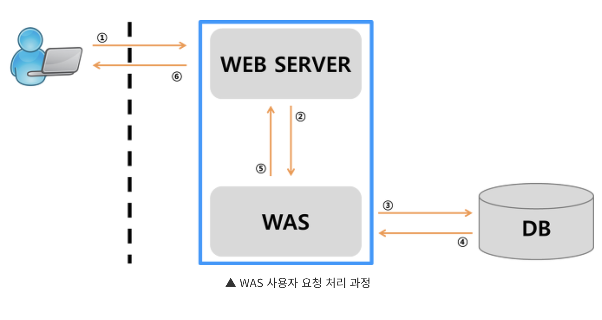

## Q. Apache Tomcat 이란?

Apache Tomcat은 자바 기반 웹 애플리케이션을 실행하기 위한 대표적인 WAS(Web Application Server)이자 Servlet Container입니다. HTTP 요청을 받아 Servlet을 실행하고, 스프링과 같은 자바 웹 애플리케이션이 동작할 수 있는 환경을 제공합니다.

</br>
</br>

### 💡 Tomcat = WAS + Servlet Container

**WAS (Web Application Server)**



- 웹서버 + 웹 컨테이너(서블릿 컨테이너)
- 정적 자원 제공 뿐만 아니라, 비즈니스 로직을 수행하고 동적인 응답 생성 가능
- 예를 들어 다음과 같은 작업을 처리함
    - HTTP 요청 수신
    - 비즈니스 로직 실행
    - DB 연동
    - 동적 HTML/JSON 생성

</br>

**서블릿 컨테이너**

- Servlet을 생성, 실행, 관리해주는 환경

</br>

**서블릿 컨테이너가 해주는 일**

- Servlet 객체 생성 및 관리
- Servlet 생명주기 관리
- URL과 Servlet 매핑
- 요청마다 스레드 할당
- HTTP Request / Response 객체 생성
- 적절한 Servlet 호출

</br>

**SpringMVC에서 동작 흐름**

```
브라우저 요청
   ↓
Tomcat이 HTTP 요청 수신
   ↓
DispatcherServlet(Servlet) 실행 (생성, 관리까지)
   ↓
Controller 호출
   ↓
응답 반환
```