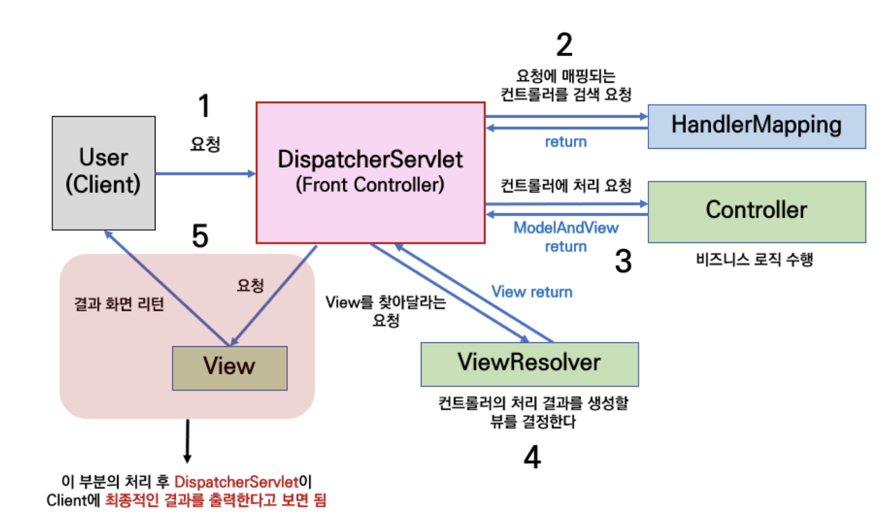
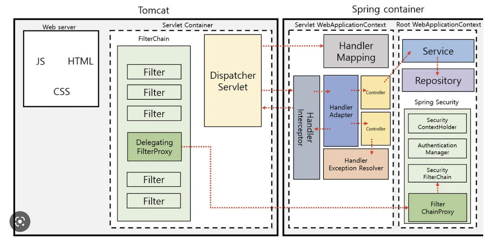

## Q.Dispatcher Servlet기반 Spring MVC 동작 방식을 설명해주세요.

Dispatcher Servlet은 스프링 MVC의 핵심 Servlet이자 Front Controller입니다. 클라이언트의 모든 HTTP 요청을 가장 먼저 받아 적절한 Controller로 전달하는 역할을 합니다.

스프링 MVC는 이러한 Dispatcher Servlet을 중심으로 MVC 패턴을 구현하며, 공통 요청 처리 흐름을 중앙에서 관리합니다.

클라이언트 요청이 들어오면 Tomcat이 Dispatcher Servlet에게 전달하고, Dispatcher Servlet은 HandlerMapping을 통해 요청에 맞는 Controller를 찾습니다. HandlerAdapter가 Controller를 실행하면 Controller는 비즈니스 로직 수행 후 결과를 반환합니다. Dispatcher Servlet은 ViewResolver 또는 HttpMessageConverter를 통해 최종 응답을 생성하여 클라이언트에게 반환합니다.

이를 통해 요청 매핑, 예외 처리, 데이터 바인딩과 같은 공통 로직을 중앙화할 수 있고, 개발자는 비즈니스 로직에 집중할 수 있습니다.

</br>
</br>

### 💡 MVC 패턴이란?

애플리케이션의 역할을 분리하여 유지보수성과 확장성을 높이기 위한 소프트웨어 설계 패턴이다.

과거에는 하나의 Servlet이 요청 처리, 비즈니스 로직, 화면 생성까지 모두 담당하는 경우가 많았다.

```java
@WebServlet("/user")
publicclassUserServletextendsHttpServlet {

protectedvoiddoGet(...) {

// 요청 처리
Useruser=userService.findUser();

// HTML 생성
response.getWriter().write("<h1>"+user.getName()+"</h1>");
    }
}
```

이처럼 하나의 클래스가 모든 역할을 담당하면 코드가 복잡해지고 유지보수가 어려워진다.

이를 해결하기 위해 MVC 패턴에서는 역할을 다음과 같이 분리한다.

- **Model**
    - 데이터와 비즈니스 로직을 담당
    - DB 조회, 데이터 처리 등을 수행
- **View**
    - 사용자에게 보여지는 화면을 담당
    - JSP, Thymeleaf, HTML 등이 해당
- **Controller**
    - 클라이언트 요청을 받아 적절한 비즈니스 로직(Model)을 호출하고, 결과를 View에 전달하는 역할 수행

Spring MVC는 이러한 MVC 패턴을 기반으로 동작하는 웹 프레임워크이다.

</br>
</br>

## 💡 Spring MVC

- Spring Framework에서 제공하는 MVC 패턴 기반의 웹 프레임워크
- DispatcherServlet을 중심으로 요청 처리 흐름을 관리한다.
- Servlet 기반으로 동작하며, 개발자가 Servlet을 직접 다루지 않고도 웹 애플리케이션을 쉽게 개발할 수 있도록 추상화해준다.

</br>
</br>

### **💡 Dispatcher Servlet이란??**

- 스프링 MVC의 핵심 서블릿
- 클라이언트의 모든 HTTP 요청을 가장 먼저 받아 적절한 컨트롤러로 전달해주는 프론트 컨트롤러 역할 수행
- 공통 처리(인코딩, 예외 처리, 요청 위임 등)를 중앙에서 관리하여 중복 코드를 줄이고 MVC 구조를 효율적으로 관리할 수 있게 해줌

</br>

**프론트 컨트롤러 패턴**

- 클라이언트의 요청을 하나의 진입점(프론트 컨트롤러)에서 먼저 받아 처리한 뒤, 적절한 컨트롤러에 위임하는 디자인 패턴
- 스프링 MVC에서는 Dispatcher Servlet이 프론트 컨트롤러 역할을 담당

</br>

**Dispatcher Servlet의 장점**

- 모든 요청을 Dispatcher Servlet이 중앙에서 처리하기 때문에 공통 로직을 일관되게 관리할 수 있다.
    - 과거에는 이런 식으로 처리를 다 해줘야 했음
    
    ```java
    @WebServlet("/user")
    public class UserServlet extends HttpServlet {
        protected void doGet(...) {
            // 인코딩 처리
            // 인증 확인
            // 예외 처리
            // 요청 파라미터 파싱
            // 비즈니스 로직 호출
            // 응답 생성
        }
    }
    ```
    
    - 스프링 MVC에서는 Dispatcher Servlet이 요청을 받아 다음과 같은 공통 흐름을 처리한다.
        - 요청 수신
        - Handler Mapping을 통한 컨트롤러 조회
        - 요청 파라미터 바인딩
        - 응답 변환(ViewResolver / HttpMessageConverter)
        - 예외 처리 전략 연동
    
    ```java
    @GetMapping("/user")
    public UserResponse getUser() {
        return userService.findUser();
    }
    ```
    
    - ⇒ 개발자는 비즈니스 로직에 집중할 수 있고, 유지보수성이 향상된다.
- 과거에는 서블릿마다 URL 매핑을 직접 등록해야 했지만, 스프링 MVC에서는 Dispatcher Servlet이 요청을 받아 Handler Mapping을 통해 적절한 컨트롤러를 찾아준다.

</br>

**정적 자원 처리 방식**

1. URL 패턴으로 분리하는 방식

- `/static/*`, `/resources/*` 같은 경로로 정적 자원을 분리하여 처리한다.
- Dispatcher Servlet이 해당 요청을 정적 리소스 핸들러로 전달한다.

2. 컨트롤러 조회 후 정적 자원 처리

- Dispatcher Servlet이 먼저 요청에 맞는 컨트롤러를 찾는다.
- 적절한 컨트롤러가 없으면 Resource Handler가 정적 자원 요청으로 처리한다.

</br>
</br>

### **💡** DispatcherServlet **기반 Spring MVC**

Spring MVC는 DispatcherServlet을 중심으로 요청 처리 흐름을 관리한다.





- 클라이언트가 http://localhost:8080/users/1로 GET 요청을 보냄
- 톰캣의 HTTP Connector가 요청을 수신
- 톰캣은 URL 패턴에 따라 Dispatcher Servlet에 요청을 전달
- Dispatcher Servlet은 `HandlerMapping`을 사용하여 /users/{id}에 매핑된 Controller를 찾음
- `HandlerAdapter`가 Controller 메서드를 실행한다. (getUser() 메서드 호출)
- Controller는 Service 계층을 호출하여 비즈니스 로직을 수행하고 결과를 반환한다.
- 반환 타입에 따라:
    - View 이름을 반환하면 `ViewResolver`가 실제 View(JSP, Thymeleaf 등)를 찾아 렌더링한다.
    - DTO / ResponseEntity를 반환하면 `HttpMessageConverter`가 JSON으로 변환한다.
- DispatcherServlet은 반환된 결과를 HttpServletResponse에 작성
- Tomcat이 최종 HTTP 응답을 클라이언트에게 반환한다.

```
Tomcat
→ DispatcherServlet
→ Controller
→ ViewResolver / HttpMessageConverter
→ HttpServletResponse
→ 클라이언트
```

이를 통해 Spring MVC는 요청 처리 흐름을 중앙화하고, 개발자가 비즈니스 로직에 집중할 수 있도록 함!!

</br>

**참고자료**

[[Spring] Dispatcher-Servlet(디스패처 서블릿)이란? 디스패처 서블릿의 개념과 동작 과정](https://mangkyu.tistory.com/18)