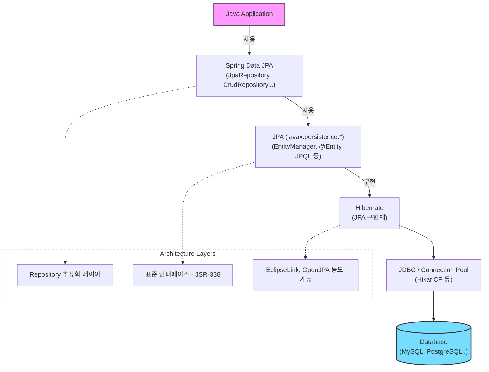

> JPA(Java Persistence API) 는 ORM 표준 인터페이스이고, Hibernate 는 그 표준을 구현한 대표 구현체입니다.
> 
> 
> JPA 는 표준 명세서로 `EntityManager`, `@Entity` , `JPQL` 등의 인터페이스와 애노테이션만 정의하지 실제 동작 코드는 없습니다.
> 
> Hibernate 는 이 JPA 를 구현한 라이브러리입니다.
> 
> JPA 를 사용하는 이유는 SQL 중심 개발에서 객체 중심 개발을 할 수 있고 이를 통해 생산성과 유지 보수성 그리고 DB 제약에서 벗어날 수 있습니다.
> 

### JPA vs Hibernate

---



**[JPA]**

- Java Persistence API
    - 자바 진영의 ORM 기술 표준 인터페이스 모음
    - ORM 동작 규칙을 정의한 문서

https://chaeyami.tistory.com/255

**[Hibernate]**

- JPA 라는 인터페이스를 실제로 구현한 대표 프레임워크
- 데이터 저장 시 내부 순서
    1. EntityManagerFactory 생성
        
        애플리케이션 로딩 시점에 DB 당 하나만 생성된다.
        
    2. EntityManager 생성
        
        트랜잭션 단위로 엔티티 매니저가 생성되어 Persistence Context 에 접근한다.
        
    3. 영속 상태 관리
        
        객체가 영속성 컨텍스트에 들어오면 JPA 가 스냅샷을 찍는다.
        
    4. Flush & commit
        
        트랜잭션이 끝날 때 스냅샷과 현재 객체를 더티 체킹해 변경 사항에 대해 업데이트 쿼리를 날리고 반영한다.
        

### 그러면 왜 사용하는 것일까?

---

> ORM 과 이어집니다.
> 

**1️⃣ 상속 관계 매핑**

객체에는 상속이 있지만 RDB 에는 JOIN 등으로 처리해야 합니다.

- JPA 가 알아서 테이블 조이블을 조인해줍니다.

```java
@Entity
public class Album extends Item {...}
```

**2️⃣ 연관 관계 그래프 탐색**

객체는 **참조를 통해** 해당 객체를 찾습니다. (`item.getCategory().getName()`)

JPA 에서 Lazy Loading 을 통해 실제 데이터가 필요한 시점에만 쿼리를 날릴 수 있습니다.

**3️⃣ 동일성**

동일 트랜잭션 내에서 같은 ID 로 조회한 객체는 **항상 같은 인스턴스임이 보장**됩니다. (1차 캐시의 이유)

### 참고 사항

---

Spring Data JPA 와 JPA 와 다릅니다.

이는 JPA 기반 애플리케이션 개발을 편하게 만드는 라이브러리입니다.

- JpaRepository 를 통해 정해진 규칙대로 메서드를 입력해 Spring 이 메서드 이름에 적합한 쿼리를 날리는 구현체를 만들어 Bean 등록을 해줍니다.