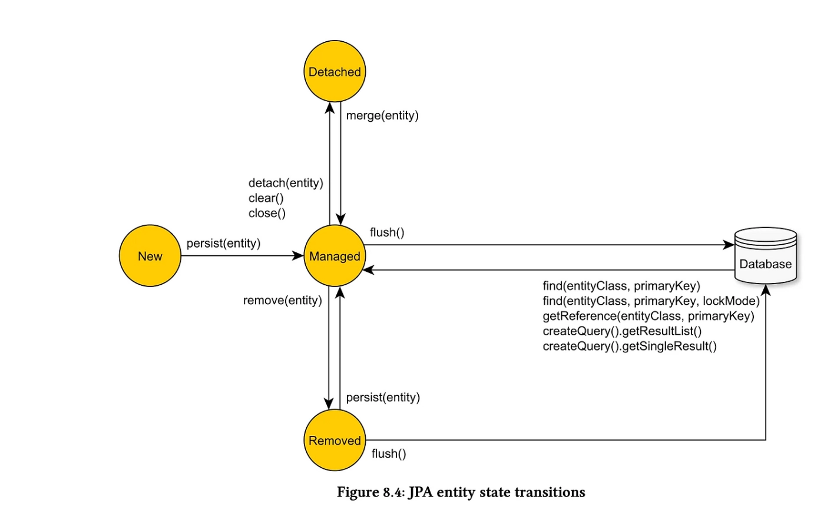
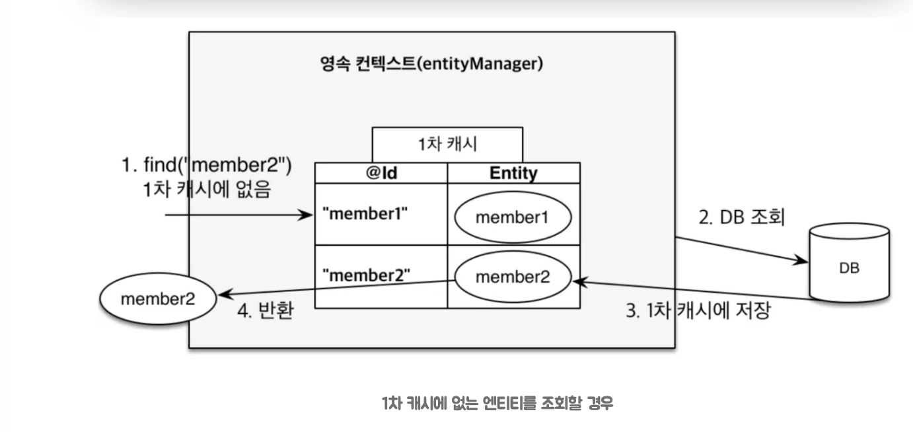
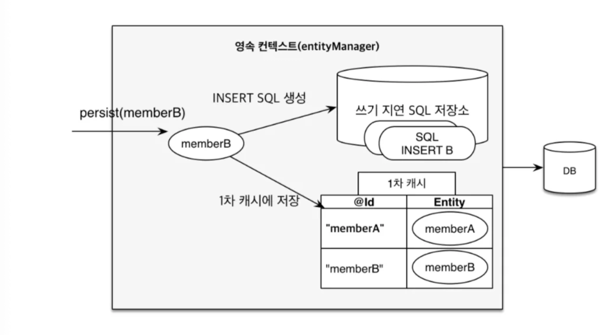
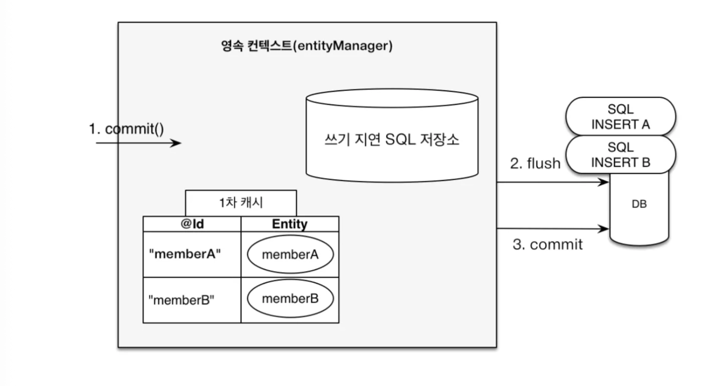

> 영속성 컨텐스트는 JPA 가 엔티티를 DB 에 저장하기 전 관리하는 메모리 공간으로 1차 캐시, Dirty Checking, 쓰기 지연, 지연 로딩 4가지 기능을 제공합니다.
조건에 따라서 성능 향상에 도움이 되는데, 잘못 사용하면 오히려 메모리를 불필요하게 사용하거나 N+1 문제, 불필요한 더티 체킹으로 오버헤드가 발생합니다.
> 

### 영속성 컨텍스트 내부 구조

> **엔티티를 영구 저장하는 환경**
> 

```java
EntityManager (= Hibernate Session)
│
├── 📦 1차 캐시 (First-Level Cache)
│   └── Map<EntityKey, Entity>
│       ├── Key: (타입, PK)
│       └── Value: 엔티티 인스턴스
│
├── 📸 스냅샷 저장소 (Snapshot Store)
│   └── Map<EntityKey, EntitySnapshot>
│       └── Dirty Checking을 위한 최초 상태 복사본
│
├── 📝 ActionQueue (쓰기 지연 SQL 저장소)
│   ├── InsertAction[]
│   ├── UpdateAction[]
│   └── DeleteAction[]
│
└── 🔗 프록시 레지스트리
    └── 초기화된/미초기화 프록시 객체 관리
```

- **엔티티의 상태 4가지**
    
    
    

    - 비영속(new/transient) : 영속성 컨텍스트와 전혀 관계가 없는 새로운 상태
    - 영속(managed) : 영속성 컨텍스트에 관리되는 상태
    - 준영속(detached) : 영속성 컨텍스트에 저장되었다가 분리된 상태
    - 삭제(removed) : 삭제된 상태
    

### 1️⃣ 1차 캐시

---

> 트랜잭션 내부에서 한 번 조회한 엔티티를 메모리에 보관해 같은 ID 로 데이터 조회 시 DB 가 아닌 메모리에서 꺼내 씁니다.
> 

`em.find(Member.class, 1L)` 을 호출합니다.

- 캐시가 HIT 되었으면 이를 return
- 만약 없다면 쿼리문을 실행해서 DB 에서 조회하고 캐시에 저장합니다.



**📍 단, 1차 캐시는 트랜잭션 범위 내에서만 유효합니다.**

트랜잭션이 종료되면 소멸합니다.

### 2️⃣ Dirty Checking

---

```java
em.find() 시점
      │
      ▼
엔티티 로드 + 스냅샷 복사본 저장
      │
   (비즈니스 로직 수행)
   member.setName("변경")
      │
      ▼
transaction.commit() 호출
      │
      ▼
flush() 자동 실행
      │
      ▼
현재 엔티티 vs 스냅샷 전체 필드 비교
      │
   변경 감지
      │
      ▼
UPDATE SQL 자동 생성 → ActionQueue 추가
      │
      ▼
DB 반영
```

- Flush 실행 과정
    - 변경 감지가 동작해서 영속성 컨텍스트 안에 있는 모든 엔티티를 스냅샷과 비교한다.
    - 수정된 엔티티가 있으면 수정 쿼리를 만들어 쓰기 지연 SQL 저장소에 등록한다.
    - 이후 `commit()` 이 호출되면, 쓰기 지연 SQL 저장소의 모든 쿼리가 데이터베이스에 전송된다.
    
- Flush 호출 방법
    - 직접 호출 : 엔티티 매니저의 `flush()` 메서드를 직접 호출해서 영속성 컨텍스트를 강제로 플러시한다.
    - 트랜잭션 커밋 시 플러시 자동 호출 : 트랜잭션이 커밋되기 전에 JPA는 영속성 컨텍스트의 변경 내용을 데이터베이스에 반영하기 위해 플러시를 자동으로 호출한다.
    - JPQL 쿼리 실행 시 플러시 자동 호출 : 데이터베이스에 JPQL 쿼리를 직접 작성해서 날릴 때도 플러시가 자동 실행된다.
    

Dirty Checking 을 생각했을 때 비용적인 측면에서 추가적으로 고려할 수 있는 것.

```java
// 안 좋은 예: 불필요한 엔티티 조회
@Transactional
public void updateAllMemberNames(List<Long> ids) {
    for (Long id : ids) {
        Member member = em.find(Member.class, id); // 엔티티 로드
        member.setName("새이름");
        // 매 커밋 시 스냅샷 비교 발생
        // 엔티티 필드가 50개라면 50개 필드 전부 비교!
    }
}

// 좋은 예: 벌크 UPDATE 사용
@Transactional
@Modifying
@Query("UPDATE Member m SET m.name = :name WHERE m.id IN :ids")
void bulkUpdateNames(@Param("name") String name, @Param("ids") List<Long> ids);
// → 단 1번의 SQL로 해결
```

### 3️⃣ 쓰기 지연

---

`em.persist()` 를 호출하는 즉시 쿼리문을 날리는 것이 아닌 ‘**쓰기 지연 SQL 저장소**’에 쌓았다가 **트랜잭션이 커밋되는 순간**에 DB 로 날립니다.





트랜잭션 커밋 시 Flush 가 호출되어 쓰기 지연 SQL 저장소에 모여 있던 쿼리들이 한 번에 DB 로 보내집니다.

📍모아둔 쿼리를 데이터베이스에 한 번에 전달할 수 있으므로 성능을 최적화할 수 있는 포인트

### 4️⃣ 지연 로딩

---

연관된 객체를 실제 사용하는 지점까지 조회를 미루는 것이다.

엔티티를 조회할 때 연관 객체 대신 가짜 객체(프록시)를 넣어둔다.

`member.getTeam().getName()` 처럼 실제 필드 값을 사용할 때 DB 조회를 해서 채워넣는다.

### 5️⃣ 동일성 보장

---

동일성 이란?

실제 인스턴스 주소가 같다. 는 의미로 참조 값을 비교하는 `==` 를 사용합니다.

동등성 이란?

실제 인스턴스의 값이 같다는 의미이다. `equals()`

```java
Member a = em.find(Member.class, "member1");
Member b = em.find(Member.class, "member2");
```

- **둘은 동일한가요?**
    
    네 맞습니다.
    
    만약 영속성 컨텍스트를 사용하지 않고 DB 를 바로 거쳐 인스턴스를 생성했다면 매번 새로운 인스턴스가 생성되어 동일성이 보장되지 않습니다.
    

### 추가 질문

---

> 영속성 컨텍스트가 너무 커지면 어떤 문제가 발생하는가?
> 

> 영속성 컨텍스트 때문에 변경이 안 되는 시나리오
> 
- 간략히 설명
    1. `@Transactional` 을 사용했는가?
    2. `@Transactional(readOnly=true)` 를 썻는가? (더티 체킹이 필요 없는데 이가 활성화 됨)