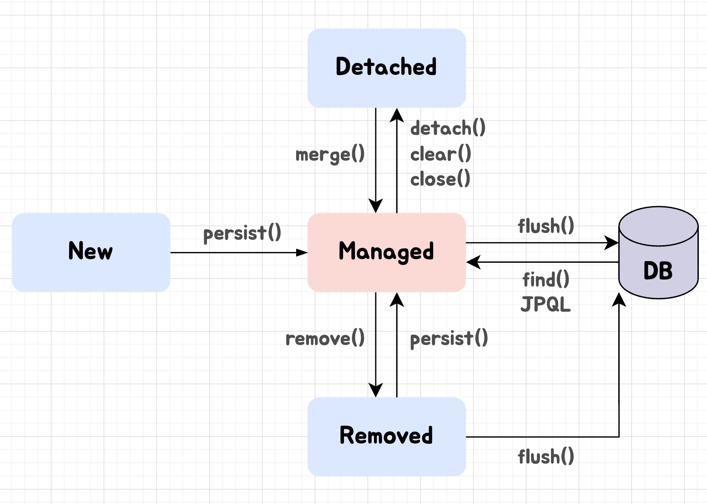

## Entity 의 생명 주기에 대해 설명해주세요

***

> JPA 에서 엔티티 생명 주기는 비영속, 영속, 준영속, 삭제 4가지로 나뉩니다.

> 객체 생성 직후는 비영속 상태이며, EntityManager 를 통해 영속성 컨텍스트에 저장되면 영속상태가 되고, 분리되면 준영속, 제거 마킹이 되면 삭제 상태가 됩니다.

> 엔티티를 엄격하게 관리하는 이유는 객체와 관계형 데이터베이스 간의 패러다임 불일치의 해소라 생각하는데요. 영속성 컨텍스트는 DB가 아닌 메모리에 엔티티를 두어 동일성, 1차 캐시, 쓰기 지연과 변경 감지 등을 통해 DB 저장 전 효율성과 일관성을 위해 앞처럼 관리하고 있습니다.

***



크게 4가지의 상태가 존재한다.

영어 그대로 또는 한국어 그대로 상태를 이해하면 암기하기 더 쉽다. 

또한 영속성 컨텍스트와 어떤 관계인지를 함께 외우면 좋다.

### 비영속 상태 [ new | transient ]

---

> **순수한 객체** 상태이며, 영속성 컨텍스트와 **관련이 없는 상태**이다.
> 

단순히 메모리에만 존재하게 된다.

```java
Member member = new Member();
```

### 영속 상태 [ managed ]

---

> **EntityManager** 을 통해 엔티티를 영속성 컨텍스트에 저장되어 있어 **영속성 컨텍스트가 관리하는 상태**이다.
> 

따라서 영속성 컨텍스트가 제공하는 1차 캐시, 변경 감지 등의 이점을 누릴 수 있다.

```java
em.persist(member);
```

- **준영속 → 영속**
    
    `merge()` 로 사용할 수 있는데, 엔티티의 식별자 값으로 영속성 컨텍스트에서 찾고 없다면 DB 에서 조회하고 영속 상태로 만든다.
    
    만약 없다면 새로운 엔티티를 생성한다.
    
    만약 가져온 데이터가 수정 사항이 있다면 값을 채우고 merge 가 이루어진다.
    

### 준영속 상태 [ detached ]

---

> 영속성 컨텍스트에 저장되었다가 **분리된 상태**이다.
> 

```java
em.detach(member);

em.close();
em.clear();
```

영속 상태의 엔티티가 분리되어 있어 Dirty Checking, 변경 감지 등의 기능을 사용할 수 없다.

엔티티를 JPA 에서 관리하지 않고 1차 캐시, 쓰기 지연 SQL 저장소에서 해당 엔티티를 관리하는 모든 정보가 삭제된다.

사실상 가장 중요한 특징이 있지만 우리가 고려할 요소는 아니라고 생각이 든다.

- **clear 와 close**
    
    `clear()`  : 영속성 컨텍스트를 초기화하여 해당 영속성 컨텍스트에 존재하는 모든 엔티티를 준영속으로 만든다. 즉, new 와 동일한 상태이다. 그래서 동일 Entity 을 조회 시 캐시가 아닌 DB 에서 조회하기에 SELECT 쿼리가 수행한다.
    
    `close()` : 영속성 컨텍스트를 종료하고 관리하던 모든 엔티티가 준영속으로 변경된다.
    
- **준영속의 특징**
    - 사실 영속성 컨텍스트가 관리하지 않기에 비영속과 동일한 상태다.
    - 그러나 비영속은 (아래에 나올 이유로) 식별값이 없을 수 있지만, 준영속은 영속에서 떨어져 나온 상태이기에 식별자가 있다.
    - 지연 로딩은 실제 객체 대신 프록시 객체를 로딩하고 해당 객체를 실제 사용시에 영속성 컨텍스트에서 가져오는데 더 이상 관리하지 않기 지연 로딩 시 문제가 발생합니다. (지연 로딩은 다음 질문에 나옵니다.)

### 삭제 상태 [ removed ]

---

> 엔티티를 **영속성 컨텍스트와 데이터베이스에서 삭제**한 상태이다.
> 

```java
em.remove(member);
```

## 왜 JPA 가 엔티티를 엄격하게 관리하는 것일까? 🤔

---

### 1️⃣ 데이터 일관성 및 동일성 보장

- 동일 트랜잭션에서 **같은 ID로 조회한 엔티티는 항상 같은 인스턴스임을 보장**하는 것이 영속성 컨텍스트가 하는 일이다.

### 2️⃣ 데이터 베이스 IO 최적화

- 매번 DB 에서 찾거나 변경 시 SQL 을 수행하면 IO가 쌓이기 때문에 영속성 컨텍스트는 이를 최적화하기 위해 생명주기를 관리한다.

### 3️⃣ 트랜잭션을 지원하는 쓰기 지연

- 트랜잭션이 커밋하면 모아둔 SQL을 한 번에 전송해 커넥션 점유 시간을 최소화할 수 있다.

## 상세한 작동 순서

---


JPA Entity 의 생명주기(Entity LifeCycle)

### 1. New → Managed

객체를 생성하고 persist()를 호출하면 영속성 컨텍스트의 1차 캐시에 엔티티가 등록된다.

- DB의 PK 생성 전략이 `IDENTITY` 라는 가정 하에 즉시 `INSERT` SQL이 DB 로 전송된다.
- PK를 알아야 1차 캐시 식별자로 등록할 수 있기 때문이다.
- 그 외의 전략은 메모리에만 생성되고 SQL 은 지연된다.

### 2. Managed 상태에서 조회 및 변경 감지

`em.find()` 를 호출하면 데이터가 1차 캐시에 있으면 Cache Hit 로 DB 를 거치지 않는다.

- 만약 영속 상태의 엔티티가 수정되면, JPA는 트랜잭션 커밋 시점(또는 flush())에 영속화된 상태를 저장한 스냅샷과 현재 상태를 비교한다.
- 변경이 있다면 자동으로 `UPDATE` 를 생성해 쓰기 지연 SQL 에 쌓는다.

### 3. Managed → Detached

`detach()` 를 수행하면 특정 엔티티가 `clear()` 를 호출해서 영속성 컨텍스트 전체가 비워진다.

- 준영속 상태가 된 객체는 값을 변경해도 Dirty Checking 이 동작하지 않아 지연 로딩을 수행하면 `LazyInitializationException` 이 발생한다.

---

사실 개인적으로 이 상태는 알아서 JPA 에서 관리하기 때문에 큰 중요도가 있지는 않는 것 같지만 다음이 중요한 것 같다고 생각해 추가적으로 가져와 보았습니다.

## 1️⃣ 영속성 전이 (`Cascade`)

---

부모 엔티티가 영속화되거나 삭제될 때 그 상태 변경을 연관된 **자식도 동일하게 적용**하는 기능이다.

- 부모 엔티티가 저장될 때 자식도 자동으로 저장된다.

### 2️⃣ 고아 객체 (Orphan)

---

부모 엔티티와 연관관계가 **끊어진 자식 엔티티를 자동으로 DB에서 삭제**하는 기능이다.

`CascadeType.REMOVE` 는 부모 엔티티가 `em.remove()` 가 수행될 때 자식 엔티티들도 함께 `DELETE` 쿼리가 나간다. 하지만 부모 객체에서 자식 객체를 리스트에서 제거하는 경우는 자식이 삭제되지 않고 관계만 끊어진다.

orphanRemoval = true 는 부모 객체 내부의 컬렉션에서 자식 객체를 제거하는 행위 자체를 삭제로 인식해서 `DELETE` 쿼리를 예약한다. 

1. 만약 하지 않는다면?
- 부모에서 자식을 삭제해도 DB 데이터는 지워지지 않는다.
- 만약 자식에서 FK 가 NOT NULL 이라면 JPA에서 FK를 null 로 바꾸다가 DB 에러가 난다.

1. Trade-Off
- 부모와 연관관계를 끊었다고 내용이 완전히 삭제되므로 다른 엔티티에서 이를 참조하고 있다면 외래 키가 깨져 데이터 정합성에 오류가 난다.
- 추가적으로 당연히 데이터 유실이 발생한다.

1. 연관관계가 아니라 FK 로만 가지고 있다면?
- 이 때는 당연히 JPA Cascade 를 사용할 수 없기에 애플리케이션 계층에서 Service 에서 관리 또는 이벤트 기반으로 트랜잭션을 묶어서 생명주기를 우리가 관리해야 한다.
- 이는 DDD 에서 자주 사용하는 방식이다.

```java
@Transactional
public void deleteParent(Long parentId) {
	// 1. 부모를 삭제하면
	parentRepository.deleteById(parentId);
	
	// 2. 자식도 삭제되어야 한다면.
	eventPublisher.publishEvent(new ParentDeletedEvent(parentId));
}

// 자식의 리스너
@Component
@RequiredArgsConstructor
public class ChildEventListener {
	private final ChildRepository childRepository;

    // 부모 삭제 트랜잭션이 커밋되기 직전에 함께 실행되도록 묶음
    @TransactionalEventListener(phase = TransactionPhase.BEFORE_COMMIT)
    public void onParentDeleted(ParentDeletedEvent event) {
        // 벌크 연산으로 자식 데이터 일괄 삭제 (JPA 성능 최적화)
        childRepository.deleteByParentIdInBatch(event.getParentId());
    }
}
```

### 3️⃣ remove.all (DeleteAll vs DeleteAllInBatch)

---

Spring Data JPA 에서 제공하는 일괄 삭제 메서드인데 메모리로 엔티티와 가져와서 건별로 삭제하거나 DB 에 직접 단일 대량 쿼리를 날리는 2가지 방식으로 나뉩니다.

- `deleteAll()`
    
    `findAll()` 를 먼저 수행해 모든 엔티티를 영속성 컨텍스트에 올리고 하나씩 돌면서 `em.remove()` 를 수행한다. (참고로 `@PreRemove` 가 작동하고 자식 객체의 Cascade 옵션도 적용되지만 N+1 DELETE 쿼리가 발생 가능)
    
- `deleteAllInBatch()`
    
    영속성 컨텍스트를 통해서가 아닌 직접 DB 에 DELETE FROM table 로 벌크 쿼리를 수행한다. (그러나 영속성 컨텍스트와 상태가 불일치할 수 있고 당연히 Cascade 가 무시된다.)
    

그래서 deleteAllInBatch 와 DB 에 제약조건을 고려해서 자식 테이블 Batch 호출 후 부모를 삭제하는 방법도 있다.

### 4️⃣ 지연 로딩 (Lazy Loading)

---

연관된 엔티티를 직접 조회가 아닌 실제 해당 객체의 데이터가 필요한 시점에 DB에 쿼리를 날려서 조회하는 프록시 기술이다.

`FetchType.LAZY` 를 통해 연관 엔티티 조회 시 DB 가 아닌 프록시 객체로 채워둔다. 호출 시에 DB 에서 가져오게 된다.